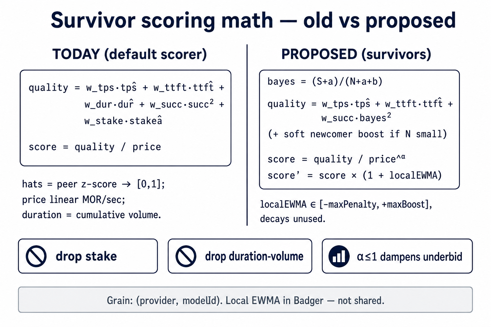
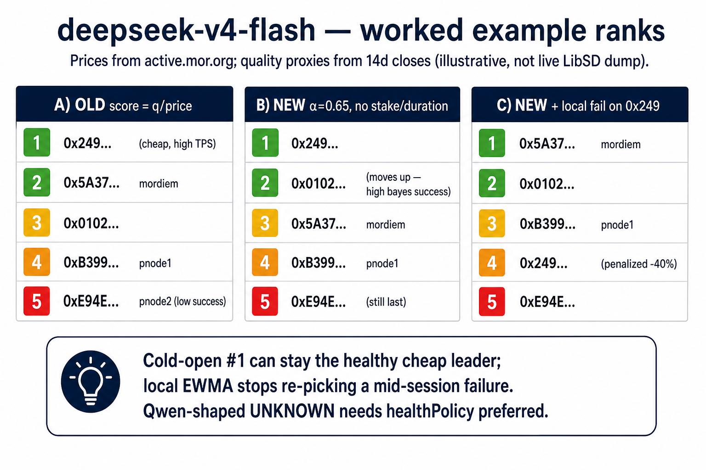

# Consumer C-Node: Bid selection defense rings

**Status:** Design proposal (not implemented)  
**Audience:** Proxy-router / consumer-node developers  
**Branch:** `fix/cnode-rating-defense-rings-design` (docs only — no implementation PR yet)  
**Related code today:**

- Rating: `proxy-router/internal/rating/`
- Schema: `proxy-router/internal/rating/rating-config-schema.json`
- Open + ping gate: `proxy-router/internal/blockchainapi/service.go` (`OpenSessionByModelId`, `tryOpenSession`, `blockingModelHealthStatus`)
- On-chain stats: `smart-contracts/contracts/interfaces/storage/IStatsStorage.sol`, `SessionRouter._setStats`
- Local storage: `proxy-router/internal/storages/storage.go` (Badger at `PROXY_STORAGE_PATH`)
- Docs: `docs/reference/rating-config.mdx`, `docs/providers/full/model-health.mdx`

---

## TL;DR — Exec summary

**Problem (root cause):** The consumer C-Node bid selection algorithm is flawed. It ranks with `score = quality / price` over **lifetime** on-chain `(provider, model)` stats. Cheap underbidders with high historical “success” (valid closeout receipts) win even when they are `unknown`/broken for live prompts. There is no denylist, no durable local memory of “this pair just failed *me*,” and the pre-open health ping is too lenient (`unknown` proceeds).

**Evidence (production HA consumer, 2026-07-21 → 07-22):** On **Qwen 2.5 7B**, the cheap `unknown` provider (`0x5A42…`) repeatedly won cold opens on price + lifetime reputation, failed instantly (p50 ≈ **4s** on Jul 22, **100%** early close, **0** TTFT), HA failover briefly used the serviceable peer (`0x5A37…`), then the next cold open **forgot** and returned to the cheap peer — ping-pong that escrowed MOR into open→fail→early-close churn and stressed the consumer wallet. See §1.2.

**Proposal:** Fix selection **inside the consumer proxy-router** (every C-Node on the network). Four rings:

1. **Hard deny / allow** in `rating-config.json`
2. **Smarter scoring** of survivors (dampened price, drop stake & volume-duration, Bayesian success, soft newcomer prior, **local EWMA experience**)
3. **Configurable health strictness** on the existing ping (`permissive` | `preferred` | `strict`), with a **single-bid leniency** caveat
4. **Persistent local experience in Badger** — soft score bumps / short cooldowns, **not** an auto deny list

HA clients that omit a bad provider on mid-prompt failure remain useful, but they are **not** the root fix: without better C-Node ranking + local memory, cold opens keep re-selecting the same bad provider×model pair.

**Ask:** Review/approve this design, then implement behind defaults that preserve today’s behavior (`permissive`, empty deny/allow, local experience off or neutral).

**Also in this doc:** exact survivor scoring math + deepseek-v4-flash old/new rank worked example (§2.3); HA-client follow-ups that complement but do not replace the C-Node fix — cold-open omit from known-bad health, 429 backoff (not early-close), expensive tier on **max** bid price for 20 vs 70 min (§9).


---

## 1. Problem statement

### 1.1 What “best” means today

Default algorithm (`rating-config.json` → `algorithm: default`):

```text
score = (w_tps·tpŝ + w_ttft·ttft̂ + w_dur·dur̂ + w_succ·succ² + w_stake·stakê) / pricePerSecond
```

- Stats grain: **`(provider, modelId)`**, not per bid (`getProviderModelStats`).
- Stats lifetime only — no on-chain “last 24h” window.
- `successCount` increments on close when the provider receipt **signature verifies**, even if the session was useless (e.g. TTFT 0 / lived a few seconds).
- `totalDuration` is a **cumulative sum** of successful session lifetimes — high volume helps the score.
- Final divide by **linear price** — a ~10× cheaper bid needs impossible quality ratios to lose.
- `providerAllowlist` exists; **no denylist**.
- Pre-open ping skips only `unhealthy` | `tee_unverified` | `no_model`. **`unknown` / missing report proceeds.**

### 1.2 Incident evidence — Qwen 2.5 7B (2026-07-21 / 07-22)

Production HA consumer closes on Base (`segment` = gateway consumer wallet), model **Qwen 2.5 7B**. Two competing providers; the cheap peer wins ranking and fails open; HA briefly switches; cold open forgets.

| Day (UTC) | Provider | Health (self-report / UI) | Closes | Early closes | p50 duration | TTFT |
|-----------|----------|---------------------------|--------|--------------|--------------|------|
| 2026-07-21 | `0x5A42…` (cheap) | **unknown** | 84 | **84 (100%)** | 75s | **0** samples with TTFT |
| 2026-07-21 | `0x5A37…` (mordiem) | healthy / degraded (429) | 78 | 76 | **726s** | 65 with TTFT (avg ~2.1s) |
| 2026-07-22 | `0x5A42…` (cheap) | **unknown** | 165 | **165 (100%)** | **4s** | **0** TTFT |
| 2026-07-22 | `0x5A37…` (mordiem) | healthy / degraded (429) | 45 | 45 | **494s** | 27 with TTFT (avg ~2.9s) |

**Two-day totals (same model, same consumer):**

| Provider | Closes | Early % | p50 duration | Pattern |
|----------|--------|---------|--------------|---------|
| `0x5A42…` | **249** | **100%** | **6s** | Wins cold open on **price + lifetime reputation**; never produces TTFT for this consumer |
| `0x5A37…` | 123 | ~98% early* | **690s** | Actually serves for minutes; later capacity/429; HA early-closes after real use |

\*Early-close rate on the serviceable peer is high because HA closes/reopens under load and policy — but duration/TTFT show it was **usable**, unlike `0x5A42…`.

**Why the cheap peer stays #1:** marketplace score is dominated by linear price (~9–10× cheaper) plus lifetime success/duration volume. Weight retunes alone cannot flip the order.

**Ping-pong (the MOR-lock pattern):**

```text
cold open → cheap unknown (#1) → fail in seconds (no TTFT)
     → HA omit once → open serviceable peer → works / later 429
     → next cold open has no durable memory → cheap unknown again
     → escrowed MOR cycles through open → fail → early-close
```

That churn is what locked/stressed the HA consumer’s MOR balance. **HA omit is a band-aid; the selection algorithm is the root cause.**

### 1.3 Comparator (deepseek-v4-flash, multi-bid)

Healthy cheap high-TPS peer is already #1; degraded expensive peer is last. Cold-open ranking is mostly fine. Pain is **sticky memory after mid-session failure**, not “unknown underbidder always wins.” Same defense rings still help; they don’t invert a true quality leader.

### 1.4 Scope boundary

| In scope (this design) | Out of scope |
|------------------------|--------------|
| Consumer proxy-router bid selection for **all** C-Nodes | Client-only denylists outside `rating-config` |
| `rating-config` + Badger local experience | Multi-`omitProviders[]` (optional later) |
| Using existing ping / model health report | On-chain “recent stats” contract upgrade |
| Soft local EWMA (not shared gossip) | Replacing HA failover omit (keep as-is for mid-prompt) |

---

## 2. Proposed solution

### 2.1 Defense rings (consumer node)

| Ring | Purpose | Durable where |
|------|---------|----------------|
| **1. Hard deny / allow** | Operator policy: never / only these providers | `rating-config.json` |
| **2. Score survivors** | Rank by reliability-first math + local EWMA | Config + Badger |
| **3. Open loop + health policy** | Ping with strictness; on fail record local experience and try next | Runtime + Badger |
| **4. Local experience store** | Soft ± score and short cooldown for provider×model | **Badger** (`PROXY_STORAGE_PATH`) |

**Order of operations:**

1. Load active bids for model  
2. Apply denylist, then allowlist (if non-empty)  
3. Score remaining (on-chain + local EWMA + newcomer prior; dampened price; **no stake**)  
4. For each bid in rank order: if local cooldown active → skip to next; else ping under `healthPolicy`; if disqualified → record fail/cooldown → next; else open  
5. On open/prompt outcome visible to the node → update Badger EWMA  

### 2.2 Health strictness (three modes)

Too many modes were rejected; use **three**:

| Mode | Behavior |
|------|----------|
| **`permissive`** | **Default = today.** Skip only `unhealthy`, `tee_unverified`, `no_model`. `unknown` / missing report allowed. |
| **`preferred`** | If **any** peer reports `healthy` or `degraded`, **skip** `unknown` / missing. If none do, fall back to permissive for that open (don’t black-hole the model). |
| **`strict`** | Only try providers that report **`healthy`** for that model. |

**Degraded:** Treat as **serviceable** under `preferred` (capacity risk ≠ “don’t open”). Only `strict` excludes degraded.

#### Single-bid caveat

If after hard filters **only one bid** remains (or only one peer for the model):

- Do **not** apply `preferred` / `strict` in a way that yields **zero** attempts.  
- **Force `permissive` for that open** (or equivalent: allow unknown/degraded so the sole provider can still be tried).  
- Rationale: single-provider models must remain usable; HA/omit already no-ops when there is no alternate.

Document in config as `healthPolicySingleBid: "permissive"` (fixed or default).

**Qwen under `preferred`:** `0x5A42` unknown skipped → `0x5A37` tried.  
**Qwen under `strict`:** only if mordiem reports `healthy`; if mordiem is `degraded`, sole remaining path should still open via single-bid leniency **or** operator accepts outage — prefer leniency when it is the only bid.  
**deepseek under `preferred`/`strict`:** healthy pack remains; degraded peer skipped only in `strict`.

### 2.3 Scoring survivors — exact math

Grain stays **`(provider, modelId)`** (same as `getProviderModelStats` today). Hats (`tpŝ`, `ttft̂`, …) keep today’s peer z-score → clip to \([-3,3]\) → map to \([0,1]\) (see `proxy-router/internal/rating/common.go`).



#### Today (`algorithm: default`)

```text
sucĉ     = (successCount / totalCount)²          # 0 if totalCount = 0
tpŝ      = normRange( z(providerTps, modelTpsSD) )
ttft̂     = normRange( -z(providerTtft, modelTtftSD) )
dur̂      = normRange( z(providerTotalDuration, modelDurationSD) )
stakê    = normMinMax(providerStake, minStake, 10×minStake)

quality   = w_tps·tpŝ + w_ttft·ttft̂ + w_dur·dur̂ + w_succ·sucĉ + w_stake·stakê
score     = quality / pricePerSecond             # price in MOR/sec (wei/1e18)
```

Prd weights today (`rating-config`): `tps=0.24`, `ttft=0.08`, `duration=0.24`, `success=0.32`, `stake=0.12`.

#### Proposed (survivors after deny/allow)

```text
bayes     = (successCount + a) / (totalCount + a + b)     # default a=b=1
sucĉ     = bayes²
tpŝ,ttft̂ = same z-score normalization as today
# dur̂ and stakê REMOVED (weights forced 0 / ignored)

quality   = w_tps·tpŝ + w_ttft·ttft̂ + w_succ·sucĉ
if totalCount < newcomer.maxSampleCount:
    quality *= (1 + newcomer.scoreBoost · (1 − totalCount/maxSampleCount))

score     = quality / pricePerSecond^α                   # α = priceExponent
score'    = score · (1 + clamp(localEWMA, −maxPenalty, +maxBoost))
```

| Symbol | Meaning |
|--------|---------|
| `α` / `priceExponent` | `1.0` = today’s linear price; prod suggestion `~0.6–0.7` so a ~10× underbid cannot 10× the score |
| `localEWMA` | Per-node Badger signal for this provider×model; → 0 if unused past half-life |
| cooldown | Optional: skip this pair on the first try-loop pass while `cooldownUntil` is in the future |

**Remove / zero:** stake; cumulative `totalDuration` as a positive “stability” term.  
**Keep / reshape:** TPS, TTFT, Bayesian success, dampened price, soft newcomer prior, local EWMA.

Wiping Badger = cold start; impact acceptable.

### 2.3.1 Worked example — `deepseek-v4-flash` (5 providers)

**Inputs (illustrative reconstruction, 2026-07-22):** bid prices from `active.mor.org` `bidDetail`; TPS / TTFT / success / volume proxies from 14d `chain_closes` for that model (not a live LibSD dump from the Diamond — numbers will drift; the **ranking shape** is what matters). Stake held at mid-scale (`0.5`) in the “old” column so it doesn’t invent differences.

| Provider | Health | MOR/hr | pps (MOR/s) | ~TPS | ~TTFT ms | useful/total | Σ duration |
|----------|--------|-------:|------------:|-----:|---------:|-------------:|-----------:|
| `0x249f…` | healthy | 0.1276 | 3.55e-5 | 62.3 | 5966 | 328/374 | high |
| `0x5a37…` | healthy | 0.1414 | 3.93e-5 | 38.5 | 7181 | 498/544 | highest |
| `0x0102…` | healthy | 0.1344 | 3.73e-5 | 34.2 | 6730 | 203/214 | med |
| `0xb399…` | healthy | 0.1667 | 4.63e-5 | 10.3 | 2774 | 309/360 | high |
| `0xe94e…` | healthy* | 0.2160 | 6.00e-5 | 8.0 | 2139 | 2/49 | tiny |

\*Earlier snapshots showed pnode2 **degraded**; under `strict` it would be skipped regardless of score.



| Rank | OLD `q/price` (prd weights) | NEW `q/price^0.65` (no stake/dur) | NEW + local fail on `0x249` (−0.40) |
|-----:|-----------------------------|-------------------------------|-------------------------------------|
| 1 | **`0x249`** ~18.2k | **`0x249`** | **`0x5a37`** (local +0.15) |
| 2 | `0x5a37` ~16.7k | `0x0102` ↑ (strong bayes success) | `0x0102` |
| 3 | `0x0102` ~16.4k | `0x5a37` | `0xb399` |
| 4 | `0xb399` ~12.3k | `0xb399` | **`0x249`** (penalized) |
| 5 | `0xe94e` ~4.3k | `0xe94e` | `0xe94e` |

**How to read this:** for deepseek, today’s scorer already picks a **healthy cheap high-TPS** #1 — scoring reform alone is not the crisis fix. The proposed math still helps: duration-volume no longer props up high-n peers, Bayesian success lifts thin-but-reliable peers (`0x0102`), and **local EWMA** is what stops mid-session death from being re-selected on the next cold open.  

**Contrast — Qwen 2.5 7B:** even with `α=0.65` and zero duration/stake, the ~9.6× price gap still leaves `0x5A42` #1 in a pure score race. Cold-open fix there is **`healthPolicy: preferred`** (skip `unknown` when a reported peer exists), not weight tuning.

### 2.4 Age on network

Soft only: young provider / new bid with thin samples gets a **small** boost so they can be tried and, if reliable, climb quickly. Not a permanent handicap for incumbents with good local+chain signal; not “bully new entrants away.”

### 2.5 HA clients and mid-prompt failure

Keep existing single-`omitProvider` (or equivalent) for mid-prompt failover. After omit, the C-Node should record local fail on that provider×model so the **next cold open** does not immediately re-pick the same bad pair. Phase 1 does **not** require client-side bid filtering against external health UIs — the C-Node makes the smart decision.

---

## 3. Suggested `rating-config.json` extensions (additive)

Defaults preserve today’s behavior.

```json
{
  "$schema": "./internal/rating/rating-config-schema.json",
  "algorithm": "default",
  "providerAllowlist": [],
  "providerDenylist": [],
  "params": {
    "weights": {
      "tps": 0.30,
      "ttft": 0.10,
      "duration": 0.0,
      "success": 0.60,
      "stake": 0.0
    },
    "priceExponent": 1.0,
    "healthPolicy": "permissive",
    "healthPolicySingleBid": "permissive",
    "newcomer": {
      "maxSampleCount": 30,
      "scoreBoost": 0.1
    },
    "localExperience": {
      "enabled": false,
      "failHalfLifeSecs": 86400,
      "successHalfLifeSecs": 604800,
      "cooldownSecs": 900,
      "maxScoreBoost": 0.3,
      "maxScorePenalty": 0.5
    }
  }
}
```

**Precedence:** deny wins → allow (if non-empty) → score → try loop with health + cooldown.

Update `rating-config-schema.json`, `docs/reference/rating-config.mdx`, and unit tests accordingly.

---

## 4. Badger local experience (sketch)

- **Path:** existing Badger under `PROXY_STORAGE_PATH` (default `./data/badger/`).  
- **Key:** e.g. `rating/exp/<providerHex>/<modelIdHex>`  
- **Value:** EWMA success/fail signals, `lastUpdated`, optional `cooldownUntil`  
- **Writers:** ping disqualify, open fail, (optional) first-prompt failure if already visible in proxy-router  
- **Readers:** scoring step + try-loop cooldown check  
- **Not shared** across nodes; not synced to chain  

---

## 5. Validation scenarios

### 5.1 Qwen 2.5 7B (2 providers) — matches §1.2 evidence

| Config | Expected cold-open first try |
|--------|------------------------------|
| Today / `permissive` | `0x5A42` (cheap unknown) |
| `preferred` + local off | `0x5A37` (skip unknown while degraded/healthy peer exists) |
| After forced fail on 5A42 with local on | Cooldown / penalty → next opens prefer 5A37 without deny list |

### 5.2 deepseek-v4-flash (multi providers)

| Config | Expected |
|--------|----------|
| `permissive` / `preferred` | Healthy cheap leader remains first among scored peers |
| `strict` | Degraded peer not tried; healthy set unchanged order by score |
| After mid-session fail + omit + local | Failed provider×model deprioritized for cooldown window; not permanently denied |

### 5.3 Single-bid model

Any `healthPolicy`: still attempts the sole bid (unknown/degraded allowed via `healthPolicySingleBid`).

---

## 6. Implementation prompt (for another developer / agent)

Copy-paste:

```text
Implement the Consumer C-Node “bid selection defense rings” design in
Morpheus-Lumerin-Node as specified in:

  .ai-docs/CNODE_RATING_DEFENSE_RINGS.md

Constraints:
- Preserve today’s behavior when using default config (permissive health,
  empty deny/allow, priceExponent 1.0, localExperience.enabled false,
  current weight sums = 1).
- Root fix is proxy-router selection — do NOT depend on external HA client
  bid filtering for cold opens.
- Do NOT make local experience a permanent deny list — soft EWMA + optional
  cooldown only; persist in existing Badger (PROXY_STORAGE_PATH).
- Drop stake from scoring influence (weight 0 / ignore); stop using
  cumulative duration as a positive stability signal (weight 0 or remove).
- healthPolicy: permissive | preferred | strict, with single-bid forced
  permissive behavior as documented.
- providerDenylist + existing providerAllowlist; deny then allow.
- Update JSON schema, docs/reference/rating-config.mdx, and unit tests
  (rating package + open/ping gate tests for health policy and single-bid).
- Add focused tests for: Qwen-like unknown+healthy/degraded pair under
  preferred; single-bid unknown still opens; local cooldown deprioritizes
  without removing from allow set.
- Use §1.2 evidence as the acceptance narrative: cheap unknown must not
  win cold open under preferred when a reported peer exists; after fail,
  Badger experience must prevent immediate re-pick.

Validate:
- go test ./internal/rating/... and relevant blockchainapi tests
- Manual or integration: with preferred policy, unknown peer skipped when
  a reported peer exists; after simulated fail, Badger key appears and
  ranking shifts until half-life/cooldown elapses
- Confirm existing mid-prompt omit/failover path still works unchanged

Deliver a small PR series to origin/dev if possible:
  (1) schema + denylist + healthPolicy gating
  (2) scoring math (priceExponent, weights)
  (3) Badger local experience
```

---

## 7. Open questions (non-blocking)

1. Exact default half-lives for prod presets.  
2. Whether first-token / prompt failure inside proxy-router should update EWMA (stronger self-defense) or only open/ping failures in v1.  
3. Future: on-chain windowed stats (contract) — complementary, not required for this design.  
4. Future: `omitProviders[]` — only if single omit + local EWMA proves insufficient for HA clients.

---

## 8. Decision ask

Approve this design for implementation on `dev` (proxy-router). Phase 1 is the C-Node selection algorithm + Badger local experience; HA mid-prompt omit stays as today.

---

## 9. Follow-up — HA client (APIGW) enhancements

These are **not** required for the C-Node root fix above. Keep them as a complementary backlog for the hosted HA consumer that opens many sessions against a shared wallet. Implement after (or in parallel with) proxy-router defense rings if product still sees gaps.

### 9.1 Cold-open omit from known-bad health (existing single `omitProvider`)

**Problem:** C-Node does not read `active.mor.org`. A bid can be `unknown` / unhealthy in the gateway’s health feed and still win cold open on price + lifetime stats (Qwen `0x5A42` pattern).

**Change:** On session open (idle claim or on-chain open), if the HA client already knows a provider×model is `unknown` or `unhealthy` from `active_models` / `bidDetail`, pass today’s single `omitProvider` for the worst offender when a healthier alternate exists.

**Scope:** Uses existing transmit path — no proxy-router API change. Limited to **one** omit per open until/unless multi-omit is added later (out of scope here).

**Acceptance:** Qwen cold open never selects `0x5A42` while `0x5A37` reports `healthy`/`degraded`.

### 9.2 Treat 429 as capacity, not hard death (backoff; don’t early-close)

**Problem:** HA currently treats many upstream failures similarly. A **429** on an otherwise good peer (e.g. mordiem on Qwen) triggers invalidate → early `closeSession` → new open → MOR escrow churn, even though the session might have recovered.

**Change:**

- Classify **429 / rate_limited** separately from hard death (dial fail, 5xx HTML, no-TTFT open fail, stream reset).
- On 429: **exponential backoff + retry** against the **same** session/provider for a short window (e.g. 1s → 2s → 4s, cap ~15–30s, small max attempts); surface 429 to the end user if still limited.
- **Do not** early-close + failover solely for 429 when the peer is the last remaining bid (or when policy says “capacity ≠ dead”).
- Hard death still uses existing omit + reopen.

**Acceptance:** 429 storms no longer dominate early-close stake for multi-bid models; last-bid 429 returns to client with session left OPEN when appropriate.

### 9.3 Expensive-model tier: classify on **highest** bid price (20 vs 70 min)

**Problem:** Today `_get_model_min_price_per_second` / `_is_expensive_model` uses the model’s **lowest** rated bid vs `SESSION_EXPENSIVE_CUTOFF_MOR_PER_SECOND`. Prd opens expensive models at **1200s (20 min)** vs global **4200s (70 min)**. If a model looks “cheap” because an underbidder exists, it gets the **70 min** stake — then HA failover can land on a much more expensive peer and escrow a large stipend anyway.

**Change:** Classify expensive tier from the model’s **maximum** (highest) rated-bid `PricePerSecond`, not the minimum. Optionally document as `max(bid.price) >= cutoff`. Keep expensive duration/idle grace as today (1200s / ≥duration idle grace so idle rides to natural expiry).

**Code touchpoints:** `Morpheus-Marketplace-API` `session_routing_service.py` (`_get_model_min_price_per_second` → max variant), unit tests in `tests/unit/test_session_expensive_tier.py`, prd tfvars comments in `Morpheus-Infra` `session_expensive_tier`.

**Acceptance:** A model with any premium-tier bid opens at the expensive (20 min) duration even if a cheap underbid exists; wallet stake for that model is bounded under HA failover to the pricey peer.
