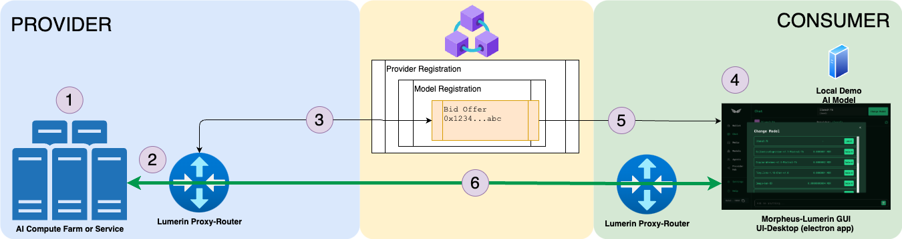

# Morpheus Lumerin Node



The purpose of this software is to enable interaction with distributed, decentralized LLMs on the Morpheus network through a desktop chat experience.

> **v7.0.0 — TEE capability (Intel TDX only).** The v7 release completes a two-hop Trusted Execution Environment (TEE) trust chain for Intel TDX models registered on-chain with the `tee` tag; SEV per-template verification is not yet wired, so SEV-based providers cannot be fully verified by consumers at this time:
>
> - **Phase 1** — *consumer → P-Node.* A consumer proxy-router (v6.0.0+) cryptographically verifies the provider's P-Node runs the exact official hardened `-tee` image inside a genuine Intel TDX SecretVM, with TLS pinning, at session open and on every prompt.
> - **Phase 2 (new in v7)** — *P-Node → backend LLM.* The v7+ P-Node itself verifies the backend LLM it forwards inference to (CPU TDX quote, TLS pinning, workload RTMR3 replay of the backend's `docker-compose.yaml`, CPU-GPU nonce binding, and NVIDIA NRAS GPU attestation) at startup and on every prompt.
>
> Because Phase 2 runs inside the attested P-Node, **any v6+ consumer is forward-compatible with a v7+ Intel TDX provider** and gains the Phase 2 guarantees automatically — no client-side upgrade required. SEV-based providers are not yet fully verifiable by consumers. See the [TEE reference](https://nodedocs.mor.org/providers/full/tee-reference), the [SecretVM quickstart](https://nodedocs.mor.org/providers/full/secretvm-quickstart), and the [TEE backend verification developer reference](https://nodedocs.mor.org/providers/full/tee-backend-verification).

## What this fork adds

Everything above is the official Morpheus network. This branch (`stake-duration`)
adds a consumer desktop experience on top of it, in two areas:

**Session duration and cost, actually under your control.**

- **Type how long you want the session, in plain language** — "1 day", "2
  years" — instead of picking from fixed chips. That typed length sets the
  stake directly and opens as ONE block, up to the network's per-session cap
  (7 days by default, read live from the contract, not hardcoded).
- **Only a length longer than that cap chains** into multiple blocks
  automatically, and only then does a renewal choice appear: **Seamless**
  (the next block opens before the current one ends — inference never pauses,
  but two blocks' stake is briefly locked at once) or **Sequential** (waits
  for the block to end first — a short pause, same total cost either way).
  A normal-length session never sees this; there is nothing to renew.
- **Pick a specific provider**, not just the router's auto-pick (auto-select
  itself is upstream's own long-standing default, not something added here).
  A model is often served by several providers at different prices and
  uptimes; the picker shows each one's online/offline state and its price,
  greys out any you can't afford, and — once picked — every renewal in a
  chained session targets that same provider rather than whatever the router
  would auto-pick next.
- **Stake even if you can only afford some of a model's providers.** The old
  gate priced against the model's most expensive provider and blocked you
  outright; it now gates on the cheapest and tells you "covers N of M
  providers" so a comfortably-affordable session isn't refused over a provider
  you were never going to use anyway.
- **See who's actually serving you** — the provider's endpoint and the MOR you
  actually have locked, not an abbreviated on-chain address and a cost figure
  that used to be computed wrong.
- **A warning before an early close locks your MOR**, naming the exact figure
  and until when — closing before a block's `EndsAt` time-locks that stake for
  ~24h on-chain, which is the network's behavior, not a bug in this app; you
  just weren't told beforehand. Held stakes past their lock are auto-claimed
  back for you while your own node is running — with it stopped, or for stakes
  held against a different wallet, the claim is a manual on-chain call.

**Your terminal, not just the app window.**

- **[grok](https://x.ai) and [opencode](https://opencode.ai) integration** —
  pin the Morpheus models you use in Settings → OpenAI-compatible API, and
  they appear in both tools' own model pickers, session or no session.
- **No model ever decides to spend.** Ask a pinned model with no session open
  and your terminal says so; this app's window comes forward with the price,
  the provider, and the duration, and a session opens only once you confirm it
  here — never from inside the agent's own turn.
- **One command from a clean clone to a running build** — see
  [Build the desktop app from source](#build-the-desktop-app-from-source)
  below.

Full detail on each release lives in the app itself (Settings → What's new in
this version) and in
[`ui-desktop/src/shared/release-notes.ts`](ui-desktop/src/shared/release-notes.ts).

## Documentation

The canonical documentation lives at **[nodedocs.mor.org](https://nodedocs.mor.org)**. Source files are in [`/docs`](docs/) and built with [Mintlify](https://mintlify.com). The site replaces the previous `00-overview.md` / `02-*.md` / `04-*.md` / `99-troubleshooting.md` set of files; old paths still resolve via redirects in [`docs/docs.json`](docs/docs.json).

The site is structured around **role-based journeys** (consumer / prosumer / provider tiers), with anti-hallucination [AI knowledge](https://nodedocs.mor.org/ai/myths) pages and curated mirrors of the broader [ecosystem](https://nodedocs.mor.org/ecosystem/overview) ([mor.org](https://mor.org), [tech.mor.org](https://tech.mor.org), [active.mor.org](https://active.mor.org), [MyProvider](https://myprovider.mor.org), [Everclaw](https://everclaw.xyz), [NodeNeo](https://nodeneo.io), [app.mor.org](https://app.mor.org)).

## What's in this repo

- Lumerin `proxy-router` — background process that monitors blockchain contract events, manages secure sessions between consumers and providers, and routes prompts and responses between them.
- `ui-desktop/` (**MorpheusUI**) — Electron desktop app for consumers. Release assets are `*-morpheus-app-*` installers (`.dmg` / `.AppImage` / portable `.exe`); on first launch the app downloads the proxy-router, a local `llama.cpp` runtime + the `Qwen2.5-1.5B-Instruct` demo model, and an IPFS (kubo) node. There is no zip / `mor-launch` package in current releases.
- `cli/` — CLI client (`*-morpheus-cli-*` release binaries; local builds produce `mor-cli`).
- Standalone `*-morpheus-router-*` release binaries for headless / provider deployments.

## End-to-end picture

0. **PreRequisites**: BASE Layer 2 Blockchain, MOR and ETH on BASE for staking and bidding.
1. Existing, Hosted AI model available for inference via the Morpheus network.
2. The proxy-router talks to and listens to the blockchain; it routes prompts and inference between providers' models and consumers.
3. Providers register their models via bids on the blockchain.
4. The consumer node is the "client" that purchases bids, sends prompts via the proxy-router, and receives inference back from the provider's models.
5. Consumers stake MOR to open a session for the duration they intend to use.
6. Once the session is open, prompt and inference (ChatGPT-like) can start.

## Tokens and contract information

| Item | BASE Mainnet | BASE Sepolia (testnet) |
|------|--------------|------------------------|
| Chain ID | `8453` | `84532` |
| Branch | `main` (`MAIN-*` releases) | `test` (`*-test` releases) |
| MOR Token | `0x7431aDa8a591C955a994a21710752EF9b882b8e3` | `0x5C80Ddd187054E1E4aBBfFCD750498e81d34FfA3` |
| Diamond Marketplace | `0x6aBE1d282f72B474E54527D93b979A4f64d3030a` | `0xA328196f2438DADA5ab729E39388D86896c27c85` |
| Block Explorer | https://base.blockscout.com/ | https://base-sepolia.blockscout.com/ |

You will need both **MOR** (for stake / fees / session payment) and **ETH on BASE** (for gas) in your wallet.

> **Do not deploy the contracts to Base mainnet from this branch.**
> `smart-contracts/deploy/helpers/config-parser.ts:20` hardcodes
> `deploy/data/config_base_sepolia.json` and takes no network argument, so
> `parseConfig()` returns the **Base Sepolia** parameters whatever `--network`
> says — no deploy path reads the mainnet config file at all. The mainnet
> commands documented in the migration comment blocks
> (`smart-contracts/deploy/1_full_protocol.migration.ts:132-133`, and the
> equivalent lines in migrations 2, 3 and 4) therefore write the *testnet* token
> address, funding account and bid bounds into a **Base mainnet** deployment,
> and `1_full_protocol.migration.ts:119` ends by calling
> `transferOwnership(config.owner)` — handing that deployment to the Sepolia
> owner, which is a plain single-key account, where the Diamond in the table
> above is held by a 5-of-9 multisig.
>
> **Nothing fails first.** Each initialiser stores its address argument without
> ever calling it (`Marketplace.sol:29-38`, `SessionRouter.sol:39-52`,
> `Delegation.sol:11-13`), so a token address that does not exist on the target
> chain does not revert: the run succeeds silently and `--verify` then publishes
> it as verified source. This does **not** take the Diamond listed above away
> from its owners — migration 1 deploys a *new* one — so the exposure is a
> second, official-looking mainnet protocol controlled by a single testnet key,
> not loss of the existing one. Note also that
> `2_change_bid_price.migration.ts:22-23` documents its own mainnet command as
> `--only 1`, so a reader who meant only to inspect bid prices would run the
> full protocol deploy.
>
> **Fixing the parser is necessary but not sufficient.**
> `config_base_mainnet.json:7` still carries a bid price floor that the live
> contract has never returned at any block, so a parser that honoured
> `--network` would faithfully deploy that wrong floor instead. A mainnet deploy
> needs both changes — the parser selecting its config by network, and the
> mainnet config reconciled against the deployed contract — before any
> `migrate --network base` command here is safe to run.

## Quickstart

The linked pages below are the official Morpheus docs — accurate for wallet
setup, staking, and how the network works, regardless of which fork built
your binary. **The "download from GitHub releases" step they describe does
NOT apply to this fork**: this repo's only release
([`desktop-v7.5.0-cc.1`](https://github.com/cowboycoderhq/Morpheus-Lumerin-Node/releases/tag/desktop-v7.5.0-cc.1))
predates everything below, carries no desktop-app asset at all, and its
`proxy-router` binaries predate the model-health and attestation work this
branch just merged in from upstream. Build from source instead — it is the
one path on this fork that is actually current.

| Role | Start here |
|------|-----------|
| Consumer (chat) | [`yarn app`](#build-the-desktop-app-from-source), then the [Consumer quickstart](https://nodedocs.mor.org/get-started/quickstart-consumer) from "Onboard" onward |
| Provider (host your own model) | `cd proxy-router && make build`, then the [Provider quickstart](https://nodedocs.mor.org/get-started/quickstart-provider) from "Configure" onward |
| TEE provider (SecretVM) | [SecretVM quickstart](https://nodedocs.mor.org/providers/full/secretvm-quickstart) |
| Resale provider | [Resale overview](https://nodedocs.mor.org/providers/resale/overview) |
| Prosumer / agent | [Prosumer overview](https://nodedocs.mor.org/prosumers/overview) |
| Developer (API) | [API overview](https://nodedocs.mor.org/reference/api-overview) |

## Build the desktop app from source

> **macOS only, in practice.** The build itself succeeds on Linux and Windows,
> but the app it produces cannot finish first-run setup — and you only find
> that out after a full build plus a ~2GB service download. This fork has no
> proxy-router binary uploaded for either platform, so
> `SERVICE_PROXY_DOWNLOAD_URL_LINUX_*` / `_WINDOWS_*` ship commented out
> (`ui-desktop/.env.example:57-64`) and `yarn app` copies that file verbatim
> to `.env` (`ui-desktop/scripts/ensure-env.mjs:51-57`). With no URL,
> `downloadProxyRouter()` downloads nothing yet still sets its status to
> `'success'` (`ui-desktop/src/main/orchestrator/orchestrator.ts:193-209`),
> the router is then started out of a directory that was never created
> (`:360-363`), and `calculateOrchestratorStatus()` never reaches `'ready'`
> because the router is not running (`:684-703`) — so the setup wizard sits
> on "Connecting to the Morpheus network" indefinitely, with no error shown.
>
> Only the from-source desktop app is affected. **CI-built releases are
> fine** — `.github/workflows/build.yml` injects a real per-platform URL
> (`:3043` Linux x64, `:3236` Windows x64). And the proxy-router itself
> builds and runs everywhere (`cd proxy-router && make build`), so the
> API-only consumer path
> ([Install from source](https://nodedocs.mor.org/consumers/install-from-source))
> works on Linux and Windows today.

Requires **Node >= 20** — nothing else. On **macOS**, one line builds an
installer for the machine you are on and puts it in your Downloads folder:

```bash
(git clone https://github.com/cowboycoderhq/Morpheus-Lumerin-Node.git || (cd Morpheus-Lumerin-Node && git fetch -q && git merge --ff-only -q @{u} || true)) && cd Morpheus-Lumerin-Node/ui-desktop && NODE_OPTIONS=--dns-result-order=ipv4first npx --yes yarn@1.22.22 app
```

`npx` runs the exact Yarn release pinned in `ui-desktop/package.json`
(`packageManager`) without installing anything globally, so there is no
separate `npm install -g yarn` step and no drift toward whatever Yarn
happens to already be on your machine. That single `yarn app` then installs
dependencies, creates `.env` from `.env.example` if you do not have one, picks
the right build target for your OS and CPU, and copies the finished installer
to `~/Downloads`. Nothing to choose and nothing to remember.

Safe to run more than once in the same spot. `git clone` into a directory
that already exists fails outright ("destination path already exists") —
when it does, the fallback branch `cd`s into it and fast-forwards it to the
latest commit itself (`git fetch && git merge --ff-only`; `|| true` so a
diverged or offline checkout still falls through to building whatever is
there rather than stopping). This lives in the command itself, not only in
a script inside the repo: a checkout old enough to predate a fix has no way
to run that fix's own self-update code, so the update has to happen before
`yarn app` is ever invoked, from a copy-paste that's always current because
it comes fresh from this page every time. `yarn app` also re-checks and
fast-forwards on its own once inside a checkout that already has that logic
— redundant on a checkout old enough to need the fallback above, but keeps
working for anyone invoking `yarn app` directly without this wrapper.

`NODE_OPTIONS=--dns-result-order=ipv4first` works around a real, fairly common
failure: some VPNs and mesh networks (Tailscale among them) advertise a
default IPv6 route that isn't actually reachable, and Node tries that route
first when a registry host offers both an A and AAAA record — surfacing as
`yarn install` dying mid-fetch with `EHOSTUNREACH`. This flag makes Node try
IPv4 first without disabling IPv6. If `yarn install` still fails on
`EHOSTUNREACH` or a registry timeout after that, the network you're on can't
reach the npm registry at all right now — check your VPN/proxy, not this repo.

The build is **unsigned**, because signing needs an Apple Developer ID that only
the publisher has. On macOS the first open is refused with "Apple cannot check
it for malicious software" — right-click the app and choose **Open** to run it
anyway. On first launch the app downloads its own services (proxy-router, IPFS,
a local model), about 2GB, so give it a few minutes before the window is usable.

Install with **yarn**, not npm: `yarn.lock` is the committed, tested dependency
tree and CI runs `yarn install --frozen-lockfile` against it. `npm install`
resolves a different tree from the one that is tested.

<details>
<summary>Building a specific target by hand</summary>

```bash
yarn install
yarn build:mac-arm64        # or build:mac-x64 / build:win-x64 / build:linux-x64
```

`build:win-x64` and `build:linux-x64` build and install cleanly; the app they
produce then freezes on the first-run wizard — see the caveat at the top of
this section.

The installer lands in `ui-desktop/dist/`. `scripts/release.sh` is the signed
and notarized path and works only for the publisher.

</details>

### Run it without building

```bash
cd ui-desktop && yarn dev
```

`yarn dev` reads the same `.env`, so on Linux and Windows it hits the same
first-run freeze as a from-source packaged build (caveat at the top of
"Build the desktop app from source").

### The checks

The desktop app carries a verification suite that runs in seconds and needs no
network, no wallet, and no built app:

```bash
cd ui-desktop
yarn typecheck                      # both tsconfigs

# The harness is a separate package and uses npm — it has no yarn.lock.
cd tools/ui-verify && npm install
npm run logic                       # pure-logic + source invariants
npm run isolate                     # mounts real components in a browser, screenshots
npm run openai                      # drives the OpenAI-compatible endpoint end to end
npm run frozen                      # catches colours that cannot theme-swap
```

Run these before opening a PR. `logic` and `openai` are the fastest way to tell
whether a change broke something you did not touch. None of them need a network,
a wallet, or a built app.

## Contributing

**PRs should target [`dev`](https://github.com/MorpheusAIs/Morpheus-Lumerin-Node/tree/dev), not `main`.** Changes promote `dev` → `test` → `main`.

See [`CONTRIBUTING.md`](CONTRIBUTING.md) for the branch model, PR checklist, and local docs/proxy-router tips. The GitHub PR template reminds you to pick the right base branch.

## For AI agents reading this repo

**Start with [`AGENTS.md`](AGENTS.md)** — hard rules, quick lookup tables, and ingestion instructions.

To load the full documentation corpus in one fetch:

| Resource | URL | Use |
|----------|-----|-----|
| Full corpus (preferred) | [`llms-full.txt`](https://nodedocs.mor.org/llms-full.txt) | Complete markdown export — primary ingestion path |
| Page index | [`llms.txt`](https://nodedocs.mor.org/llms.txt) | Titles, descriptions, and per-page `.md` links |
| Page Markdown | append `.md` or non-browser fetch | Same page URL returns clean Markdown when `Accept` lacks `text/html` |
| Docs MCP | [`/mcp`](https://nodedocs.mor.org/mcp) | Search / retrieve pages without scraping HTML |

See `AGENTS.md` for priority reading slugs and anti-hallucination rules.
