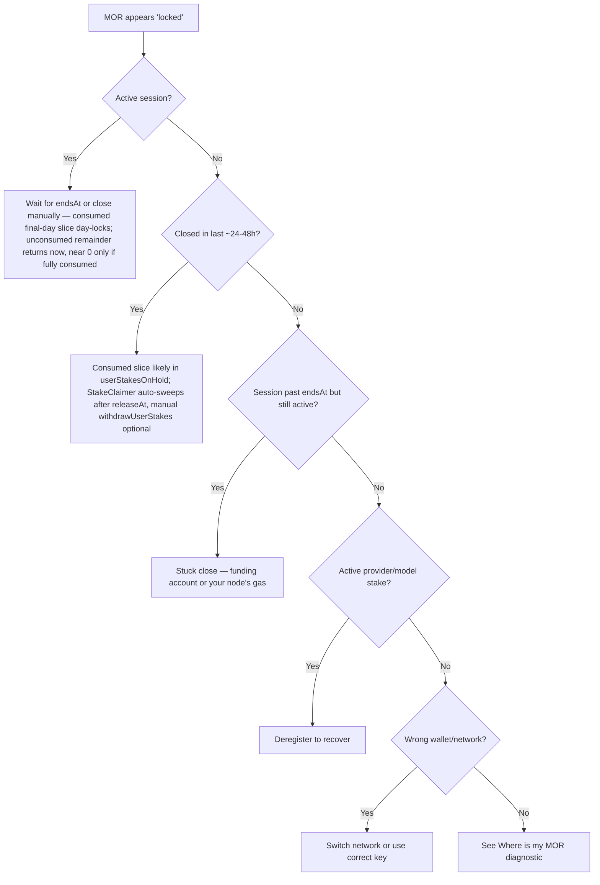

If you see your MOR sitting in the Inference Contract instead of your wallet, you are looking at one of these legitimate states. None of them are "stuck" or "lost." For the canonical mechanics, see [Sessions: stake, close, claim](/concepts/sessions-stake-close-recover).

## Cause 1: Active session

You opened a session. The **entire stake** sits in the Inference Contract while `closedAt == 0`.

- Resolution: wait for natural expiration (your consumer node submits `closeSession` ~1 minute after `endsAt`), or close early via `POST /blockchain/sessions/<id>/close`. After close, the final UTC day's **consumed** slice day-locks (Cause 2) and the **unconsumed** remainder returns immediately — roughly 90% of the stake if you close at 10% of the scheduled duration, and approximately nothing only if the session ran to `endsAt` inside one UTC day. See [Session states](/ai/session-states-open-close-recover).

## Cause 2: Used-stipend day-lock (`userStakesOnHold`)

You closed a session (early **or** same-day natural/late close). The contract locks the stake-equivalent of the final UTC day's consumption (or the entire remaining stake if less) in `userStakesOnHold[you]` with `releaseAt = startOfTheDay(min(closedAt, endsAt)) + 1 day` (≈ "after the end of the UTC day the session ended on"). Only the remainder is transferred immediately — that is the part you did not consume. The lock scales with consumed seconds, so it equals the entire remaining stake, returning nothing at close, only when the session was fully consumed inside one UTC day; an early close returns most of the stake in the close transaction.

- Resolution: after `releaseAt` your own proxy-router sweeps it automatically every 10 minutes (`stake_claimer.go`) — but only while that node is running, and only for the wallet it holds: the StakeClaimer is started inside `Proxy.Run` (`proxy-router/internal/proxyctl/proxyctl.go:237-240`) and withdraws for `GetMyAddress` alone (`proxy-router/internal/blockchainapi/service.go:1118-1124`). With the node stopped, or for a session opened from a different wallet, nothing sweeps and you must call `withdrawUserStakes(yourAddress, iterations)` on the Diamond contract yourself. You may also call it to take the withdrawal sooner. **No HTTP route on the proxy-router** — use `cast send` or MetaMask "Interact with contract" directly. See [Where is my MOR? → Bucket 2](/ai/where-is-my-mor#bucket-2-on-hold-queue-used-stipend-day-lock).

## Cause 3: Stuck close — pool-mode funding account or gas

`closeSession` is one transaction that pays the provider from your escrowed stake for direct-pay sessions, or from the protocol's separate **`fundingAccount`** for pool-mode sessions. If that funding account is empty or its allowance to the Inference Contract is too low, **closeSession for non-direct-pay sessions fails** — yours included. Direct-pay sessions pay providers directly from the contract's token balance via `safeTransfer` and do not use the funding account. Sessions then sit "active" past `endsAt`.

- Resolution (operator): top up / re-approve the funding account.
- Resolution (you): make sure your consumer node is online and has Base ETH for gas. If the close still fails, check its logs.

## Cause 4: Provider stake (active provider)

If you registered as a provider, your provider stake (`0.2` MOR on Base mainnet — live on-chain, `0.2` on Sepolia; no subnet tier) is held in the contract for as long as the provider record is active.

- Resolution: deregister your provider to recover the stake. Mind the cooldown rules and any open obligations (running sessions, posted bids).

## Cause 5: Model stake (active model)

Each registered model carries a `0.1` MOR refundable stake.

- Resolution: deregister the model to recover the stake.

## Cause 6: Allowance is not balance

`POST /blockchain/approve?amount=X` does **not** move MOR — it grants the contract permission to move up to `X` MOR on your behalf. If you confused allowance with balance, no MOR is locked at all.

- Resolution: re-check `GET /blockchain/balance` separately from `GET /blockchain/allowance`.

## What is *not* a legitimate "locked" state

- "I see the Diamond contract holds X MOR total." That's the sum across **all users' active sessions plus all `userStakesOnHold` entries plus provider/model stakes**. It is not your MOR.
- "I sent MOR to the wrong address." That is **lost MOR**, not locked. The contract did not receive it; some other contract or wallet did.
- "MorpheusUI shows zero balance after recovering my mnemonic." You almost certainly recovered the wrong address. See [Where is my MOR?](/ai/where-is-my-mor#bucket-5-wrong-wallet-address).

## Quick decision tree

## Related

- [Where is my MOR?](/ai/where-is-my-mor)
- [Session states](/ai/session-states-open-close-recover)
- [Tokens and fees](/concepts/tokens-and-fees)
- [Sessions: stake, close, claim](/concepts/sessions-stake-close-recover)
- Hosted wallet checker: [tech.mor.org/session.html](https://tech.mor.org/session.html)
