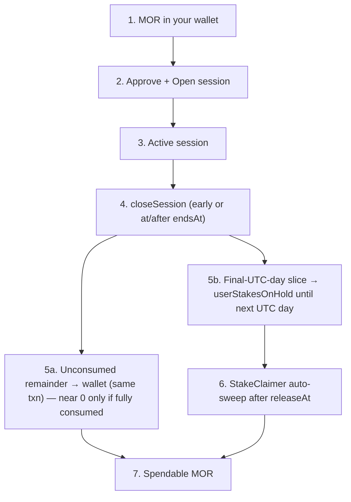
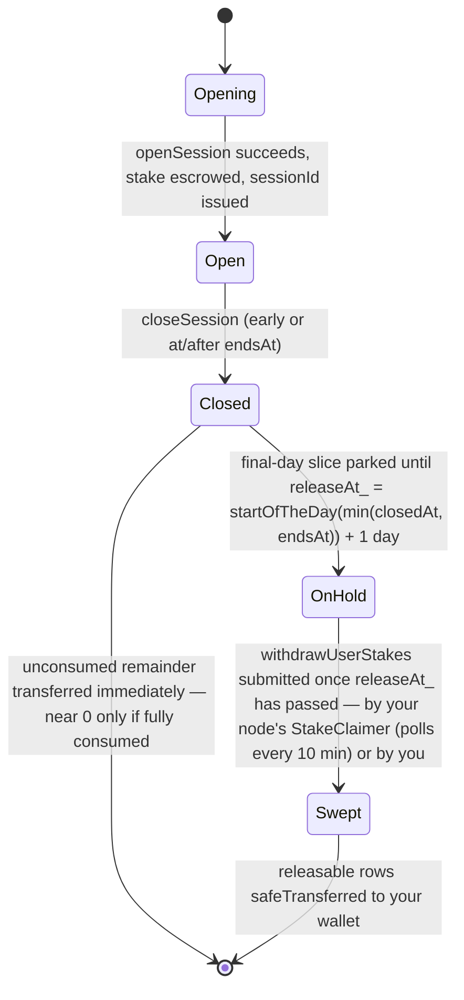

This is the most misunderstood part of Morpheus. The vast majority of "where is my MOR?" support questions resolve here. Read carefully.

<Note>
The hosted checker at [tech.mor.org/session.html](https://tech.mor.org/session.html) is useful for reading the three on-chain buckets. **For live parameter values the deployed contract on Base mainnet is authoritative**: stake minimums and the bid fee are owner-settable on chain, so this repo's deploy inputs can lag them — `config_base_mainnet.json` had to be corrected to the live values in `cef943ef`. The facet **source** in `smart-contracts/contracts/` is what this page cites for behaviour (line references throughout). If the checker page lags, refer to the deployed contract.
</Note>

## End-to-end flow



## The three places your MOR can be on chain

The Morpheus consumer node (proxy-router) does **not** custody tokens — it just calls the same Inference Contract functions you could call directly from `cast` or MetaMask. So your consumer MOR is always in exactly one of three places:

<CardGroup cols={3}>
  <Card title="1. Your wallet" icon="wallet">
    Standard ERC-20 `balanceOf(you)` on the MOR token. Anything the contract `safeTransfer`s to you during `closeSession` or `withdrawUserStakes` lands here.
  </Card>
  <Card title="2. Active session escrow" icon="hourglass-half">
    `openSession` does `transferFrom(you, InferenceContract, amount)`. While `closedAt == 0`, your stake lives inside the session record — not in your wallet, not yet in the on-hold queue.
  </Card>
  <Card title="3. On-hold queue" icon="lock">
`userStakesOnHold[user]` array. Holds `min(your remaining stake, the stake-equivalent of the seconds consumed during the **final UTC day**)` until `releaseAt = startOfTheDay(min(closedAt, endsAt)) + 1 day` — but only when the close lands **before** `releaseAt` (`SessionRouter.sol:305`). A later close skips the lock entirely and the whole remaining stake returns at close, matching the walkthrough's "if you close before that timestamp" below. Cleared automatically by the proxy-router's StakeClaimer; manual `withdrawUserStakes` is not required.
  </Card>
</CardGroup>

## Walkthrough

<Steps>
  <Step title="MOR in your wallet">
    Standard ERC-20 balance, like any token.
  </Step>
  <Step title="Approve + open">
    `openSession` does `transferFrom(you, Diamond, amount)`. The whole stake moves out of your wallet into the Inference Contract for the duration of the session. Scheduled `endsAt` comes from stake → daily stipend ÷ `pricePerSecond` (capped by max session duration).
  </Step>
  <Step title="Active">
    Until `endsAt` (or until you close early), the session is active and your stake is reserved for inference with the chosen provider.
  </Step>
  <Step title="Close — one transaction">
    Closing always happens in a single on-chain `closeSession` call — either your consumer node ~1 minute after `endsAt` (if online), or you closing early via API / UI.

    Refund math does **not** treat "late" vs "early" as a special case that skips the lock. It anchors to when the session stopped consuming compute: `sessionEnd = min(closedAt, endsAt)`.
  </Step>
  <Step title="Token state right after close">
    Inside `_rewardUserAfterClose`:

    - The contract computes `userStakeToLock_ = min(remaining stake, stipendToStake(secondsConsumedInFinalUTCDay × pricePerSecond, startOfEndDay))` (`SessionRouter.sol:306-308`) and pushes it to `userStakesOnHold` with `releaseAt = startOfTheDay(sessionEnd) + 1 day`, **if you close before that timestamp**.
    - Whatever is left — `remaining stake − userStakeToLock_` — is `safeTransfer`'d to your wallet **in the same transaction** (`:314-315`).

    <Warning>
    **The split is not "unused vs used."** The lock is sized from the final UTC day's
    consumption, converted at **close-day** pool rates (`stipendToStake`, `:408-415`) rather
    than the open-time rates that set your `endsAt`. Three consequences:

    - **What returns scales with how much of the session went unused.** `userDuration_` counts
      only the seconds actually consumed (`:306`), so the lock is roughly *fraction-consumed ×
      stake* and the `min()` clamps to your whole remaining stake only as that fraction
      approaches 1. A close at 10% of the scheduled duration returns roughly 90% of the stake
      in the close transaction. A session **left to run to `endsAt`** inside one UTC day returns
      ~nothing at close; you get that after midnight UTC instead.
    - **A multi-day session returns MORE than "unused"** — only the final day's slice is
      locked, so earlier days' consumed stake comes back immediately.
    - **A close submitted after `releaseAt` locks nothing** and returns the whole
      *remaining* stake in one transaction. "Remaining" is load-bearing for
      `directPayment: true` sessions: `_rewardUserAfterClose` subtracts the provider's
      reward — `(sessionEnd − openedAt) × pricePerSecond` — from `session.stake` before
      anything is refunded (`SessionRouter.sol:300-301`), so a direct-pay user gets the
      unconsumed part back and never the consumed part. In stake mode the provider is
      paid from `fundingAccount`, that subtraction is zero, and the entire stake does
      come back.
    </Warning>
  </Step>
  <Step title="The day-locked slice comes back on its own">
    After `releaseAt` (≈ after the end of the UTC day the session ended on) the proxy-router sweeps it automatically every 10 minutes; you may also call `withdrawUserStakes(yourAddress, iterations)` on the Diamond contract. **There is no HTTP route for this on the proxy-router today** — use `cast send`, MetaMask "Interact with contract", or your wallet's contract UI.

    ```bash
    # Mainnet; replace placeholders
    cast send 0x6aBE1d282f72B474E54527D93b979A4f64d3030a \
      "withdrawUserStakes(address,uint8)" 0xYOUR_CONSUMER_WALLET 20 \
      --rpc-url https://mainnet.base.org \
      --private-key "$PRIVATE_KEY_OF_DELEGATEE"
    ```
  </Step>
  <Step title="Done">
    Spendable MOR is back in your wallet — everything except the final UTC day's locked slice lands at close, and that slice once the day-lock expires and the proxy-router's StakeClaimer sweeps it back — no manual claim needed. It is not an "unused now, used later" split: on a multi-day session the earlier days' consumed stake is in the amount returned at close.
  </Step>
</Steps>

## Consumer capital expectation (important)

The used portion of stake is **not reusable the same UTC day**. Plan float accordingly:

- Opening many short sessions that each "use" most of their stake will park that capital until the next UTC day, when the proxy-router's StakeClaimer sweeps it back automatically. The wait is the day-lock, not a manual claim step.
- Letting sessions expire naturally does **not** free the used stake for immediate reuse — the node auto-close still day-locks it.
- Size your wallet for the **gross** stake you need in a day of concurrent / sequential sessions, not for recycling one pile of MOR many times before midnight UTC.

## How the provider gets paid (and what your stake has to do with it)

Your stake **is not** what pays the provider in real time. Inside `closeSession`:

1. The contract sets `closedAt` and marks the session inactive.
2. **`_rewardUserAfterClose`** — if the close lands before `releaseAt`, day-locks `min(remaining stake, final-UTC-day consumed slice)` in `userStakesOnHold`; otherwise the lock stays at its zero initialiser. Either way it transfers what is left immediately (`SessionRouter.sol:302-315`), which for a genuinely late close is the whole remaining stake.
3. **`_rewardProviderAfterClose`** — pays the provider for time actually used. For typical staked sessions, the payment comes from the protocol's separate **`fundingAccount` via `transferFrom`**, **not** from your stake in that same step.

The practical implication: if the protocol's funding wallet is empty or has insufficient allowance to the Inference Contract, pool-mode sessions (the default) cannot close because the provider is paid from that wallet. Direct-pay sessions (`directPayment: true`) pay the provider from the user's escrowed stake, so they can close independently of the funding account. That's a different failure mode from a stuck consumer node and is handled by the Morpheus operators, not by you. For pool-mode sessions, it can manifest as sessions sitting "active" past their `endsAt`.

## States (with the on-hold queue made explicit)



## What "recover" really means

Older docs (and even some early Morpheus discussion) used the word "recover" loosely. There is no single `recover` RPC. There are two distinct on-chain calls:

- **`closeSession`** stops the session and triggers refund logic.
- **`withdrawUserStakes`** is the *separate* claim action for day-locked balances.

If a session is genuinely stuck (e.g. pool-mode funding account empty, your consumer node offline past `endsAt`), the resolution is still a successful `closeSession`. The follow-up `withdrawUserStakes` is submitted for you by the proxy-router's StakeClaimer once the day-lock matures — you only call it yourself to take the withdrawal sooner. There is no other path on chain.

## On-chain calls (consumer, via proxy-router)

| Action | Endpoint |
|--------|----------|
| List models | `GET /blockchain/models` |
| Open session | `POST /blockchain/models/:id/session` |
| List sessions for a wallet | `GET /blockchain/sessions/user?user=0x…` |
| List session IDs only (lighter) | `GET /blockchain/sessions/user/ids?user=0x…` |
| Fetch one session | `GET /blockchain/sessions/0x…` |
| Close a session | `POST /blockchain/sessions/0x…/close` |
| Claim day-locked on-hold balance | The proxy-router automatically claims matured on-hold stakes via its internal StakeClaimer (see `proxy-router/internal/blockchainapi/stake_claimer.go`). While there is no dedicated HTTP endpoint, manual claiming via `cast send` or wallet UI is an alternative for direct contract interaction. |

See [API endpoints](/reference/api-endpoints) for full curl examples.

## Read-only wallet check (off-site)

[tech.mor.org/session.html](https://tech.mor.org/session.html) has a hosted read-only wallet checker that shows your MOR split across the three buckets (wallet / active session / on-hold). Use it whenever the wallet balance "looks wrong."

## Minimums (from the contract)

- **Consumer session open**: no MOR-denominated minimum. The only contract floor is `MIN_SESSION_DURATION = 5 minutes` (`SessionStorage.sol:34`, enforced at `SessionRouter.sol:147`); the MOR required is derived from the bid price and the pool's stipend rate.
- **Bid price floor**: `10000000000` wei/sec on Base mainnet (`0.00000001` MOR/sec); on Base Sepolia read `getMinMaxBidPricePerSecond()` for the live floor — `121052630917` wei/sec as of 2026-08-27. Owner-settable.
- **Provider stake**: `0.2` MOR on Base mainnet (live on-chain; `0.2` on Sepolia). There is no subnet tier: a single `providerMinimumStake` applies to every provider.

These are governance-controlled and can change; check [Networks and tokens](/get-started/networks-and-tokens) and the [release notes](https://github.com/MorpheusAIs/Morpheus-Lumerin-Node/releases).
