# Inference Contract Enhancements: Contractor RFP

**Product:** Morpheus Lumerin Node, Inference Diamond (BASE)  
**Repository:** [`smart-contracts/`](../)  
**Status:** Draft for contractor scoping  
**Last updated:** 2026-06-16 20:44 UTC  
**Audience:** Smart contract engineering contractor, Morpheus protocol team

---

## 1. Purpose

This document is a scoping brief for a smart contract contractor. It consolidates a review of the current Inference Diamond facets (`ModelRegistry`, `Marketplace`, `ProviderRegistry`, `SessionRouter`) and the changes we want made, aimed at user-facing simplification, marketplace integrity, and developer experience.

### 1.1 Problem statement summary

These are the seven deficiencies in the contract today that motivate everything below. Each is contract-verified against the current facets; the right-hand column points to where it is addressed.

| # | Problem (today's behavior) | Addressed in |
|---|----------------------------|--------------|
| P1 | **Model identity is per-owner, not global.** `modelId = keccak256(owner, baseModelId)`, so two parties can both register `"glm-5.1"` as unrelated models, causing naming collisions, sprawl, and impersonation. | §3.1 |
| P2 | **No global name idempotency or curation.** `modelRegister` is open to anyone and never checks existing names; the catalog accumulates duplicate, garbage, and abandoned listings. | §3.1 |
| P3 | **Dead/unused mechanisms.** `Model.fee` is never read in settlement; the per-model creation stake protects nothing. | §3.1, §2 (F4) |
| P4 | **Direct-pay vs staking is opaque.** The two modes are structurally identical except for who pays the provider, but a consumer cannot see what a given stake actually buys (duration / price). | §3.4 |
| P5 | **Early close strands MOR.** A slice of stake is parked in `userStakesOnHold[]` behind a 1-day lock and needs a second `withdrawUserStakes` transaction; funding-account shortfalls can revert the whole close, together requiring an external recovery job. | §3.4 |
| P6 | **Read queries are fragmented.** A complete model-market or session view needs multiple chain calls. | §3.6 (and §3.1 catalog reads) |
| P7 | **Provider reward limiter.** Earnings are capped to staked amount on a 365-day reset (`PROVIDER_REWARD_LIMITER_PERIOD`), constraining honest providers and widely misunderstood. | §3.4 + §3.3 |

**How this document is organized.** Changes are grouped by the facet or function they touch, so each section can be reasoned about and matured end-to-end rather than scattered across delivery phases. Within a section, related changes are grouped together, and each carries a priority (High / Med / Low) as metadata; priority does not drive ordering. Open questions live inline as Discussion items in the section they belong to. There is intentionally no phased delivery plan; sequencing is a contracting decision, not a design one.

### 1.2 Canonical code references

| Facet | Path |
|-------|------|
| ModelRegistry | [`contracts/diamond/facets/ModelRegistry.sol`](../contracts/diamond/facets/ModelRegistry.sol) |
| Marketplace | [`contracts/diamond/facets/Marketplace.sol`](../contracts/diamond/facets/Marketplace.sol) |
| ProviderRegistry | [`contracts/diamond/facets/ProviderRegistry.sol`](../contracts/diamond/facets/ProviderRegistry.sol) |
| SessionRouter | [`contracts/diamond/facets/SessionRouter.sol`](../contracts/diamond/facets/SessionRouter.sol) |
| Model struct | [`contracts/interfaces/storage/IModelStorage.sol`](../contracts/interfaces/storage/IModelStorage.sol) |
| Session struct | [`contracts/interfaces/storage/ISessionStorage.sol`](../contracts/interfaces/storage/ISessionStorage.sol) |
| Model metadata schema | [`docs/schemas/morpheus.model.v1.schema.json`](schemas/morpheus.model.v1.schema.json) |
| _new_ QueryFacet (read-only) | proposed (§3.6) |
| _new_ Delegation/custody | proposed (§3.5) |

### 1.3 Related product docs (behavior today)

- [Session states (open, close, claim)](../../docs/ai/session-states-open-close-recover.mdx)
- [Why is my MOR locked?](../../docs/ai/why-locked-in-contract.mdx)
- [Tokens and fees](../../docs/concepts/tokens-and-fees.mdx)
- [Rewards and economics](../../docs/concepts/rewards-and-economics.mdx)

---

## 2. Guiding principles (non-functional requirements)

These are the *fundamentals that govern the whole contract*. Every change must conform; where a change conflicts, these win. They are acceptance gates, not a work item.

### F1: Additive, non-breaking upgrades (no flag-day)

The Inference Contract is upgradeable, but every change should ship as additive functionality so deploying an upgrade does not force a synchronized, wholesale release of the proxy-router, API gateway, and app.

- Preserve existing external function signatures, event shapes, and storage slots (append-only storage; Diamond storage discipline). Never repurpose a slot.
- New behavior ships as new functions or new facets; existing call paths keep working until clients opt in.
- Where behavior must change in place, it must be interface-compatible (same ABI, no client change) and economically safe.
- Every change declares a **compatibility class**:
  - `Additive`: new surface only.
  - `In-place compatible`: behavior change, identical ABI/storage, no client change.
  - `Breaking`: requires a coordinated client release; avoid, and isolate it. The only accepted breaking change is the model-registry overhaul (§3.1.1–§3.1.3), which is landed as a single coordinated cutover via the §3.1.5 migration; the individual `Breaking` labels in §3.1 all refer to that one migration.

> **Authoring convention.** Each change is written as intent, diagram, numbered requirements, verifiable acceptance criteria, then compatibility class, with a priority tag. Acceptance criteria must be demonstrable by a contractor and verifiable by a reviewer on the returned code. Prefer diagrams and pseudocode over Solidity; include code only where a signature is load-bearing (e.g. read-facet return shapes).

### F2: No human in the loop for value-bearing functions (bus-factor)

The marketplace must keep settling and releasing funds even if every privileged key disappears. These must be permissionless and always callable, never gated on an owner/operator key:

- `openSession`, `closeSession`, `claimForProvider`, `withdrawUserStakes`
- `providerDeregister` + stake withdrawal, `modelDeregister` + stake withdrawal (where stake exists)
- `postModelBid`, `deleteModelBid`

Worst case if all privileged keys are lost: no new models can be listed, but existing sessions settle, stakes withdraw, providers get paid, consumers get refunds. Frozen funds are not acceptable; a frozen catalog is.

> **Test:** for every privileged (`onlyOwner` / `onlyOperator`) function, confirm that losing that key cannot strand user or provider funds.

### F3: Two-tier governance (owner multisig + delegable operator)

| Tier | Who | Scope |
|------|-----|-------|
| **Owner** | Protocol multisig (currently 7 wallets) | High-impact: facet upgrades, set/rotate operator, fee bounds, capability/feature schema, pool config, emergency disable of non-fund paths |
| **Operator** | Delegated wallet: EOA or (ideally) 2/3 multisig | Routine ops: add/update/deprecate/retire models, manage capabilities/features (within owner schema). The provider fee rate and destination are owner-set (§3.4.5). |

- Owner can grant and revoke the operator role at any time, bounding the blast radius if an operator key is compromised.
- Operator can never move user/provider funds or touch custody logic (F2).
- When the operator is a multisig, CI/CD automation holds only a proposer seat: it submits register/update transactions for the operator quorum to sign and execute, and cannot unilaterally change state (see §3.1's "how a new model is born"). This keeps the always-on CI key from being a single point of compromise.
- Balances speed (operator handles day-to-day catalog/param changes) and security (owner multisig holds the keys to the kingdom).

### F4: Remove unnecessary / unused mechanisms

Challenge every staking/fee mechanism: does it earn its keep?

- `Model.fee` field: unused today. Remove (§3.1.3). Royalties, if ever wanted, go through the §3.4.5 fee destination.
- Per-model creation stake: with a curated registry (§3.1) it protects nothing. Remove it.
- Provider stake: kept only as a nominal anti-bot bond (§3.3.1). Earning is not tied to or capped by stake; the 365-day reward limiter is removed (§3.4.4).
- Dead reward-limiter fields (`limitPeriodEnd`, `limitPeriodEarned`, `PROVIDER_REWARD_LIMITER_PERIOD`): remove or leave dormant per a storage-layout note.

### F5: Threat model: "if MOR were a high-value token, how do bad actors game / stall / rug it?"

Address each vector explicitly (mitigation or accepted risk):

| Vector | Concern | Mitigation direction |
|--------|---------|----------------------|
| **Emission farming (self-dealing)** | A colluding consumer+provider open self-dealt sessions to capture a larger share of the daily emission budget | Accepted risk (economic): total issuance is bounded by global `getTodaysBudget`; capturing share requires staking large MOR, which drives demand/price up and makes honest holding dominate draining (§3.4.4). No per-provider cap, no token gate. Direct-pay touches no treasury. |
| **Intra-day stake recycling** | Open + early-close repeatedly to reuse the same stake and over-draw the daily stipend | Not a cheaper amplifier: emissions flow per elapsed wall-clock second and one stake backs one open session, so total per stake/day is bounded by time × price regardless of close path. Natural-close chaining already recycles stipend penalty-free, so the early-close lock blocks nothing extra (§3.4.3). |
| **Fee path brick** | Misconfigured fee destination blocks `closeSession` | Fee path must skip (not revert) if `feeDestination` unset or rate 0; full reward goes to the provider (F2, §3.4.5). |
| **Stranded user stake** | Early-close lock + funding-revert leave MOR "stuck" needing external recovery | Return user funds in-tx or auto-sweep on release; decouple provider payment (§3.4.3). |
| **Operator key compromise** | Rogue operator corrupts catalog or params | Owner revokes; operator cannot touch funds; param bounds enforced on-chain. |
| **Name squatting / sprawl** | Garbage or impersonating model names | Curated registry + normalized name keys anchored to upstream sources (§3.1). |
| **Gas griefing** | Unbounded arrays (`userStakesOnHold`) make functions uncallable | Pagination + bounded iteration (§3.4.3, §3.7.1). |
| **Allowance/funding griefing** | `fundingAccount` allowance drained/revoked stalls staked closes | Operational monitoring; direct-pay path independent of funding account. |

### F6: Prefer on-chain; minimize off-chain dependencies

The functional protocol layer is contract + maintained CI/CD + operator key. Keep these from drifting out of joint by pushing logic and data into the contract wherever it reasonably can live there, rather than leaning on off-chain services.

- The chain is the source of truth for model identity and its descriptive metadata (name, capability, features, tags, limits); see §3.1.2. No off-chain store is the canonical record an app must trust.
- Off-chain dependencies are acceptable only where on-chain is impractical (e.g. the GitHub review + CI validation that gates model registration, §3.1.1), and even then the result is committed on-chain by the operator key.
- When a contractor proposes putting something off-chain, the default question is "can this live in the contract?" If yes and gas-reasonable, it should.
- Caveat: this is a preference, not absolutism. Don't put unbounded or rapidly-churning blobs on-chain where it creates gas/griefing risk (F5); structured, queryable fields belong on-chain.

---

## 3. Requested changes: grouped by facet

Each subsection matures one facet/function end-to-end. Where a concern spans facets (custody/delegation, read views), it gets its own clearly-named section.

| Section | Facet / function | Changes (priority) |
|---------|------------------|--------------------|
| §3.1 | **ModelRegistry**: canonical catalog | Identity & naming (H), vocabulary (M), curated registration + remove model stake/`fee` (M), catalog reads (M), migration (H) |
| §3.2 | **Marketplace**: bidding | Update bid price without repost (M) |
| §3.3 | **ProviderRegistry**: provider identity & bond | Nominal 10 MOR bond (H), endpoint update + bounds (M/L) |
| §3.4 | **SessionRouter**: sessions, settlement & rewards | Quote (H), direct-pay semantics (H), close & stranded-MOR (H), remove limiter / session-based rewards (H), provider fee (H), earnings view (M) |
| §3.5 | **Custody & delegation** (cross-facet) | Consumer cold/hot staking, Many:1 + own-funds (M), provider payout steering (M), privacy/masking (L) |
| §3.6 | **Read / Query facet** | Enriched session/bid/model views (H) |
| §3.7 | **Storage hygiene & future** | Storage hygiene (L), veracity hook (L), rating outcomes (L) |

---

## 3.1 ModelRegistry facet: canonical model catalog

**Facet intent.** Replace per-owner, free-for-all model registration with a curated canonical catalog: globally unique identity, normalized names anchored to what already exists in the wider AI ecosystem (no squatting/sprawl), a typed capability plus boolean feature flags plus free-form discovery tags, and rich on-chain descriptive metadata (§3.1.2, F6). Providers bid on catalog models; they do not unilaterally mint catalog entries, but they can propose them (see the story below and §3.2/§3.3).

### How a new model is born: end-to-end story

**Today (the problem).** Anyone can call `modelRegister` with any name. `modelId` is `keccak256(owner, baseModelId)`, so the same human-readable name can exist many times under different owners, with no curation, no shared vocabulary, and no guarantee the name maps to a real model. The result is overlap, naming conflicts, impersonation, and sprawl (P1, P2).

**Future (the end state).** A model becomes listable through a reviewed, automated pipeline, so no single human is a bottleneck and no random wallet can pollute the catalog:

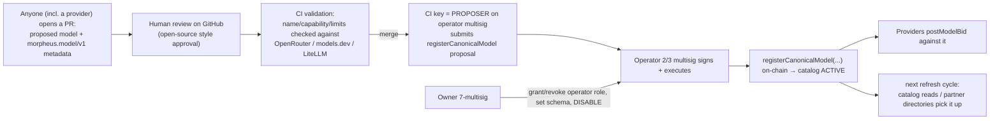

1. **Propose.** Anyone, including a provider who wants to serve a model that isn't listed yet, opens a PR adding the model and its `morpheus.model/v1` metadata (capability, features, limits, upstream id).
2. **Review.** Maintainers review the PR like any open-source contribution (is it real, named correctly, capability/limits sane?).
3. **Validate (CI).** CI cross-checks the proposed name, capability, and capacity (context/output limits) against external canonical sources (§3.1.1) so Morpheus names line up with the rest of the world.
4. **Propose on-chain (CI).** On merge, the CI/CD wallet, which holds the operator role only as a proposer when the operator is a multisig, submits the `registerCanonicalModel` (or batch) transaction to the operator multisig and stops there. The CI run ends with a proposal, never a unilateral state change. (If the owner has instead delegated the operator role to a single EOA/CI key, that key registers directly and the multisig step collapses to one signer.)
5. **Sign & execute (operator multisig).** The operator 2/3 multisig reviews and signs the proposal; execution writes `registerCanonicalModel` on-chain and the catalog entry becomes ACTIVE. Splitting propose (automated, low-trust CI key) from execute (human-quorum multisig) keeps the CI key from being a single point of compromise (F3).
6. **Publish & bid.** On the next refresh cycle, downstream directories (the on-chain catalog reads in §3.1.4, `active.mor.org`, partner/helper sites) pick up the new `canonicalModelId` from the emitted event; providers post bids against it (§3.2) and consumers open sessions against bids.

This keeps creation open to contribution but gated for consistency: the chain is the source of truth for "what model is this," curation can't strand funds (F2), and the owner can revoke the operator/CI key instantly if it misbehaves (F3). The subsections below (3.1.1–3.1.5) each support this end state.

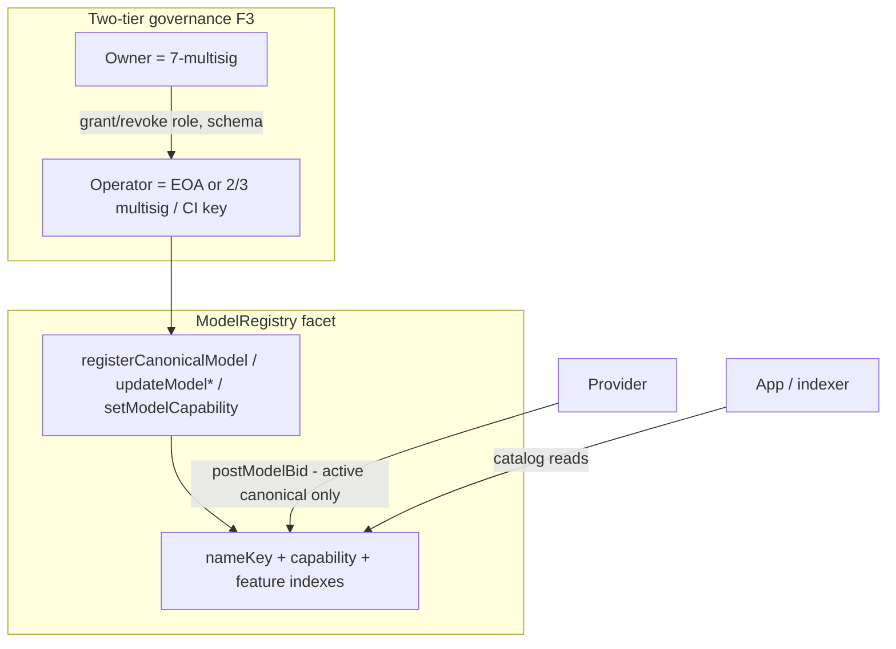

**Roles (summary; full definition in [F3](#f3-two-tier-governance-owner-multisig--delegable-operator)).** AccessControl with `MODEL_OPERATOR_ROLE = keccak256("model.operator")`; `DEFAULT_ADMIN_ROLE` (owner) grants/revokes it. When the operator is a multisig (the recommended shape), the CI/CD wallet is a proposer on that multisig: a reviewed PR merge ends by submitting the register/update transaction for the operator quorum to sign and execute, and the CI key never changes state on its own. When the owner instead delegates to a single EOA/CI key, that key registers directly. Either way, registry writes are curation only, never custody (F2).

### 3.1.1 Canonical identity & naming (Priority: High)

**Intent.** Give every model a global immutable `canonicalModelId` plus a normalized, deduplicated name key, anchored where possible to an existing upstream model id, so the chain is the source of truth for "what model is this" and the same name can't be squatted by two owners.

> **Scope split (read this first).** This section spans two workstreams. The Solidity/smart-contract contractor owns only the on-chain identity primitives (ID-R1 to ID-R5 plus their ACs). The upstream-anchoring work below is CI/CD scope, delivered after or around the contract, and is not a Solidity deliverable; it is included here only as context for why the on-chain shape is what it is.
>
> | Concern | Owner | Where |
> |---------|-------|-------|
> | `canonicalModelId` derivation, `modelNameKey` pure fn + on-chain guards, `modelIdByNameKey` uniqueness, immutability, alias | Contract (this RFP) | ID-R1 to ID-R5, AC-ID-* |
> | The shared name-normalization reference implementation (heavy NFKC + casefold) that produces the normalized string the contract hashes | CI/CD + client libs | ID-R2 note |
> | Choosing/fetching/diffing upstream sources (models.dev / OpenRouter / LiteLLM), validating name/capability/limits, populating the `upstream` metadata field | CI/CD (post-contract) | "Upstream anchoring" below + §3.1.3 |

**Upstream anchoring (CI/CD scope; informative, not a Solidity deliverable).** Morpheus is not inventing new models; it lists models that already exist in the wider ecosystem, occasionally adding Morpheus-specific variants via suffixes (e.g. `:tee`, `:thinking`, `:non-thinking`). Anchoring canonical names to an upstream source makes downstream matching (pricing, capability, comparison) reliable. Practical upstream sources (from current research):

| Source | Strength | Use |
|--------|----------|-----|
| **models.dev** (`/api.json`) | Cleanest capability + limits schema (reasoning, tool_call, vision, modalities, knowledge cutoff, context/output, cost, open_weights) | Recommended primary: capability + capacity anchor |
| **OpenRouter** (`/api/v1/models`, no auth) | Open + closed models with pricing, context, modality, capability flags | Secondary: pricing + comparison anchor |
| **LiteLLM** (`model_prices_and_context_window.json`, MIT) | ~2800 entries, feature flags (vision, function calling), deprecation | Broad coverage fallback |

**Recommended upstream policy (resolved, CI/CD scope).** Use a layered anchor: models.dev as the primary source of truth for capability and capacity (its schema is the cleanest), OpenRouter for pricing/competitor comparison, and LiteLLM as a broad-coverage fallback when a model is missing from the first two. This validation runs off-chain in CI (step 3 of the story); the contract stays source-agnostic and never calls or verifies an upstream registry. The only on-chain trace is the free-form `upstream` id recorded in the model metadata (`upstream` in [`morpheus.model.v1`](schemas/morpheus.model.v1.schema.json)). The fetch/diff/version-pin logic is out of scope for the Solidity contractor (see §3.1.3's CI/CD callout).

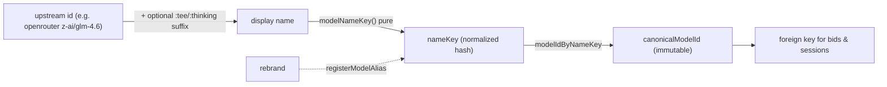

**`canonicalModelId` scheme (resolved).** Today the client supplies a random GUID as `baseModelId_` and the contract derives `modelId = keccak256(owner, baseModelId)`, so identity is per-owner and effectively random, which is the root of P1 (two owners, same name, different ids). The recommendation is to make identity deterministic from the normalized name and independent of `msg.sender`: `canonicalModelId = keccak256("morpheus.model.v1/" + nameKey)`. This makes the id reproducible (anyone can compute it from the name), makes duplicate registration structurally impossible (same name gives the same id, so register reverts on collision, ID-R3), and removes the random-GUID step entirely. A sequential counter is the alternative (simpler ordering, but not reproducible off-chain from the name; see discussion).

**Requirements** (all ID-R* are contract scope, the Solidity contractor's deliverables)
- **ID-R1 [contract]** Immutable `canonicalModelId` per model, derived as `keccak256("morpheus.model.v1/" + nameKey)`: deterministic from the normalized name, not from `msg.sender` and not a random GUID. Replaces the legacy `getModelId(owner, baseModelId)` derivation.
- **ID-R2 (Unicode from the start) [contract + one CI/client dependency]** The contract exposes a pure `modelNameKey(normalizedName) → bytes32` that computes `keccak256` over the supplied already-normalized UTF-8 bytes and enforces light on-chain guards (non-empty, length bound, character-class bound), preserving `:` and `/` (suffixes like `glm-4.6:tee`, HuggingFace-style `qwen3:8b`, vendor paths like `z-ai/glm-4.6`) and reverting empty-after-normalize; it also records the normalization spec version so keys can't silently change. The heavy normalization itself (Unicode NFKC + case folding, whitespace trim/collapse, mapping Unicode hyphens/dashes to ASCII `-`) is not gas-reasonable in Solidity and is therefore produced by a shared, versioned reference implementation owned by CI/client libs (the one off-chain dependency that must agree exactly). The Solidity contractor's obligation is to (a) hash and guard the normalized bytes and (b) pass a published test-vector file that the reference implementation also passes (the conformance oracle).
- **ID-R3 [contract]** `modelIdByNameKey[nameKey]` enforces one active listing per normalized name (reject duplicate on register).
- **ID-R4 [contract]** `displayName` mutable (registrar); `nameKey` and `canonicalModelId` immutable once registered.
- **ID-R5 [contract]** Optional `registerModelAlias(nameKey, canonicalModelId)` so rebrands redirect old names without breaking existing bids (subsumes the old "name to id reverse index" idea).

**Acceptance criteria**
- [ ] **AC-ID-1** `modelNameKey` matches a published Unicode test-vector file (including `GLM-4.6` == `glm 4.6`; NFKC/casefold cases such as full-width/accented forms folding to the same key; `glm-4.6:tee` and `qwen3:8b` preserve `:`; `z-ai/glm-4.6` preserves `/`; empty-after-normalize reverts).
- [ ] **AC-ID-2** Registering a second model whose name normalizes to an existing `nameKey` reverts.
- [ ] **AC-ID-3** `canonicalModelId` and `nameKey` cannot be mutated after creation; `canonicalModelId` equals `keccak256("morpheus.model.v1/" + nameKey)` for the registered name.
- [ ] **AC-ID-4** Alias redirects resolve to the canonical id via `resolveModelIdByName`.

> **Discussion items**
> - `canonicalModelId`: confirm the name-derived hash (recommended, reproducible and dedup-by-construction) vs a sequential counter (simpler ordering, not reproducible from the name off-chain).
> - Normalization reference implementation: where it lives and how its version is pinned across clients/CI (this is the only "must agree exactly" off-chain dependency).

**Compatibility class:** `Breaking` (model identity changes; ships with the §3.1.5 migration).

### 3.1.2 Vocabulary: capability (type), features, tags (Priority: Med)

**Intent.** Keep this deliberately simple and stop overloading `string[] tags`. Three distinct concepts, only two of which are governed:

- **capability**: the model TYPE. Exactly one, from a small governed enum. Drives routing/filtering. Governed.
- **featureFlags**: boolean capabilities the contract/router may branch on (e.g. TEE). A governed bitmask. Governed.
- **tags**: free-form discovery labels for humans/UX. Not governed and not used for any contract branching. Leaving them free-form costs nothing because nothing on-chain depends on them, and registration is already curated (§3.1.3), so sprawl is contained by PR review rather than an on-chain registry.

**Where the metadata lives: on-chain (F6).** The data that describes a `canonicalModelId` lives on-chain so the chain alone answers "what is this model," and apps don't have to trust an off-chain store. The current `Model` struct already keeps `name` and `tags` on-chain; we extend that pattern to the descriptive metadata below. How it's stored (discrete typed fields vs a single schema-versioned JSON string) is an open design choice (VOCAB-R4) with a lean toward the JSON string for downstream flexibility. The existing `ipfsCID` field is left untouched for backward-compatibility (F1), but no new field in these changes depends on it; it is not part of this design.

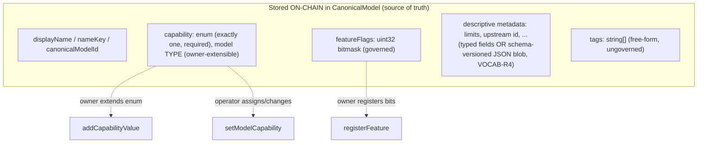

**Requirements**
- **VOCAB-R1 (capability = type)** `enum ModelCapability { UNKNOWN, LLM, EMBEDDING, STT, TTS, IMAGE, VIDEO, MULTIMODAL }`; `UNKNOWN` rejected on register. The set is owner-extensible at runtime via `addCapabilityValue`, so adding future types (e.g. `RERANK`, `MODERATION`) needs no contract upgrade; that is exactly why capability is a governed registry, not a hard-coded list. Operator assigns/changes a model's value via `setModelCapability`, a single call emitting `ModelCapabilityChanged`.
- **VOCAB-R2 (features)** `uint32 featureFlags` with owner-registered bits (`FEATURE_TEE_REQUIRED`, `FEATURE_TEE_OPTIONAL`, `FEATURE_TOOL_CALLING`, `FEATURE_VISION`, `FEATURE_REASONING`, `FEATURE_STREAMING_ONLY`, and so on) plus pure `hasFeature(flags, bit)`. Owner-only `registerFeature(bit, name)`. Morpheus suffixes that change routing (e.g. `:tee`) must be reflected as the corresponding feature bit.
- **VOCAB-R3 (tags)** `string[] tags` stored as-is on-chain, free-form (confirmed acceptable for v1): no on-chain tag registry and no validation beyond a max count plus per-tag length bound (anti-griefing, §3.1.3 REG-R8). Tags are advisory metadata only.
- **VOCAB-R4 (on-chain descriptive metadata, F6; storage shape is an open choice)** Store `displayName`, `capability`, `featureFlags`, `tags`, and the richer descriptive metadata (`limits` such as `contextWindow`/`maxOutputTokens`, the matched `upstream` id, etc.) on-chain in the extended `CanonicalModel` (operator-writable), conformant to and version-locked against [`morpheus.model.v1`](schemas/morpheus.model.v1.schema.json) (§3.1.3 REG-R9). The contractor chooses one of two storage shapes for the descriptive block (identity, capability, and featureFlags stay typed regardless, since the contract branches on them):

  | Shape | Pros | Cons |
  |-------|------|------|
  | Discrete typed fields | Cheapest reads; directly queryable on-chain; type-safe | Hard to evolve: adding/changing a field is a struct/storage change (upgrade + layout care) |
  | Single schema-versioned JSON string (leaning) | Evolves with `schemaVersion` and no storage-layout change; clients already parse JSON; one slot | Slightly higher storage/gas; not directly filterable on-chain (fine, since filtering is by capability/feature, which stay typed) |

  Lean: the JSON string blob keyed by `schemaVersion`, because anything in it can be re-shaped later just by bumping the accepted schema version (REG-R9), whereas discrete contract fields are awkward to adjust downstream. Capability and featureFlags remain typed because the contract itself branches on them.
- **VOCAB-R5** `postModelBid` (§3.2) must reference a model with `lifecycle == ACTIVE` and `capability != UNKNOWN`.

> **Note (legacy `"tee"` tag).** We do not need an on-chain "tag to feature" migration mapping. Because the catalog is re-seeded under curation (§3.1.5), the operator simply sets `FEATURE_TEE_REQUIRED` at seed time, and the proxy-router reads the feature bit. During the brief transition the router may read either the bit or the legacy tag; this is handled in seeding/proxy-router, not in the contract.

**Acceptance criteria**
- [ ] **AC-VOCAB-1** Register with `UNKNOWN` reverts; exactly one capability per model.
- [ ] **AC-VOCAB-2** `setModelCapability` changes capability in one operator call plus event; changing a model with active bids is allowed but loud.
- [ ] **AC-VOCAB-3** `featureFlags` accept registered bits only; `hasFeature` matches test vectors.
- [ ] **AC-VOCAB-4** Free-form tags stored/returned unchanged; only max-count and max-length bounds enforced.
- [ ] **AC-VOCAB-5** A client can read a model's complete descriptive metadata (name, capability, features, tags, limits, upstream) from chain alone, with no off-chain fetch required.

> **Discussion items**
> - Capability storage shape (VOCAB-R4): confirm the schema-versioned JSON string (leaning, easiest to evolve) vs discrete typed fields. Identity/capability/featureFlags stay typed either way.

**Compatibility class:** `Breaking` (extends the `Model` struct, part of §3.1.5); the `hasFeature`/`modelNameKey` pure helpers are `Additive`.

### 3.1.3 Curated registration & governance (Priority: Med)

**Intent.** Only operator/owner roles create or modify catalog entries; public `modelRegister` is closed. Removes metadata-squatting (wrong listings are corrected, not fought over), and removes the now-pointless per-model stake and the dead `Model.fee` field ([F4](#f4-remove-unnecessary--unused-mechanisms)). This is the on-chain landing point for the "how a model is born" pipeline above.

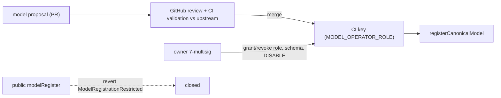

This is full CRUD for the catalog, operator-driven: **C**reate (register), **R**ead (§3.1.4), **U**pdate (correct metadata/capability without changing identity), **D**elete (retire dead entries).

**Requirements**
- **REG-R1 (Create)** Operator: `registerCanonicalModel`; owner: `addCapabilityValue`/`registerFeature` (schema).
- **REG-R2 (Update, correct without re-identifying)** Operator: `updateModelMetadata` (displayName / featureFlags / tags / limits / upstream) and `setModelCapability`. These let us fix mistakes (a mis-name, wrong capability, bad tag) without changing `canonicalModelId` or `nameKey`, so existing bids and in-flight sessions are never disturbed. `nameKey`/`canonicalModelId` remain immutable (rename surfaces via `displayName` + `registerModelAlias`, §3.1.1 ID-R5).
- **REG-R3 (Delete, retire)** Operator `retireModel(modelId)` for models that are obsolete/irrelevant: allowed only when the model has no active bids and no open sessions (else revert with a named error, F2). Retiring removes it from active listings; keep a tombstone (lifecycle `RETIRED`) so historical ids still resolve for closed-session lookups. Owner may force-`RETIRE` in emergencies.
- **REG-R4 (lifecycle)** `enum ModelLifecycle { ACTIVE, DEPRECATED, DISABLED, RETIRED }`. DEPRECATED rejects new bids; DISABLED rejects new sessions (emergency, owner-only); RETIRED is removed from active listings (REG-R3). `setModelLifecycle` ACTIVE/DEPRECATED is operator; DISABLED/RETIRED is owner-or-operator per above.
- **REG-R5 (bulk / batch operations)** The contract provides bounded batch variants `batchRegisterCanonicalModels([...])` and `batchUpdateModelMetadata([...])` so the initial seed (§3.1.5) and multi-model proposals land in one transaction instead of N. Bound the batch size (e.g. within 50/tx) to avoid block-gas/griefing limits (F5); each item is validated independently; default semantics are atomic revert on any invalid item (simplest, deterministic). How batches are assembled, chunked, retried, and proposed is CI/CD scope (out of scope for the contract); the contract only guarantees the bounded, atomic batch entrypoints exist.
- **REG-R6 (close public register)** `modelRegister(modelOwner_, baseModelId_, …)` reverts `ModelRegistrationRestricted()`; remove the legacy per-owner `DELEGATION_RULES_MODEL` write path for the public.
- **REG-R7 (remove model stake + `Model.fee`; no registration fee)** Delete the per-model creation stake and the unused `Model.fee` field. There is no model registration fee (confirmed): registration is gated by curation (the PR/CI/operator pipeline), not by payment, so spam is contained by review rather than a toll. Never reintroduce a per-provider model stake. This is the single home for the "unused fee field" cleanup.
- **REG-R8 (input bounds)** Enforce on new writes only (existing records grandfathered): max `name` length (e.g. 64 bytes), reject empty name; max tag count plus per-tag length; reject with named errors. Endpoint bounds live in §3.3.2.
- **REG-R9 (schema version-lock)** Store the accepted metadata `schemaVersion` (e.g. `morpheus.model/v1`) on-chain so the on-chain field layout is bound to a known, owner-governed version of [`morpheus.model.v1`](schemas/morpheus.model.v1.schema.json); reject writes that don't conform to an accepted version. Owner governs which schema versions are accepted.

**Registry-specific anti-rug** (general threat model in [F5](#f5-threat-model-if-mor-were-a-high-value-token-how-do-bad-actors-game--stall--rug-it)): operator key compromise is handled by owner revoke (catalog-only, never funds); a malicious capability flip emits a loud event plus an optional owner-guard when open sessions exist; a catalog freeze (keys lost) is an accepted degraded mode where the market keeps settling (F2). "DB-admin vs DAO" balance: curated enough to stop sprawl, decentralized enough that no single human can rug/freeze (owner can replace the operator instantly; all changes emit events; catalog reconstructable from chain alone); progressively decentralizable (ops, then committee multisig, then DAO) with no rewrite.

**Acceptance criteria**
- [ ] **AC-REG-1** Only operator/owner create/update entries; public `modelRegister` reverts `ModelRegistrationRestricted`.
- [ ] **AC-REG-2** `updateModelMetadata`/`setModelCapability` correct a mis-named or mis-capability'd model without changing its `canonicalModelId`/`nameKey`; existing bids/sessions remain valid (regression).
- [ ] **AC-REG-3** `retireModel` succeeds for a model with no active bids/sessions and removes it from active listings; reverts (named error) if active bids/sessions exist; retired ids still resolve for closed-session lookups.
- [ ] **AC-REG-4** DEPRECATED rejects new bids; DISABLED rejects new sessions; DISABLED/RETIRED follow the role rules in REG-R4.
- [ ] **AC-REG-5** `batchRegisterCanonicalModels`/`batchUpdateModelMetadata` write multiple models in one tx, enforce the size bound, and validate each item; any invalid item reverts the whole batch (atomic).
- [ ] **AC-REG-6** Owner can grant/revoke the operator role; a revoked operator can no longer write.
- [ ] **AC-REG-7** No model stake or `Model.fee` remains; bus-factor test: with all admin keys gone, bids/sessions/withdrawals still work (F2).
- [ ] **AC-REG-8** Name/tag bounds enforced on new writes with named errors; existing records grandfathered.
- [ ] **AC-REG-9** A write whose metadata doesn't conform to an accepted `schemaVersion` reverts; the accepted version set is owner-governed.

**Resolved decisions.** Operator shape: the CI key is a proposer on a 2/3 operator multisig (CI proposes; the human quorum signs and executes, per the §3.1 story, F3). No model registration fee (REG-R7). Batch entrypoints are atomic (REG-R5).

> **What is CI/CD scope (out of contract scope).** The contract surface ends at the operator-gated entrypoints (`registerCanonicalModel`, `updateModelMetadata`, `setModelCapability`, `setModelLifecycle`, the batch variants). Everything around how proposals are produced and applied lives in CI/CD and is not part of this contract work: PR linting; fetching/diffing/version-pinning the upstream sources (§3.1.1); validating name/capability/limits against them; assembling and chunking batches (REG-R5); submitting the multisig proposal; and refreshing downstream directories after execution. This RFP only requires the contract to expose the bounded, role-gated entrypoints those jobs call.

**Compatibility class:** `Breaking` (closes public `modelRegister`, removes model stake; coordinate via §3.1.5). Role management and input bounds are `Additive`/`In-place compatible`.

### 3.1.4 Catalog reads (Priority: Med)

**Intent.** One on-chain source of truth for the model picker (resolve a name, list by capability/feature, get a market summary) without 4+ RPC round-trips. This is also how the `canonicalModelId` gets published so providers know what to bid on: registration emits `CanonicalModelRegistered(modelId, nameKey, displayName, capability)`, and these reads let any site (app, `active.mor.org`, a provider's own tooling) surface the id and its metadata directly from chain. Generic enriched session/bid joins live in §3.6; these are catalog-specific.

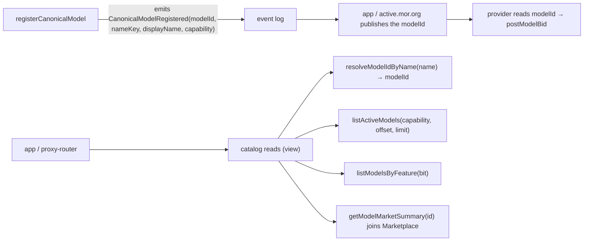

**Requirements**
- **CAT-R1** View-only catalog reads: `modelNameKey`, `resolveModelIdByName` (nameKey + aliases) returning `canonicalModelId`, `getCanonicalModel` (full on-chain metadata), `listActiveModels(capability, …)`, `listModelsByFeature`, `getCapabilityLabel`, `getFeature`, `getModelMarketSummary` (model + active bid count + min price).
- **CAT-R2** All list functions paginated (reuse the existing `Paginator`); read only from existing/registry storage.
- **CAT-R3 (publish the id)** Registration emits `CanonicalModelRegistered(modelId, nameKey, displayName, capability)` so off-chain sites can index and publish the `canonicalModelId` for providers to bid against; `resolveModelIdByName(name)` gives the same id on-chain for tooling that prefers a direct lookup.
- **CAT-R4 (sort options; default newest-first)** Paginated listings accept an optional sort parameter with a deterministic default. Supported orders: by creation date (`createdAt`, ascending or descending) and alphabetical by canonical human-readable name (`displayName`/`nameKey`, ascending or descending). The default is creation date, descending (newest first), the common "what's new to bid on or pick" view, so a caller that passes nothing still gets a useful page without client-side sorting. `createdAt` already exists; expose an index ordered by it, plus a name-ordered index for the alphabetical option. A capability/feature filter still applies within the chosen order.

**Acceptance criteria**
- [ ] **AC-CAT-1** All catalog reads are `view`; pagination respects `Paginator` semantics.
- [ ] **AC-CAT-2** `resolveModelIdByName` returns the canonical id for direct names and aliases; zero for unknown.
- [ ] **AC-CAT-3** `CanonicalModelRegistered` is emitted with the id, name, and capability so an indexer can publish the id without a follow-up call.
- [ ] **AC-CAT-4** Listings support sort by `createdAt` (asc/desc) and by canonical name (asc/desc); omitting the parameter yields createdAt descending (newest-first); all orders are deterministic, documented, and tested.
- [ ] **AC-CAT-5** Gas benchmarks documented for `listActiveModels` and the feature index at realistic catalog sizes.

**Compatibility class:** `Additive` (new view surface).

### 3.1.5 Migration to the canonical catalog (Priority: High)

**Intent.** Land the catalog without breaking in-flight sessions or bids, then close public registration on a schedule. This is the one accepted `Breaking` change ([F1](#f1-additive-non-breaking-upgrades-no-flag-day)).

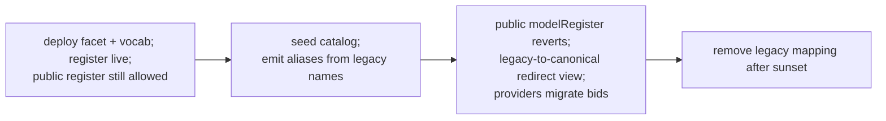

**Requirements**
- **MIG-R1** Do not break in-flight sessions (old `modelId` resolvable until closed); publish the catalog before disabling public register; run a provider re-bid campaign.
- **MIG-R2** `legacyModelRedirect[legacyId] → canonicalId` plus `resolveModelId(id)` used by Marketplace and SessionRouter during transition; removed after sunset.
- **MIG-R3** Seed the initial catalog from a one-time curated import (the current live model set, e.g. as surfaced by `active.mor.org`) plus manual review. `active.mor.org` is not a runtime dependency of the contract or protocol; it is a read-only dashboard over the chain. This requirement only means its curation/data is a convenient input to the one-time seeding exercise; after seeding, the catalog lives entirely on-chain and `active.mor.org` will simply need its curation refreshed to reflect canonical ids.

**Acceptance criteria**
- [ ] **AC-MIG-1** A session opened on a legacy `modelId` before cutover still closes/settles after cutover via redirect.
- [ ] **AC-MIG-2** After cutover, public `modelRegister` reverts; provider bids resolve to canonical ids.
- [ ] **AC-MIG-3** Provider migration runbook (re-post bids, delete old) published.

**Compatibility class:** `Breaking` (gated, governance-approved; `legacyModelRedirect` softens the cutover).

**Events (indexer contract):** `CanonicalModelRegistered`, `ModelMetadataUpdated`, `ModelCapabilityChanged`, `ModelLifecycleChanged`, `ModelAliasRegistered`.

---

## 3.2 Marketplace facet: bidding

**Facet intent.** With model creation now curated in §3.1, a provider's relationship to the marketplace is clarified: their job is to bring up a provider node, register it (§3.3), and post bids on the models they can serve. They no longer mint catalog entries directly, but they are not locked out of expanding the catalog: a provider who wants to serve a model that isn't listed yet proposes it through the §3.1 pipeline (open a PR, review, CI validation, operator registers). So providers keep the ability to grow the model set; the contract just gates that path for consistency instead of letting any wallet write arbitrary models. This section keeps the bid flow intact and removes a fee friction; bids must reference only active canonical models (§3.1.2 VOCAB-R5).

### 3.2.1 Update bid price without full repost (Priority: Med)

**Intent.** Changing a bid price today requires `deleteModelBid` + `postModelBid`, charging the 0.3 MOR `marketplaceBidFee` on every repost. Provide an in-place price update.

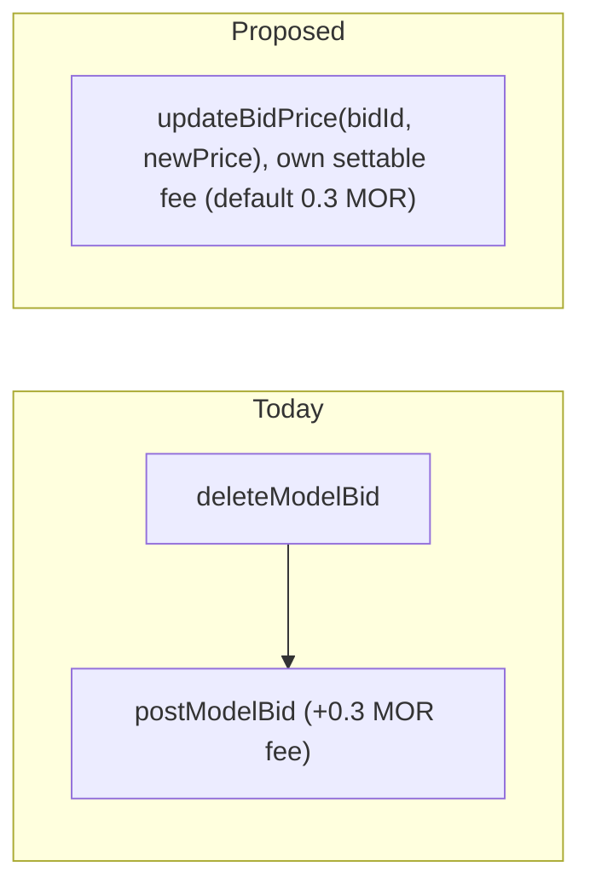

**Requirements**
- **BID-R1** `updateBidPrice(bidId, newPricePerSecond)` callable only by the active bid owner (the provider) or its authorized delegate.
- **BID-R2 (own settable fee, defaults to the post fee)** Charge a separate, owner-settable `bidUpdateFee` variable, defaulting to 0.3 MOR (same as `marketplaceBidFee`). It is not hard-wired to zero: a free update path invites churn/griefing (rapid price flipping to spam events or front-run quotes), so the fee is configurable and the owner may lower it deliberately if desired. Apply the same min/max price bounds as `postModelBid`.
- **BID-R3** Emit `MarketplaceBidUpdated`; leave `postModelBid` auto-delete-on-repost behavior unchanged for new bid creation.

**Acceptance criteria**
- [ ] **AC-BID-1** Inactive/deleted bids cannot be updated (revert).
- [ ] **AC-BID-2** Price bounds enforced identically to `postModelBid`.
- [ ] **AC-BID-3** `postModelBid` creation flow unchanged (regression).
- [ ] **AC-BID-4** Update price, open session on updated bid, then close: settlement unchanged.
- [ ] **AC-BID-5** `bidUpdateFee` defaults to 0.3 MOR, is owner-settable, and is charged on `updateBidPrice`; changing it takes effect immediately.

**Compatibility class:** `Additive` (new function plus new owner-settable fee variable). Proxy-router may expose `PATCH /blockchain/bids/:id`.

---

## 3.3 ProviderRegistry facet: provider identity & bond

**Facet intent.** A provider's on-chain footprint is: register the node with a small refundable bond, keep its endpoint current, and optionally route payouts to a cold wallet (§3.5.2). The bond is now a pure anti-bot entry fee, decoupled from earnings (the 365-day reward limiter is removed, §3.4.4). As noted in §3.2, providers can still propose new models via the §3.1 pipeline; that proposal path is off-chain (a PR), so it needs no provider-side contract surface here.

### 3.3.1 Nominal provider bond (anti-bot only) (Priority: High)

**Intent.** A provider pays a small, owner-configurable entry bond purely as an anti-bot gate. Earnings are not tied to or capped by it; deregister returns it in full. This is the ProviderRegistry half of removing the reward limiter (the reward-side change is §3.4.4).

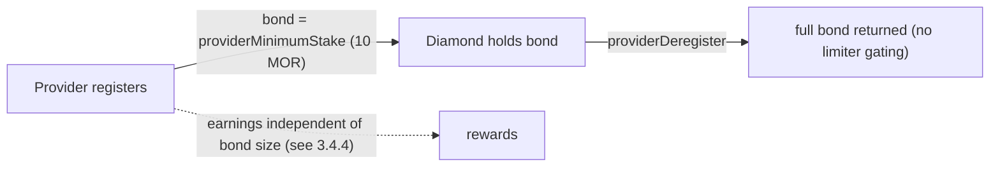

**Requirements**
- **BOND-R1 (confirmed)** `providerMinimumStake = 10 MOR` minimum bond, owner-configurable via the existing setter (no new setter needed). It is a refundable anti-bot entry bond, not an earnings cap.
- **BOND-R2 (full refund to the provider on deregister)** `providerDeregister` returns the full bond to the provider's wallet (the registered provider address, or its configured payout recipient per §3.5.2) with no reward-limiter gating (the limiter is removed in §3.4.4) and no haircut.
- **BOND-R3** No coupling between bond size and earning potential anywhere in ProviderRegistry/SessionRouter.

**Acceptance criteria**
- [ ] **AC-BOND-1** `providerMinimumStake` defaults to 10 MOR, is owner-settable, and registration enforces the current minimum.
- [ ] **AC-BOND-2** Deregister returns the full bond to the provider's wallet regardless of prior earnings.
- [ ] **AC-BOND-3** A provider with only the 10 MOR bond can earn far beyond it (cross-checked with AC-REWARD-1).

**Compatibility class:** `In-place compatible` (a parameter value plus removal of limiter gating on deregister; no ABI change).

### 3.3.2 Explicit endpoint update + bounds (Priority: Med/Low)

**Intent.** Give providers an intention-revealing endpoint update (today done via `providerRegister(..., amount_=0, endpoint)`), and bound the endpoint string to prevent calldata griefing.

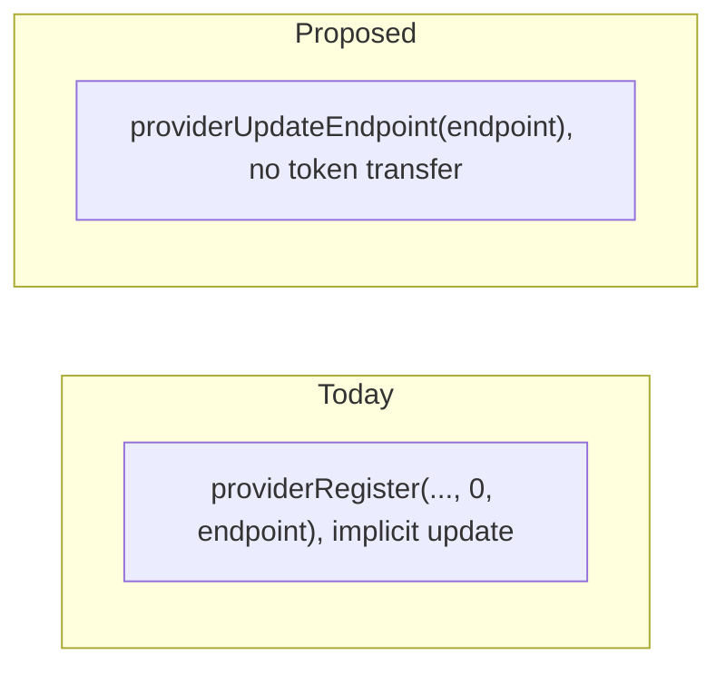

**Requirements**
- **EP-R1** `providerUpdateEndpoint(endpoint)` callable only by the active provider (or authorized delegate); no token transfer; stake unchanged.
- **EP-R2** Max `endpoint` length (e.g. 256 bytes), enforced on new writes with a named error; existing records grandfathered.

**Acceptance criteria**
- [ ] **AC-EP-1** Only active provider/delegate may call; balances unchanged.
- [ ] **AC-EP-2** Endpoint bound enforced; document equivalence with `providerRegister(..., 0, endpoint)` if both remain.

**Compatibility class:** `Additive` (new function) plus `In-place compatible` (forward-only bound).

---

## 3.4 SessionRouter facet: sessions, settlement & rewards

**Facet intent.** Make session pricing legible, make direct-pay behave like prepayment, make funds return to consumers without an external recovery job (while preserving the accounting invariants that exist for good reason), and pay providers session-based rewards (no stake cap) net of a configurable protocol fee. Grouped here because all of it lives in `SessionRouter` settlement.

### 3.4.1 Session quote view (Priority: High)

**Intent.** Let a consumer see, before staking, how much access a stake buys (duration, end time, effective price) for either mode. Today duration uses `stakeToStipend(amount) / pricePerSecond`, so the stake-to-access relationship is opaque. Support quoting by `modelId` (not just a specific `bidId`), because most consumers think "I want model X for amount Y," not "I want bid #123"; the contract should pick the cheapest active bid for them.

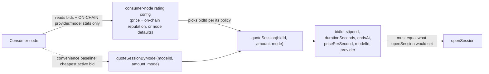

**Requirements**
- **QUOTE-R1** Pure `view quoteSession(bidId, amount, isDirectPaymentFromUser)` returning `stipend, durationSeconds, endsAt, pricePerSecond, modelId, provider`. This is the authoritative per-bid quote once a bid has been chosen.
- **QUOTE-R2 (model-level selection is rating-driven; cheapest is only a baseline)** Bid selection for a model is governed by the rating-system configuration on the consumer node (weighing price and reputation, or the node's built-in defaults when unconfigured), not decided on-chain. The rating inputs are on-chain signals only: active bid prices plus the on-chain provider/model stats (§3.6: TTFT, TPS, success rate). There is no off-chain reputation source. The contract's `view quoteSessionByModel(modelId, amount, isDirectPaymentFromUser)` provides only a deterministic convenience baseline that returns the cheapest active bid (lowest `pricePerSecond`) for callers with no rating policy; document the tie-break (e.g. earliest bid) and return empty/zero when the model has no active bids. It must not be presented as "the best bid"; that judgment lives in the consumer node.
- **QUOTE-R3** Returned `endsAt`/duration must equal what `openSession` sets for the selected bid and identical inputs at the current `block.timestamp`.
- **QUOTE-R4** Both functions cover stake-pool and direct-pay computations.

**Acceptance criteria**
- [ ] **AC-QUOTE-1** Both functions are pure `view`; no state writes.
- [ ] **AC-QUOTE-2** `quoteSessionByModel` returns the lowest-`pricePerSecond` active bid as a documented baseline (with tie-break; empty when no active bids), and the docs state that authoritative selection is the consumer node's rating config using on-chain signals only (price plus on-chain reputation stats).
- [ ] **AC-QUOTE-3** `endsAt` equals `openSession`'s result for the selected/given bid and same inputs (parity test, both modes).
- [ ] **AC-QUOTE-4** Documented formula references `stakeToStipend`, `getSessionEnd`, `maxSessionDuration`.

**Compatibility class:** `Additive` (new views; no storage migration). The rating/selection policy itself is consumer-node scope (proxy-router rating config), not contract scope.

### 3.4.2 Direct-pay vs staking semantics (Priority: High)

**Intent.** Make direct-pay behave like prepayment for N seconds at the bid price, refunded immediately on early close. Today `isDirectPaymentFromUser` only changes who pays the provider at close: in `openSession`, both modes compute duration from `stakeToStipend(amount)/pricePerSecond`, apply the same `maxSessionDuration` cap, set `endsAt` identically, and use the same early-close lock path. The two are structurally the same mechanism, just under-specified to consumers.

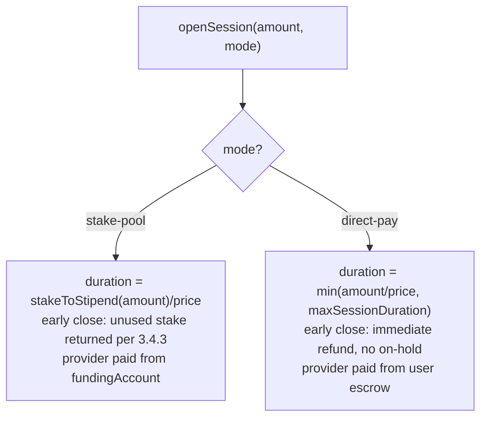

**Requirements**
- **PAY-R1** Direct-pay duration: `endsAt = openedAt + min(amount / pricePerSecond, maxSessionDuration)`.
- **PAY-R2** Direct-pay early close: user receives unused escrow immediately; no `userStakesOnHold` row.
- **PAY-R3** Stake-pool sessions preserve existing stipend math (subject to §3.4.3).
- **PAY-R4 (change the existing flag in place, resolved)** Refine the behavior of the existing `isDirectPaymentFromUser` flag in place rather than adding a parallel mode/alias: keep the same `openSession`/`closeSession` ABI and the same flag, and tighten direct-pay to the prepayment semantics above (PAY-R1/R2). The ABI is unchanged, so callers compile and call exactly as before; the only difference is the more correct duration/refund behavior on the direct-pay branch. We accept this is technically breaking at the behavioral level, but it is not expected to materially shift behavior for current clients (direct-pay duration already derives from amount/price; the refund simply returns sooner).

**Acceptance criteria**
- [ ] **AC-PAY-1** Direct-pay `endsAt` matches `min(amount/price, maxSessionDuration)`.
- [ ] **AC-PAY-2** Direct-pay early close refunds immediately; zero on-hold rows.
- [ ] **AC-PAY-3** Stake-pool behavior unchanged (regression).
- [ ] **AC-PAY-4** Existing `isDirectPaymentFromUser` callers compile and call unchanged (no ABI change); only the direct-pay duration/refund behavior is tightened (documented in the migration note).
- [ ] **AC-PAY-5** Full matrix: both modes by natural close by early close by dispute.

**Compatibility class:** `In-place compatible` at the ABI (same `isDirectPaymentFromUser` flag, no new function), with a behavioral change on the direct-pay branch (technically breaking but immaterial for current clients). Produce a migration note for proxy-router (`directPayment` body field) and MorpheusUI.

### 3.4.3 Close, early-close & eliminating stranded MOR (Priority: High)

**Intent.** Make `closeSession` return all user-due MOR in the same transaction: no second `withdrawUserStakes`, no external recovery job, and no revert when the `fundingAccount` is short. Today early close parks a stake slice in `userStakesOnHold[user]` (released `startOfTheDay(closedAt) + 1 day`), and a `fundingAccount` shortfall can revert the whole close. Having re-traced why the early-close lock exists, our recommendation is to remove it (not merely auto-return it) unless the contractor surfaces a daily-accounting dependency; see the analysis below.

**What the early-close lock does today.** In `_rewardUserAfterClose`, an early close (before `endsAt`) locks the stake-equivalent of the stipend consumed during the current day until the start of the next day, returning only the remainder immediately. A natural/late close (`closedAt >= endsAt`, i.e. `isClosingLate_`) locks nothing and returns the full stake at once.

**Tracing the mechanics (staked / `!isDirectPaymentFromUser` path).**
- The stake is collateral, not a payment. On the staked path the provider is paid from the emissions-backed `fundingAccount`, so `userStakeToProvider = 0` and the user's entire stake is returned; the lock only delays part of it by up to 1 day.
- The provider's reward is `(min(closedAt, endsAt) - openedAt) × pricePerSecond`, strictly per elapsed wall-clock second. Opening and immediately closing pays the provider about 0; you only ever emit for time that actually elapsed.

**So does removing the lock grant more session / opportunity time? No.** Early-close-and-restake gives a colluder no more session-time or emissions than chaining short sessions:
- A single stake backs only one open session at a time (the stake is locked while the session is open). Two concurrent sessions require two stakes.
- Emissions flow per elapsed second, so the most any one stake can direct in a day is bounded by wall-clock time × price, whether you early-close and re-open or let each session run to its natural end and re-open. Recycling can't beat the clock.
- Decisively, natural close already applies no lock. A consumer who opens a short session, lets it run out, takes a full instant refund, and immediately re-stakes is recycling stipend within the same day right now, with no friction. The lock only ever touches the early-closer, who by definition consumed less time than the natural-closer it lets through. As an anti-recycling control it penalizes the lower-usage party and waves the higher-usage pattern through.

**Conclusion.** The lock does not prevent intra-day recycling (natural-close chaining already does that, penalty-free), and it does not grant or deny compute; the binding constraint is wall-clock time, not the stake. Its only observable effect is to delay an early-closer's own collateral by up to 1 day, and that delayed slice is exactly the MOR that ends up stranded. The only real cost of churning many short sessions, early or natural, is gas per open. So the lock looks like vestigial friction: removing it (return the full unused stake on early close, same tx) is no more gameable than the natural-close path that already exists, and it eliminates the stranded-MOR class outright.

**One thing to confirm before deleting.** The session-settlement path is clear; what we can't fully verify from outside is whether the daily emission accounting (`getComputeBalance` / `getTodaysBudget`, and the `startOfTheDay`-keyed `userStakesOnHold`) relies on the on-hold delay to attribute consumed stipend to the correct day. The contractor must confirm (with the original authors and via tests) that nothing in the budget split depends on the hold. If clean, remove the lock (CLOSE-R4a). If some invariant genuinely needs it, keep it but auto-return on release (CLOSE-R4b). Either way the user is made whole automatically with no recovery job.

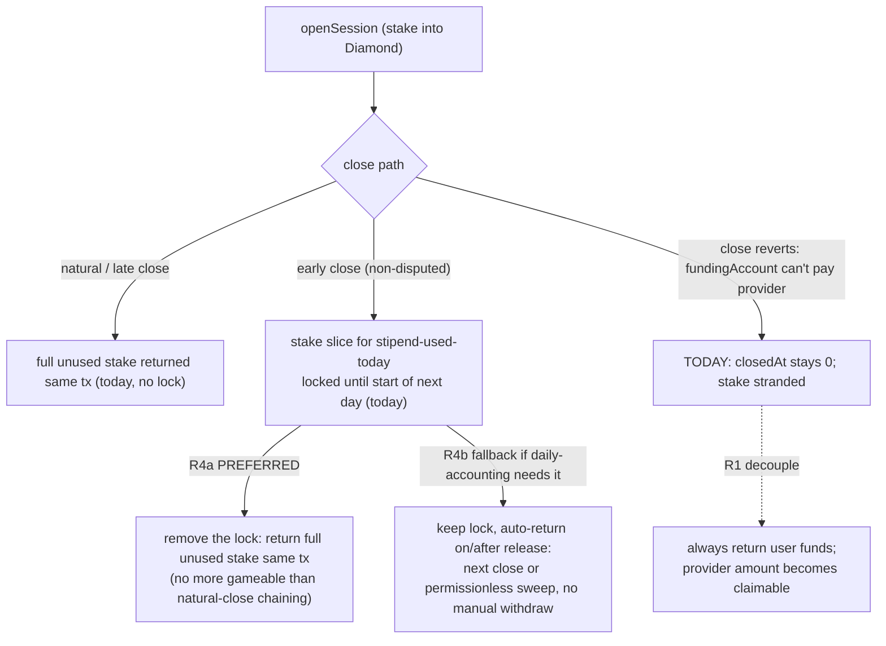

**Requirements** (ordered foundation-up: the base refund invariant first, then the return mechanism, then the bounded harvest that wraps it, then the lock-policy decision)
- **CLOSE-R1 (decouple user refund from provider payment)** The user's unused stake is always returned even if the provider leg can't be funded; record the provider's amount as separately claimable via the existing `claimForProvider` pull. This removes the "close reverts, so stake stranded" pathway and is the base invariant the rest of this section builds on.
- **CLOSE-R2 (auto-return released funds)** At the end of `closeSession`, transfer any of the user's on-hold rows already past `releaseAt` so no separate withdraw is needed, and provide a permissionless `sweepReleasedStakes(user)` so anyone can return already-released funds. This is the return mechanism used to drain legacy `userStakesOnHold` rows created before the upgrade, and by the CLOSE-R4b fallback.
- **CLOSE-R3 (bounded harvest)** `withdrawAllUserStakes(user)` and `sweepReleasedStakes(user)` use bounded/paginated iteration (no unbounded loop, F5 gas griefing); emit `UserStakeReleased(user, amount)` (and, if CLOSE-R4b is chosen, `UserStakeOnHold(user, amount, releaseAt)`) for indexers.
- **CLOSE-R4a (preferred: remove the lock)** Once the contractor confirms the daily emission accounting does not depend on the on-hold delay, return the full unused stake in the same `closeSession` transaction on early close, exactly as natural/late close already does. This is the recommended path: it is no more gameable than today's penalty-free natural-close chaining (wall-clock plus per-second emissions remain the binding constraint), and it removes the stranded-MOR class entirely.
- **CLOSE-R4b (fallback: keep the lock, auto-return)** Only if a real daily-accounting invariant is found that needs the hold: keep the early-close lock, confirm the locked amount is exactly the stipend-consumed-today equivalent (no over-locking), and make it auto-return at release via CLOSE-R2 so nothing is stranded. Dispute closes retain their existing protective behavior in both cases.

**Implications:** CLOSE-R1 changes provider-pay timing (pull vs in-close push) when the funding account is short, a behavior change for indexers/accounting but no consumer ABI break. Under CLOSE-R4a the on-hold array stops being written entirely (only legacy rows remain, drained by CLOSE-R2); under CLOSE-R4b it stops growing unbounded in steady state (helps §3.7.1). The external recovery job becomes a backstop only.

**Acceptance criteria**
- [ ] **AC-CLOSE-0 (decision gate)** Contractor documents whether the daily emission accounting (`getComputeBalance`/`getTodaysBudget`) depends on the early-close hold, with a test demonstrating that total daily emissions are unchanged whether a stake is early-closed-and-recycled or chained via natural close. Result selects CLOSE-R4a (no dependency) or CLOSE-R4b (dependency).
- [ ] **AC-CLOSE-1 (CLOSE-R4a)** On early close the consumer's full unused stake is returned in the same transaction; no `userStakesOnHold` row is created for new sessions.
- [ ] **AC-CLOSE-2 (CLOSE-R2 / R4b)** Any pre-existing or fallback on-hold funds return without a manual second transaction (auto-sweep at next close, or via permissionless `sweepReleasedStakes`); after a full open, serve, close cycle the consumer wallet is whole with no recovery job.
- [ ] **AC-CLOSE-3** Disputed close still applies the existing protective behavior (regression).
- [ ] **AC-CLOSE-4** `closeSession` with an under-funded `fundingAccount` still returns the user's stake; the provider amount is recorded claimable and `claimForProvider` pays it once funded (CLOSE-R1).
- [ ] **AC-CLOSE-5** Natural/late close unchanged (regression); harvest/sweep loops are bounded (gas analysis).

> **Discussion items**
> - CLOSE-R4a vs R4b: this is the open call. Our analysis says the lock is removable (it doesn't bound emissions and natural-close chaining already recycles stipend penalty-free). The decision hinges on AC-CLOSE-0: does any daily-budget accounting actually depend on the hold? Confirm with the original authors.
> - CLOSE-R1: acceptable to move under-funded provider legs to a claimable pull (timing change for accounting)?

**Compatibility class:** `Additive` (CLOSE-R2/R3 new functions/events); `In-place compatible` (CLOSE-R4a/R4b keep the consumer ABI; update [session-states doc](../../docs/ai/session-states-open-close-recover.mdx)); CLOSE-R1 is `In-place compatible` at the consumer ABI but a settlement-timing change for provider pay (coordinate with proxy-router/accounting).

**Parallel (non-contract):** the Infra housekeeping job becomes backstop-only; a proxy-router HTTP route for `withdrawUserStakes`/`sweepReleasedStakes` is only needed as a fallback.

### 3.4.4 Remove the reward limiter; session-based rewards (Priority: High)

**Intent.** A provider earns session-based rewards: opening a session means the consumer bought access to inference for a duration, and the provider is compensated for standing ready whether or not the consumer sends a prompt. Remove the 365-day stake-match limiter entirely; do not cap earnings by stake, by a per-provider daily ceiling, or gate them on reported tokens. The nominal 10 MOR bond is §3.3.1.

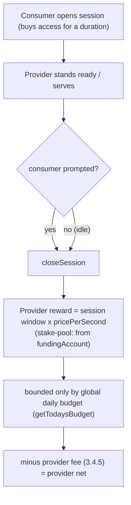

**Requirements**
- **REWARD-R1** Remove the stake-based reward limiter entirely (`PROVIDER_REWARD_LIMITER_PERIOD`, `limitPeriodEnd`, `limitPeriodEarned`, and the cap in `_claimForProvider`).
- **REWARD-R2** Preserve the existing session-based reward computation (session window × `pricePerSecond` via stipend math) paid from `fundingAccount` at close, including zero-prompt sessions.
- **REWARD-R3** Add no per-provider daily cap and no token gate. The only network-level bound is the existing global `getTodaysBudget`.
- **REWARD-R4** Direct-pay rewards (consumer escrow) unaffected; also fixes the bug where the limiter wrongly capped direct-pay.

**Anti-gaming rationale (accepted risk, economic).** Removing the per-provider cap means a colluding consumer+provider could open self-dealt sessions to capture a larger slice of the daily budget. This is accepted because (1) total issuance is bounded by `getTodaysBudget`, so gaming shifts distribution, not total; and (2) capturing meaningful share requires staking large MOR, which shrinks circulating supply, drives MOR demand/price up, and makes honest holding dominate draining. Note that early-close stake recycling is not a cheaper amplifier: emissions accrue per elapsed wall-clock second and one stake backs one open session, so per-stake draw is bounded by time × price regardless of how often you close and re-open (§3.4.3). TEE-attested work remains a separate optional quality tier, not a reward gate.

**Acceptance criteria**
- [ ] **AC-REWARD-1** Limiter removed: a provider with only the 10 MOR bond earns far beyond it across a year (no stake-match cap).
- [ ] **AC-REWARD-2** A zero-prompt session still pays the provider for the session window (availability test).
- [ ] **AC-REWARD-3** Session-based reward math unchanged vs baseline for a normally-used session (regression).
- [ ] **AC-REWARD-4** Network total emissions never exceed `getTodaysBudget` regardless of any single provider's volume.
- [ ] **AC-REWARD-5** Direct-pay payouts unaffected (regression).
- [ ] **AC-REWARD-6** No existing signature/event/storage slot changed.

**Resolved.** Confirmed and accepted: remove the limiter, session-based rewards (including zero-prompt availability), no per-provider cap and no token gate. The economic-disincentive argument above is the accepted mitigation.

**Compatibility class:** `In-place compatible` (limiter removal is internal; no ABI/event/storage change; proxy-router/app need no change).

### 3.4.5 Provider fee on payout (Priority: High)

**Intent.** Charge a platform commission (default 5%) on each provider payout, exactly like a marketplace (e.g. eBay) taking a percentage of a completed sale to fund the people who run the platform. It is deducted from the provider's reward (provider nets the rest), on both direct-pay and stake-pool earnings, and sent to an owner-settable `feeDestination` wallet, expected to be a multisig managed by the core maintainers, who carry the cost burden of supporting the ecosystem. Keep it simple, with no separate fee-router contract: just an address and a percentage, both owner-settable. If `feeDestination` is unset (`address(0)`) or the fee rate is `0`, no fee is taken and the provider receives the full reward. No maximum is enforced on the rate beyond a 100% overflow guard (owner discretion).

**This does not touch the consumer's stake.** The fee is taken only from the provider's payout, at the source the payout is already drawn from:
- Direct-pay: the fee comes out of the portion of the consumer's escrow that was already owed to the provider for seconds served. The consumer's unused/refundable stake is untouched, and the consumer never pays more.
- Stake-pool (emissions): the fee comes out of the provider's emission payout from `fundingAccount`.

In both cases the consumer's refund on close is exactly what it would be without the fee; the fee is purely a provider-side deduction (the platform's cut of the sale). What the maintainer multisig does with the collected MOR afterward is its own governance concern, entirely outside this contract.

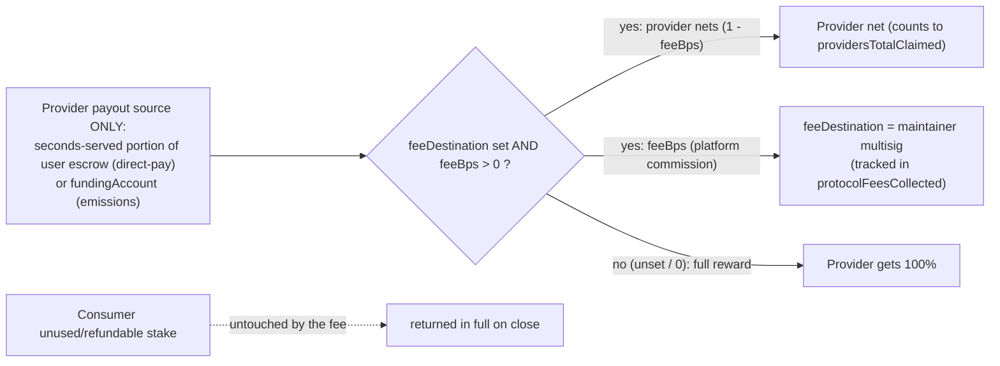

**Requirements**
- **FEE-R1** At claim/close, if `feeDestination != address(0)` and `feeBps > 0`, compute `fee = providerAmount × feeBps / 10000`, pay `providerAmount − fee` to the provider, and transfer `fee` to `feeDestination` from the same source as the payout. The consumer's refundable stake is never an input to this calculation.
- **FEE-R2** `feeBps` and `feeDestination` are owner-settable; default `feeBps = 500` (5%). No maximum cap on `feeBps` (owner discretion; a reasonable upper sanity bound such as 10000 = 100% only to prevent nonsensical overflow).
- **FEE-R3 (commission is net to the provider; tracked separately)** Applies to direct-pay (provider's share of user escrow) and stake-pool (`fundingAccount`). The provider's `providersTotalClaimed` increases only by the net amount actually paid to the provider (`providerAmount − fee`); the commission is not counted as provider earnings. The fee is instead accumulated in a separate on-chain `protocolFeesCollected` total (FEE-R6) so the maintainer take is auditable and the two reconcile to the gross payout.
- **FEE-R4** Bus-factor (F2): if `feeDestination == address(0)` or `feeBps == 0`, skip the fee and pay the provider 100%, never revert.
- **FEE-R5** Config: `setProviderFeeBps(bps)` and `setFeeDestination(addr)`, both owner-only. Emit `ProviderFeeCharged(provider, sessionId, gross, fee, feeDestination)`.
- **FEE-R6 (maintainer fee summary)** Maintain a running on-chain `protocolFeesCollected` total (incremented by every `fee` transferred) and expose `view getProtocolFeeSummary()` returning `feeBps`, `feeDestination`, and `totalFeesCollected` (and, if cheap, `lastFeeAt`). This is the maintainer-side mirror of the provider earnings view (§3.4.6): one call shows the current rate, where commission goes, and how much has been collected to date. Informational only; it moves no funds.

**Acceptance criteria**
- [ ] **AC-FEE-1** Default 5%; owner can set any `feeBps` (no max beyond the 100% sanity bound) and any `feeDestination`.
- [ ] **AC-FEE-2** Applies to both modes; provider nets `providerAmount − fee`; `fee` reaches `feeDestination`.
- [ ] **AC-FEE-3** `ProviderFeeCharged` emitted with correct fields.
- [ ] **AC-FEE-4** `feeDestination` unset or `feeBps == 0` gives the provider 100%, no transfer to a fee sink, no revert.
- [ ] **AC-FEE-5** Consumer refund on close is identical with and without the fee (the fee never reduces the consumer's returned stake).
- [ ] **AC-FEE-6** The provider's `providersTotalClaimed` increases by the net (`providerAmount − fee`), not the gross; `protocolFeesCollected` increases by the `fee`; net + collected fee reconciles to the gross payout.
- [ ] **AC-FEE-7** `getProtocolFeeSummary` returns the current `feeBps`/`feeDestination` and a `totalFeesCollected` that equals the sum of `fee` across all `ProviderFeeCharged` events.

**Resolved.** A single owner-set `feeDestination` wallet (the maintainer multisig) is sufficient for v1 (no router contract); whatever that wallet does with the MOR is its own concern. No max on `feeBps` beyond the 100% overflow guard. The commission is net to the provider and tracked in its own accumulator (FEE-R3/R6).

**Compatibility class:** `Additive` (new owner config, event, and summary view); provider payout amounts change when a fee is set, so update the [rewards docs](../../docs/concepts/rewards-and-economics.mdx). No client ABI break, no consumer-stake impact.

### 3.4.6 Provider earnings transparency (Priority: Med)

**Intent.** A single accurate earnings view. Reconciled with §3.4.4: no stake cap and no per-provider daily cap, so report the nominal bond, earnings, and the network daily-budget context only.

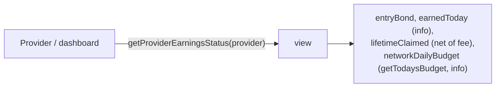

**Requirements**
- **EARN-R1** `view getProviderEarningsStatus(provider)` returning nominal `entryBond`, informational `earnedToday`, `lifetimeClaimed` (net of the §3.4.5 commission, per FEE-R3), and network `getTodaysBudget`. No stake-based `remainingCapacity`/`periodEnd` and no per-provider cap fields.
- **EARN-R2** Values match `_claimForProvider`'s post-§3.4.4 accounting (session-based, uncapped per provider, net of fee).

**Acceptance criteria**
- [ ] **AC-EARN-1** Returned values match `_claimForProvider` after §3.4.4 (no cap referenced).
- [ ] **AC-EARN-2** A provider earning past its bond shows correct positive `lifetimeClaimed` with no cap warning.
- [ ] **AC-EARN-3** `networkDailyBudget` reflects `getTodaysBudget` (informational).

**Compatibility class:** `Additive` (new view); depends on §3.4.4 shipping first.

---

## 3.5 Custody & delegation (cross-facet)

**Facet intent.** Protect high-value MOR on both sides of a session by letting a cold wallet (hardware / multisig, holding millions of MOR) authorize a hot wallet (the EOA on the node) to act (open/manage sessions, receive payouts) without exposing the cold key and without moving the bulk of the funds. The hot wallet is assumed to be the same human or a trusted operator (collusion is fine; the goal is custody safety, not mutual distrust). This spans SessionRouter (consumer staking) and ProviderRegistry/SessionRouter (provider payouts), so it is its own section. New facet: Delegation (a `DelegateRegistry`-style mapping plus per-purpose allowances).

**Many cold wallets to one hot wallet (one combined bucket).** On the consumer side, a hot wallet may receive staking allowances from several cold wallets at once (e.g. a treasury split across multiple hardware/multisig vaults, or multiple funders backing one node). The hot wallet sees a single purpose escrow "bucket" (the sum of all live allowances plus, optionally, its own funds) and stakes/opens sessions against that total without caring which cold wallet each unit came from. This Many:1 model is also what naturally covers the "I'll fund your compute for you" case (a funder cold-wallet need not be the same human as the hot-wallet operator); see the note in §3.5.1, and no separate "sponsor" feature is required.

**A built-in privacy property (and a nice-to-have on top).** Because this mechanism is an allowance/grant, not a transfer, the bulk of the MOR never leaves the cold wallet to reach the hot wallet; the hot wallet is simply permitted to use it. That already provides a degree of obfuscation: an observer watching the hot wallet's session activity does not see funds flowing out of a specific cold vault to fund each action, and pooling many cold wallets into one bucket further blurs which vault backed which action. The nice-to-have is to go further and make the cold-to-hot relationship itself hard to trace on-chain, on both the consumer side (the grants that let a hot wallet stake) and the provider side (the payout target). This is captured as an assessment in §3.5.3 (privacy/masking). One hard constraint shapes the design: on the consumer side, the session must always be opened and managed from the perspective of the c-node hot wallet, even though the funds it draws on are only available to it via cold-wallet allowances, so the masking must not require any cold wallet to appear as the session actor.

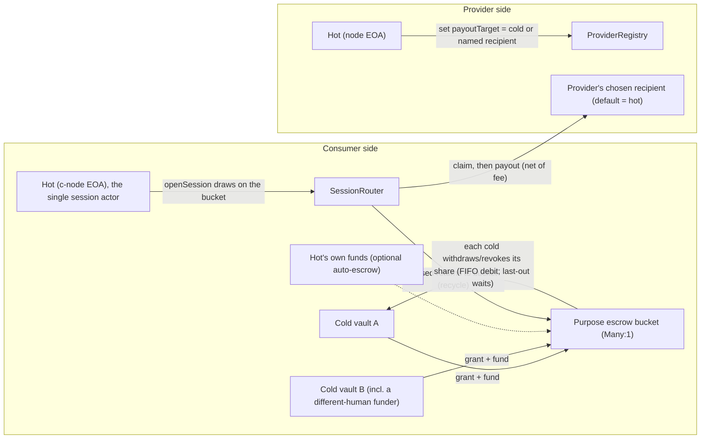

### 3.5.1 Consumer cold/hot staking allowances (Priority: Med)

**Intent.** One or more cold wallets pre-authorize a hot wallet to stake up to a capped, expiring, purpose-bound budget. The hot wallet opens/manages sessions against the combined bucket; it can never move funds outside session staking or sweep any cold wallet. Sessions are only openable/manageable by the hot wallet.

**One "available to stake" bucket (Many cold : one hot, plus the hot's own funds).** Everything the hot wallet can stake lives in a single pool: the sum of every live cold-wallet grant plus the hot wallet's own auto-escrowed MOR. There is no reason to keep these as separate sources: own-funds and delegated funds are spent through one code path, and the hot wallet never has to know or choose which funder backs a given session. A hot wallet with its own MOR is simply its own funder with a standing self-grant. This keeps one "available to stake" balance for the app to reason about.

**Recycle by default.** Granted funds are usable by the hot wallet until the granting cold wallet revokes them. Unused stake returned on close goes back into the bucket and can be staked again with no fresh cold signature: the grant is a standing, revocable authorization, not a per-session approval. Recycle timing follows the §3.4.3 close path: under the preferred CLOSE-R4a the unused stake lands back in the bucket in the same close tx; under the CLOSE-R4b fallback the held slice rejoins the bucket when it auto-returns at release.

**Debiting across funders: FIFO (easiest, deterministic).** When the hot wallet stakes, the bucket is debited FIFO by grant age: the oldest grant is consumed first, then the next, then the hot's self-escrow. Example: Cold A grants 10 MOR, Cold B grants 10 MOR; the hot wallet stakes 10 and draws Cold A's funds first. This is just bookkeeping order; the funds themselves are fungible (which matters for withdrawal, below).

**Withdrawal / revocation while funds are in use: fungible, last-out waits (no pro-rata).** A cold wallet may revoke and pull its share back at any time. Because the pooled funds are fungible, it does not matter whose specific tokens are "in" an open session at that instant: the withdrawing cold wallet immediately receives up to the bucket's free (un-staked) balance, reducing its grant. Only if free liquidity can't cover the request, because enough MOR is locked in open sessions, does the remainder queue and pay out as those sessions close. In effect, only the last funder out has to wait for the final session to end; everyone else is served from free liquidity. We explicitly reject pro-rata locking of every funder behind every session: that would freeze all cold wallets from withdrawing for the life of any session, so no one could ever get out.

**Sponsoring is just the Many:1 case (answers "why a separate sponsor feature?").** "I'll fund your compute for you" is simply a cold wallet granting/funding a hot wallet it doesn't own (a different human). The mechanism is identical: capped, expiring, purpose-bound, revocable, FIFO-debited, and the beneficiary's hot wallet remains the only session actor. So no separate "sponsor" contract surface is needed; it falls out of Many:1. The only extra care is anti-gaming (it must not make §3.4.4 emission-farming any easier, covered by AC-COLDC-7).

**Fund flow (where do unused tokens go?):** cold wallets (plus optional hot self-escrow) fund one available-to-stake bucket; `openSession` debits it FIFO; on close the unused amount recycles to the bucket; each cold may revoke/withdraw its share (free balance now, locked balance as sessions close).

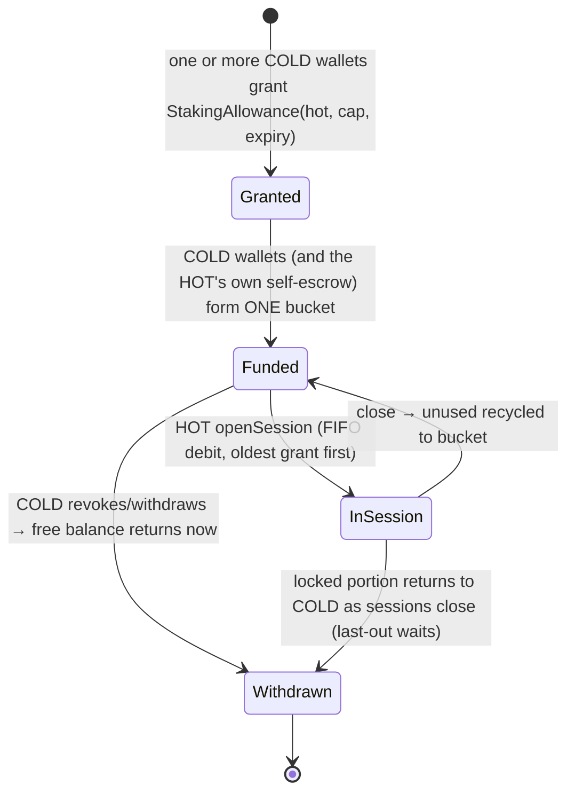

**Requirements** (executing role stated explicitly for each; in order of operations)
- **COLDC-R1 (cold-signed)** `grantStakingAllowance(hot, maxAmount, expiry)` is callable only by the granting cold wallet; it is purpose-bound to session staking only, not a general ERC-20 approval. Multiple cold wallets may hold concurrent grants to the same hot wallet. Emit `StakingAllowanceGranted(cold, hot, maxAmount, expiry)`.
- **COLDC-R2 (cold-signed)** Funding the purpose escrow is callable only by a funding cold wallet (or the grant carries the funding); each funder's contributed, unspent funds remain withdrawable by that funder. Emit `StakingAllowanceFunded(cold, hot, amount)`.
- **COLDC-R3 (one bucket: Many:1 + self)** The hot wallet's available-to-stake balance is a single pool: the sum of all live cold grants plus the hot wallet's own self-escrow. Draws debit the pool; the hot wallet never selects a funder.
- **COLDC-R4 (hot self-escrow, same path)** A hot wallet stakes its own MOR through the same pool via a standing self-grant (a hot wallet acting as its own funder); own-funds and delegated funds are not separate sources.
- **COLDC-R5 (FIFO debit)** Staking debits the pool FIFO by grant age (oldest cold grant first, then newer grants, then self-escrow). This ordering is deterministic bookkeeping; the funds are otherwise fungible (see COLDC-R8). Emit `AllowanceDebited(hot, cold, amount, sessionId)` per funder consumed.
- **COLDC-R6 (hot-signed)** `openSession`/close/manage that draws on the pool is callable only by the hot wallet; only that hot wallet may open/close/manage the resulting session.
- **COLDC-R7 (automatic / hot-context)** Unused stake on close recycles to the pool for reuse with no new cold signature, until expiry/revocation.
- **COLDC-R8 (cold-signed withdrawal; fungible, last-out waits, no pro-rata)** `revokeStakingAllowance` and `withdraw(toCold, amount)` are callable only by the owning cold wallet at any time. The withdrawing cold wallet is paid immediately from the pool's free (un-staked) balance up to the amount requested, independent of which funder's tokens are notionally locked in open sessions. Any shortfall (because MOR is locked in open sessions) is recorded as a pending withdrawal and satisfied as those sessions close: `closeSession` tops up pending withdrawals from the freed stake, and a permissionless `claimPendingWithdrawal(cold)` lets anyone push already-available funds to the cold wallet (the same auto-return-on-release pattern as §3.4.3 CLOSE-R1/R2, so nothing strands). So only the last funder out waits, and only until the final session closes. The contract must not pro-rata-lock funders behind sessions. Emit `StakingAllowanceRevoked(cold, hot)`, `AllowanceWithdrawn(cold, hot, amount)`, and `AllowanceWithdrawQueued(cold, hot, amount)`. `expiry` auto-disables further draws from that grant.
- **COLDC-R9 (invariant)** The delegated path cannot transfer any funder's funds anywhere except session staking (and back to that funder on withdrawal), nor exceed the aggregate live `maxAmount`, regardless of which wallet calls; a sponsor/funder relationship must not make §3.4.4 emission-farming any easier.
- **COLDC-R10 (read views)** Expose view functions so a client can reason about the bucket from chain alone: `getStakingAllowance(cold, hot)` returning `(maxAmount, funded, consumed, expiry)`; `getAvailableToStake(hot)` returning the pool's current free balance; `listFundersOf(hot)` returning the live grants in FIFO order (paginated); and `getPendingWithdrawal(cold, hot)` returning any queued-but-unpaid amount. All `view`, read-only over delegation storage.

**Acceptance criteria** (in order of operations)
- [ ] **AC-COLDC-1** A hot wallet with no grant and no self-escrow cannot open a session funded by a cold wallet (must be granted/funded first).
- [ ] **AC-COLDC-2** A single cold wallet grants and funds; the hot wallet then opens a session funded by the allowance without the cold key signing per session.
- [ ] **AC-COLDC-3 (Many:1 + FIFO)** Cold A grants 10 and Cold B grants 10 to the same hot wallet; the hot wallet stakes 10 and the debit consumes Cold A's share first (FIFO); accounting reflects the pooled total and the per-grant consumption.
- [ ] **AC-COLDC-4 (own funds, one bucket)** The hot wallet opens a session spending own plus delegated funds as one pool via the self-grant; FIFO places self-escrow last.
- [ ] **AC-COLDC-5** Hot draws beyond the aggregate live cap or after a grant's `expiry` revert; only the granted hot wallet (not others) can draw.
- [ ] **AC-COLDC-6** On close, unused stake recycles to the pool (re-spendable) and only the opening hot wallet manages the session.
- [ ] **AC-COLDC-7 (withdrawal while in use)** With funds locked in an open session, a cold wallet's `withdraw`/`revoke` returns its share from free balance immediately; if free balance is short, the remainder is recorded pending and returned as the session(s) close (auto on `closeSession` or via permissionless `claimPendingWithdrawal`), with `AllowanceWithdrawn`/`AllowanceWithdrawQueued` emitted. No pro-rata lock prevents withdrawal; other funders' shares are untouched (F2). Sponsoring (different-human funder) is no easier to abuse for emission farming than §3.4.4 allows.
- [ ] **AC-COLDC-8** No call path lets the hot wallet move any funder's funds outside session staking.
- [ ] **AC-COLDC-9 (events + reads)** Every state change emits its event (`StakingAllowanceGranted`/`Funded`/`Revoked`, `AllowanceDebited`, `AllowanceWithdrawn`/`Queued`); the COLDC-R10 views return values that reconcile with those events and with the staked/free split.

**Resolved decisions.** Recycle-by-default (COLDC-R7). One bucket: own-funds and grants merged via self-grant (COLDC-R3/R4). FIFO debit, oldest grant first (COLDC-R5). Withdrawal is fungible from free balance with the last funder out waiting on open sessions; no pro-rata (COLDC-R8).

**Compatibility class:** `Additive` (new Delegation facet plus opt-in allowance path: one pool, Many:1 + self-escrow); default `openSession` unchanged.

### 3.5.2 Provider cold payout target (Priority: Med)

**Intent.** Let a provider steer where its income goes: by default the hot provider wallet (today's behavior, no change), or a named recipient wallet that the hot provider wallet sets, typically a cold vault for high-value payouts, while the hot node EOA keeps running operations. This is simply payout-destination control; it uses the same delegation/authorization idea as the consumer side but needs nothing more than an optional destination field.

**Requirements** (executing role stated explicitly)
- **COLDP-R1 (provider/cold-signed to set; permissionless to pay)** A provider sets a `payoutTarget` (the named recipient / cold wallet) distinct from the operating hot EOA; `claimForProvider` pays the `payoutTarget`. Emit `PayoutTargetSet(provider, payoutTarget)`.
- **COLDP-R2 (provider/cold-signed)** Only the provider (or its cold-authorized delegate) may set/change `payoutTarget`; the default is `msg.sender` (no behavior change for existing providers).
- **COLDP-R3 (permissionless)** `claimForProvider` stays callable by anyone (F2); only the destination is the cold target.
- **COLDP-R4** Fee deduction (§3.4.5) applies before routing to `payoutTarget`.
- **COLDP-R5 (read view)** `view getPayoutTarget(provider)` returns the configured recipient (or the provider address when unset).

**Acceptance criteria**
- [ ] **AC-COLDP-1** With a `payoutTarget` set, net rewards land at the cold wallet; the hot EOA never custodies them.
- [ ] **AC-COLDP-2** Unset `payoutTarget` pays `msg.sender` (regression for existing providers).
- [ ] **AC-COLDP-3** Only provider/cold-delegate changes `payoutTarget`; the change emits `PayoutTargetSet` and `getPayoutTarget` reflects it.
- [ ] **AC-COLDP-4** Fee split occurs before payout routing.

**Compatibility class:** `Additive` (optional field defaulting to current behavior).

### 3.5.3 Privacy / masking of the cold-to-hot relationship (Priority: Low, assessment, nice-to-have)

**Intent.** As a nice-to-have, make it hard for an observer to trace a hot wallet's actions back to its cold wallet, on both consumer and provider sides. Assess what is realistically achievable on a public L2 without over-promising (blockchain ethos: transactions are public). Baseline already helps: since the grant is an allowance and not a transfer, there is no per-action fund flow from cold to hot to follow, but the grant/payoutTarget mapping itself is on-chain and links the two.

**Requirements**
- **PRIV-R1** Document the residual linkability of an on-chain `grant`/`payoutTarget` mapping (the cold-to-hot edge is visible even though funds don't move per action).
- **PRIV-R2** Evaluate options and trade-offs, preserving the §3.5.1 constraint that the hot wallet remains the session actor: commitment/nullifier indirection for the grant, a relayer/meta-tx that submits the grant so the cold address isn't the direct sender, per-session ephemeral hot wallets, and off-chain authorization with on-chain settlement. State gas/complexity/UX cost and residual leakage for each.
- **PRIV-R3 (resolved: minimize linkage, no external deps)** The pragmatic default is adopted: minimize linkage and do not claim anonymity. Do not invest in external privacy primitives / dependencies (mixers, zk infra, relayer services); anything requiring one is out of scope. The baseline obfuscation already comes for free from the design: because a grant is an allowance and not a per-action transfer, there is no cold-to-hot fund movement to follow; the residual is only the static on-chain grant/`payoutTarget` mapping, which we document rather than hide.

**Acceptance criteria**
- [ ] **AC-PRIV-1** Written assessment of on-chain linkability covering both consumer and provider sides, documenting the residual grant/`payoutTarget` edge.
- [ ] **AC-PRIV-2** Confirms no external privacy infrastructure is introduced; any stronger anonymity is explicitly out of scope.

**Compatibility class:** `Additive` (assessment only; no new dependency).

**Events & reads (Delegation facet, indexer contract).** Writes emit: `StakingAllowanceGranted`, `StakingAllowanceFunded`, `StakingAllowanceRevoked`, `AllowanceDebited`, `AllowanceWithdrawn`, `AllowanceWithdrawQueued` (consumer side, §3.5.1), and `PayoutTargetSet` (provider side, §3.5.2). Read views: `getStakingAllowance(cold, hot)`, `getAvailableToStake(hot)`, `listFundersOf(hot)`, `getPendingWithdrawal(cold, hot)` (§3.5.1 COLDC-R10), and `getPayoutTarget(provider)` (§3.5.2 COLDP-R5). Every state change emits exactly one event so an indexer can reconstruct the full grant/escrow/withdrawal history from logs alone.

> **Note: "sponsor" is not a separate feature.** The earlier "Sponsor funds a distinct beneficiary" use case ("I'll fund your compute for you") is subsumed by the Many:1 model in §3.5.1: a funder is just a cold wallet granting/funding a hot wallet it doesn't own. There is no dedicated sponsor surface, role cap, or contract path; the same capped/expiring/revocable allowance applies, the beneficiary's hot wallet stays the only session actor, and the anti-gaming check lives in §3.5.1 (COLDC-R9 / AC-COLDC-7). This directly answers "why sponsor?": with the provider stake-cap removed (§3.4.4) and custody handled by allowances, no extra sponsor mechanism is warranted.

---

## 3.6 Read / Query facet: aggregated views

**Facet intent.** A new view-only `QueryFacet` for cross-entity joins that today need multiple RPC calls (P6). Catalog-specific reads are §3.1.4; the session quote is §3.4.1; provider earnings is §3.4.6; this section is only the enriched joins.

### 3.6.1 Enriched session / bid / model views (Priority: High)

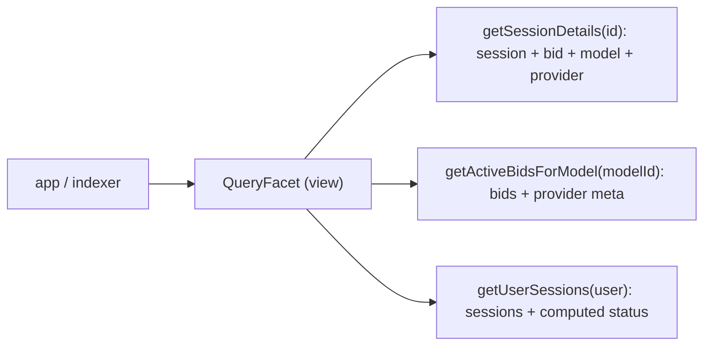

**Requirements**
- **VIEW-R1** `getSessionDetails(sessionId)` returning session + resolved bid + model + provider in one call.
- **VIEW-R2** `getActiveBidsForModel(modelId)` returning bids joined with provider metadata.
- **VIEW-R3** `getUserSessions(user)` returning sessions with computed status (active/closed/early/on-hold), paginated.
- **VIEW-R4** All `view`, read-only over existing storage; reuse `Paginator`.

**Acceptance criteria**
- [ ] **AC-VIEW-1** All functions `view`; no state writes.
- [ ] **AC-VIEW-2** Returned data equals composing the underlying single-entity getters.
- [ ] **AC-VIEW-3** Pagination respects `Paginator`; gas benchmarks documented.

**Compatibility class:** `Additive` (new read facet).

---

## 3.7 Storage hygiene & future (lower priority)

**Facet intent.** Cleanup and forward-looking hooks that don't fit a single write facet. Kept separate so they don't distract from the core facets.

### 3.7.1 Storage hygiene (Priority: Low)

**Intent.** Reduce unbounded growth / dead state. Helped materially by §3.4.3 (under CLOSE-R4a the `userStakesOnHold` array stops being written for new sessions entirely; under the CLOSE-R4b fallback it stops growing unbounded once releases auto-sweep, leaving only pre-upgrade rows to drain).

**Requirements**
- **HYG-R1** Audit `userStakesOnHold` growth; document the post-§3.4.3 steady state; ensure any remaining harvest is paginated (F5 gas griefing).
- **HYG-R2** Identify removable dead fields (reward-limiter fields per §3.4.4, `Model.fee` per §3.1.3) and provide a storage-layout-safe plan (remove vs leave dormant with a comment).

**Acceptance criteria**
- [ ] **AC-HYG-1** Written growth/steady-state analysis for on-hold storage.
- [ ] **AC-HYG-2** Dead-field removal plan preserves Diamond storage layout (no slot repurposing, F1).

**Compatibility class:** `In-place compatible` (append-only / dormant fields).

### 3.7.2 Model veracity hook (Priority: Low)

**Intent.** Optional governance hook to flag models that misrepresent capabilities; complements the curated registry (§3.1).

**Requirements**
- **VER-R1** Optional operator-set `veracityFlag`/score on a model, surfaced in catalog reads (§3.1.4); informational only, no fund movement.

**Acceptance criteria**
- [ ] **AC-VER-1** Operator can flag; flag appears in reads; never blocks fund paths (F2).

**Compatibility class:** `Additive`.

### 3.7.3 Rating / dispute outcomes (Priority: Low)

**Intent.** Surface dispute/rating outcomes for indexers without changing settlement.

**Requirements**
- **RATE-R1** Emit structured events for dispute resolution / rating changes; no new fund logic.

**Acceptance criteria**
- [ ] **AC-RATE-1** Events emitted with stable schema; settlement untouched (regression).

**Compatibility class:** `Additive`.

---

## 4. Deliverables & out of scope

**Deliverables** (sequencing is a contracting decision, intentionally not phased here):
- Solidity facets/changes per §3, each meeting its acceptance criteria.
- Hardhat/Foundry tests covering every `AC-*` (including regression and bus-factor F2 tests).
- A storage-layout report proving no slot repurposing (F1).
- Migration runbook for §3.1.5 and a client-impact note (proxy-router/app) for any `In-place compatible` behavior change (§3.4.2, §3.4.3, §3.4.5).
- Gas benchmarks for paginated reads and harvest loops.

**Out of scope** (this RFP):
- What the `feeDestination` wallet does with received MOR (burn/lock/forward); that is the destination wallet's concern, not this contract (§3.4.5).
- The off-chain CI validation pipeline against upstream registries (§3.1.1), referenced here but built in the relevant repo.
- External privacy primitives (§3.5.3) beyond an assessment.
- Proxy-router / API gateway / MorpheusUI code changes (tracked in their repos; this RFP only guarantees the contract stays additive so those can land independently).

---

## Revision history

| Date | Change |
|------|--------|
| 2026-06-16 (f) | **Readability + structure pass.** Light emphasis pass across the whole document: removed em dashes (replaced with commas/colons/parentheses or bullets), trimmed bold to structural labels and requirement IDs only, and moved heading priority tags into the parenthetical `name (Priority)` form. Updated internal anchor links (F1/F3/F4/F5) after the heading-separator change. Reordered §3.4.3 foundation-up: CLOSE-R1 (decouple refund from provider pay), CLOSE-R2 (auto-return released funds), CLOSE-R3 (bounded harvest), then the lock-policy decision CLOSE-R4a (preferred, remove) / CLOSE-R4b (fallback, keep + auto-return); fixed every CLOSE-R cross-reference (including §3.5.1 recycle timing and §3.7.1). §3.4.5 FEE-R3: the commission is **net to the provider** (it no longer counts toward `providersTotalClaimed`); added a separate `protocolFeesCollected` accumulator and a `getProtocolFeeSummary` maintainer view (FEE-R6, AC-FEE-6/7). Delegation: defined explicit write events (`StakingAllowanceGranted`/`Funded`/`Revoked`, `AllowanceDebited`, `AllowanceWithdrawn`/`Queued`, `PayoutTargetSet`) and read views (`getStakingAllowance`, `getAvailableToStake`, `listFundersOf`, `getPendingWithdrawal`, `getPayoutTarget`) with a consolidated events-and-reads block (COLDC-R10, COLDP-R5, AC-COLDC-9). |
| 2026-06-16 (e) | **Contractor's-eye scrub.** Fixed a stale "rich off-chain metadata" line in the §3.1 facet intent (now on-chain, F6). Reconciled the `CanonicalModelRegistered` event signature to 4 args (`modelId, nameKey, displayName, capability`) across the §3.1.4 intent, diagram, CAT-R3 and AC-CAT-3. Made the §3.5.1 in-use withdrawal implementable: named the trigger/fallback (`closeSession` top-up plus permissionless `claimPendingWithdrawal`, mirroring §3.4.3 CLOSE-R1) and added `AllowanceWithdrawn`/`AllowanceWithdrawQueued` events; tied allowance recycle timing to the §3.4.3 close path. Clarified F1 so the per-section `Breaking` labels in §3.1 all denote the single model-registry cutover via §3.1.5. Corrected a stale REG-R6 to REG-R9 schema-version-lock cross-reference in the history. |
| 2026-06-16 (d) | **Discussion-item resolution pass.** Added UTC time to the version line. §3.1.1: **Unicode normalization from v1** (NFKC + casefold via a versioned reference impl), **recommended `canonicalModelId = keccak256("morpheus.model.v1/"+nameKey)`** (replacing today's random-GUID `keccak256(owner, baseModelId)`), and **models.dev primary / OpenRouter / LiteLLM** upstream policy (CI scope). §3.1.2: added **VIDEO** capability + noted the enum is owner-extensible at runtime; **storage shape left as a weighed discussion leaning to a schema-versioned JSON blob**; free-form tags confirmed. §3.1.3: **CI key = proposer on 2/3 operator multisig**, **no model registration fee**, **atomic batch**, and an explicit **"what is CI/CD scope (out of contract scope)"** callout. §3.1.4: **sort by createdAt or name, asc/desc; default newest-first**. §3.2.1: `updateBidPrice` charges a **separate owner-settable `bidUpdateFee`, default 0.3 MOR** (not free). §3.3.1: **10 MOR minimum, owner-set, full refund to provider on deregister**. §3.4.1: **bid selection governed by the consumer-node rating config (price + reputation)**; on-chain `quoteSessionByModel` is only a cheapest-bid baseline. §3.4.2: **change the `isDirectPaymentFromUser` flag in place** (ABI-stable, behavior tightened, immaterial). §3.4.4: confirmed/accepted. §3.4.5: reframed the fee as a **platform commission to a maintainer multisig** (eBay-style), dropped burn/lock framing, no max beyond 100%. §3.5.1: **one available-to-stake pool** (grants + hot self-escrow), **recycle by default**, **FIFO debit (oldest grant first)**, and **fungible withdrawal where the last funder out waits on open sessions, no pro-rata lock**. §3.5.3: privacy resolved to **minimize linkage, no external privacy dependencies**. Final clarifications: §3.4.1 rating uses **on-chain signals only** (no off-chain reputation), and §3.1.1 now carries an explicit **contract-vs-CI/CD scope split** so the Solidity deliverables (ID-R*) are cleanly separated from the upstream-anchoring/normalization-reference work. |
| 2026-06-16 (c) | **Governance + IPFS + early-close re-examination.** Made the CI/CD wallet a proposer on the operator multisig: CI ends by submitting a register/update proposal; the operator quorum signs and executes; downstream directories refresh on the next cycle (§3.1 story, §3.1.3 roles, F3). De-scoped IPFS from these changes: descriptive metadata is fully on-chain, the legacy `ipfsCID` field is retained only for backward-compat and nothing new depends on it (§3.1.2, REG-R2/R9, F6, schema). Re-examined the early-close lock (§3.4.3) against the contract: on the staked path the stake is collateral returned in full, the provider is paid per elapsed wall-clock second, and natural close already applies no lock, so the lock blocks no extra emissions and grants no extra session time (the only churn cost is gas). Reframed the fix to remove the lock (preferred) with keep-and-auto-return as a fallback gated on confirming the daily emission accounting doesn't depend on the hold (AC-CLOSE-0); updated the F5 recycling row and the §3.4.4 cross-reference accordingly. (Lock requirements were later renumbered CLOSE-R4a/R4b in pass (f).) |
| 2026-06-16 (b) | **Fine-tuning pass.** Added NFR F6 (prefer on-chain / minimize off-chain dependencies), and made model descriptive metadata on-chain the source of truth (name, capability, features, tags, limits, upstream), with IPFS demoted to optional extras (§3.1.2). Added full CRUD for the registry: update-to-correct without changing identity, `retireModel` for dead entries (lifecycle `RETIRED`), and batch register/update for seeding and multi-model proposals (§3.1.3). Added publishing the `canonicalModelId` via events and a newest-first default sort for paginated listings (§3.1.4). Added `quoteSessionByModel` (cheapest active bid) alongside the bid-level quote (§3.4.1). Clarified in §3.4.3 that a session is a time window and that natural close applies no lock (answering the "use it all day" question). Reworked the provider fee to an owner-set `feeDestination` wallet plus owner-set percentage, no max, no separate router contract, full reward to provider if unset (§3.4.5). Expanded consumer custody to Many cold : one hot with a single combined bucket and optional self-escrow of the hot wallet's own funds (§3.5.1). Removed the standalone Sponsor section, subsumed by Many:1 (answers "why sponsor?"). Reframed provider §3.5.2 as default-hot-or-named-recipient payout steering. |
| 2026-06-16 | **Readability + scope pass.** Reframed the seven contract-verified facts as a Problem statement summary (§1.1) under Purpose; removed the standalone "current architecture" section; renumbered "Requested changes" to §3 (was §4) and "Deliverables" to §4 (was §6). Added the "how a new model is born" end-to-end story (PR, review, CI validation against OpenRouter/models.dev/LiteLLM, operator register) and anchored canonical names to upstream registries (§3.1.1). Simplified the vocabulary: capability = model type, governed feature flags, free-form ungoverned tags; dropped the on-chain tag registry and the legacy tag-to-feature migration mapping. Clarified that `active.mor.org` is a one-time seeding input, not a runtime dependency (§3.1.5). Documented why the early-close timelock exists (daily-stipend invariant; intra-day stake-recycling defense) and reframed the fix as auto-return-on-release rather than removal (§3.4.3); removed the MOR-backlog figure. Made explicit that the provider fee never touches the consumer's stake (§3.4.5). Expanded the custody masking/obfuscation narrative, made the executing role explicit per requirement, and ordered acceptance criteria by operation (§3.5). Moved all open decisions inline as per-section Discussion items (removed the standalone section). Externalized the metadata schema to [`docs/schemas/morpheus.model.v1.schema.json`](schemas/morpheus.model.v1.schema.json) with on-chain version-locking (§3.1.3 REG-R9); removed appendices A/B/C. |
| 2026-06-15 | Reorganized the RFP by facet/function; folded the canonical-model-registry doc into the registry section; reordered NFRs so F1 = additive/non-breaking; E1 accepted (remove reward limiter, session-based rewards, 10 MOR bond); merged early-close/stranded-MOR work; removed conversational attributions. |
