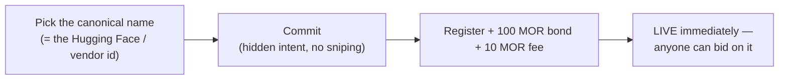
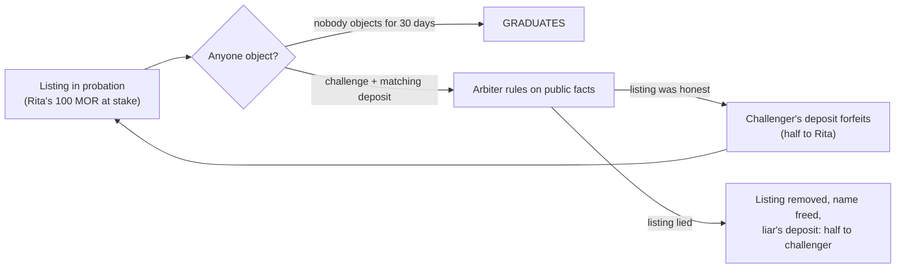
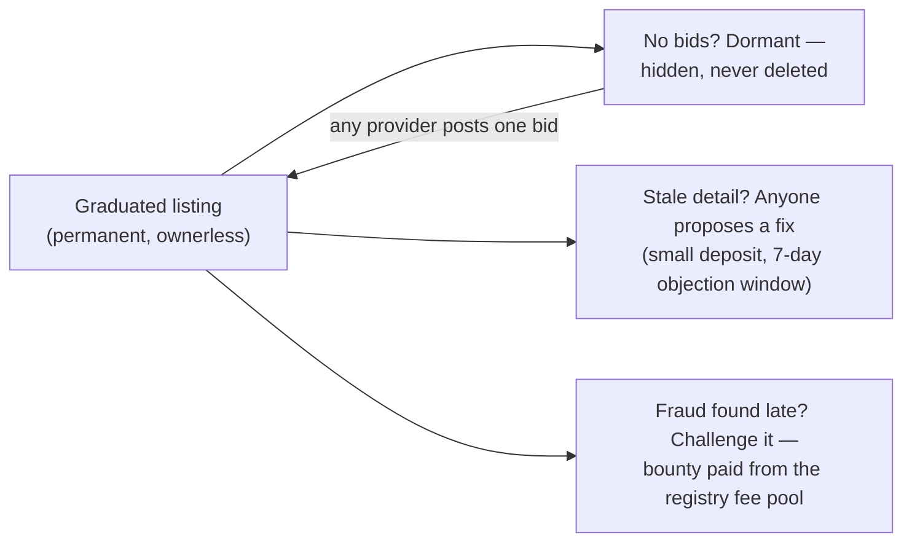

# One Name, One Model, Forever

### The story of the Morpheus model registry — how models are born, vetted, and become permanent

**Companion to:** [`inference-contract-enhancements-rfp.md`](inference-contract-enhancements-rfp.md) (the full spec) and [`inference-contract-enhancements-executive-summary.md`](inference-contract-enhancements-executive-summary.md) (the impact analysis)
**Audience:** anyone — community, providers, partners. No Solidity required.

---

## The problem, in one sentence

Today, anyone can register a model named `GLM 5.2`, and so can anyone else, and the network has no idea which one is real — so the catalog fills with duplicates, look-alikes, and abandoned junk, and a consumer picking a model is partly guessing.

We considered fixing this the traditional way: a review committee that approves every model before it lists. We rejected it. Committees are slow, they become gatekeepers, and the marketplace would freeze the day the committee stopped showing up. Instead, the registry works like this:

> **The contract checks the spelling. Money checks the honesty. Time makes it permanent.**

Nobody approves a model. Nobody can stop you from listing one. But lying costs real collateral, and telling the truth costs you nothing but patience.

---

## The cast

- **Rita**, a provider. She serves the new open-weights model `z-ai/glm-5.2` on her GPUs and wants it listed so she (and anyone else) can sell inference on it.
- **Sam**, a squatter. He'd like to camp on famous model names, or list fakes that ride a real model's reputation.
- **Charlie**, a challenger. He watches new listings, checks their claims against public sources, and earns bounties for catching lies.
- **The arbiter**, a small, narrow-purpose panel. It has exactly one job — ruling on disputes — and exactly one power: moving the disputed deposits. It cannot touch anyone's earnings, stakes, or refunds.

---

## Act 1 — Rita lists a model (minutes)

Rita picks the name. There's no creativity involved, which is the point: for an open-weights model the canonical name **is** its Hugging Face id, lowercased — `z-ai/glm-5.2`. For a hosted proprietary model it's the vendor's published API id — `gpt-5.5`. The name says what the model *is*, never who serves it: there are no "Rita's models" namespaces and no reseller labels.

She registers in two quick transactions (the first hides her intent so nobody can front-run the name — the same trick ENS uses), posting:

- a **bond** — 100 MOR, *refundable*. This is a deposit, not a price.
- a **fee** — 10 MOR, non-refundable. A spam toll.

The contract checks the spelling on-chain — lowercase, no spaces, no Unicode trickery, at most one `/` — computes the model's permanent id *from the name itself*, and rejects the whole thing if the name is already taken. One name, one id, forever. Two people can never register the same model.

**The listing is live immediately.** Providers can bid on it that same minute. No queue, no reviewer, no waiting.

---

## Act 2 — Probation: thirty days in the sunlight

For the next 30 days the listing is **on probation**. The market runs normally — bids, sessions, payments, all of it — but Rita remains personally accountable for what the listing claims, and her 100 MOR is the collateral behind it.

During probation, **anyone who thinks the listing lies can challenge it** by posting a matching deposit. Suppose Sam had registered `zai/glm-5.2` — a fake org name that doesn't exist on Hugging Face, hoping to catch typos and ride the real model's fame. Charlie spots it, spends thirty seconds confirming there is no such Hugging Face repo, and challenges.

The arbiter checks the same public facts and rules:

- **Challenge upheld** → Sam's listing is removed, the name is freed, and Sam's 100 MOR is split: **half to Charlie, half to the registry's fee pool.** Charlie made 50 MOR for fact-checking. Sam is out 110.
- **Challenge rejected** → the mirror image: *Charlie's* deposit is split in the listing's favor. Harassing honest listings is just as unprofitable as lying.

Why does this beat a review committee? Because it points the incentives the right way. A committee slows down every *honest* registrant and barely inconveniences a determined liar. Probation does the opposite: Rita barely notices it (her money comes back), while Sam bleeds collateral on every fake — during exactly the window when a new name draws the most eyeballs.

---

## Act 3 — Graduation: the model outgrows its creator

Thirty days pass. Nobody challenged Rita's listing, because it's simply true. Two things happen:

1. **Rita's 100 MOR comes home**, in full.
2. **Rita's special role ends.** She can no longer edit the listing. Not because we distrust her — because the listing no longer belongs to anyone.

This is the heart of the design. Registering a model never earned Rita a penny — no royalty, no priority, no discount; she competes for inference business like every other provider. She was never an *owner*, just the **first contributor**. So once the market has had a fair window to test her claim, there is nothing left for her to own. The listing **graduates into protocol infrastructure**: permanent, ownerless, and exactly as durable as the sessions and bids that reference it.

Rita's total cost for donating a catalog entry to the network, forever: **10 MOR and a month of patience.** A provider listing sixty models parks 6,000 MOR for one month and gets it all back.

---

## Act 4 — Forever after

**Models don't die. Markets nap.** A year later, everyone's bidding on `glm-5.5` and the `z-ai/glm-5.2` listing has no bids at all. Nothing happens. The listing goes *dormant* — hidden from the active catalog consumers browse, but permanently on the books. The day some provider finds a niche for it (cheap inference on older GPUs, a legacy workload), **one bid transaction wakes it up**. No re-registration, no new bond, no new probation. The catalog is a permanent record of models that exist, not a leaderboard of models that are currently fashionable.

**Facts can still be corrected.** Graduated listings are ownerless, so who fixes a stale detail (a wrong context-window number, an upstream link that moved)? Anyone — by posting a small correction deposit. If nobody objects within a week, the fix applies and the deposit returns. If someone objects, the arbiter settles it. Accountability always follows *whoever is making the newest claim*, not whoever happened to be first.

**Lies can still be caught — even late.** If fraud slips through probation, a graduated listing can still be challenged and removed. The challenger's deposit is returned plus a bounty from the registry's fee pool (the pool is fed by registration fees and confiscated deposits, so the policing pays for itself). And note what a late liar actually gained by waiting: nothing — being a registrant pays nothing, so there is no long game in registry fraud. Whoever *serves* something fake under an honest name is a **provider** committing an offense, and providers are judged by their own performance stats, session by session.

---

## Names, variants, and the family question

*"Aren't `z-ai/glm-5.2`, `glm-5.2`, and `z-ai/glm-5.2:tee` all basically the same model?"* Same family — different things you can buy. The registry keeps both ideas straight:

| You see | What it is | Same listing? |
|---|---|---|
| `Z-AI/GLM-5.2` vs `z-ai/glm-5.2` | Capitalization noise | **Yes** — the contract folds case; these are literally one id |
| `glm-5.2` (short form) | The vendor's hosted-API name for the same artifact | **Yes** — an *alias* that points at the main listing (aliases post their own small deposit and survive their own probation, so pointing a famous short name at the wrong model is a losing trade) |
| `z-ai/glm-5.2:tee` | The same weights served in a verified secure enclave | **Deliberately separate** — a TEE session is a different product, with its own price and its own providers, and a consumer choosing TEE must get exactly TEE |
| `zai/glm-5.2` | A look-alike org that doesn't exist upstream | **Shouldn't exist** — challengeable fraud; removed, deposit slashed |

Grouping the family back together costs nothing: the variants share the base name by construction, so any app can show "GLM 5.2 (3 variants)" with plain string matching.

---

## Who's in charge here?

Almost nobody, on purpose.

| Party | Can do | Cannot do |
|---|---|---|
| **Anyone** | Register (bonded), challenge (bonded), propose corrections (bonded), bid, wake a dormant model | Register a taken name; edit someone's live listing without a deposit at risk |
| **Arbiter** (small panel, appointed for this one job; handles disputes in batches) | Rule on challenges and correction disputes; move the disputed deposits | Touch stakes, earnings, refunds, or any listing not under dispute |
| **Owner multisig** | Tune parameters inside hard-coded ranges; appoint/replace the arbiter; emergency-pause *new sessions* on a listing | Approve or block registrations; freeze funds; pause settlements or withdrawals — ever |

And the disaster drill: if every key disappeared tomorrow, registration, bidding, sessions, settlement, refunds, and graduation bond returns **all keep working** — graduation is just a clock. The only thing that stalls is dispute *rulings*, and a contract upgrade installs a new arbiter without touching anything else.

---

## The numbers (all tunable within on-chain limits)

| Thing | Default | What it's for |
|---|---|---|
| Registration bond | 100 MOR, **returned at graduation** | Skin in the game during probation |
| Registration fee | 10 MOR, kept | Spam toll; feeds the bounty pool |
| Probation | 30 days | The market's review window |
| Challenge deposit | Matches the listing's bond | Loser pays; honesty is profitable either way |
| Correction deposit | 20 MOR, returned if unopposed | Keeps graduated listings accurate |
| Late-fraud bounty | 50 MOR from the fee pool | Keeps policing alive after graduation |

---

## The whole story in four lines

1. **Anyone can list a model in minutes** — the contract checks the spelling, a deposit backs the claim.
2. **For 30 days, the market gets to call your bluff** — liars lose their deposit to whoever catches them.
3. **Survive probation and the deposit comes home** — the listing graduates into permanent, ownerless protocol infrastructure.
4. **Nothing honest ever dies** — unpopular models nap and wake on a single bid; only proven fraud is ever removed.
