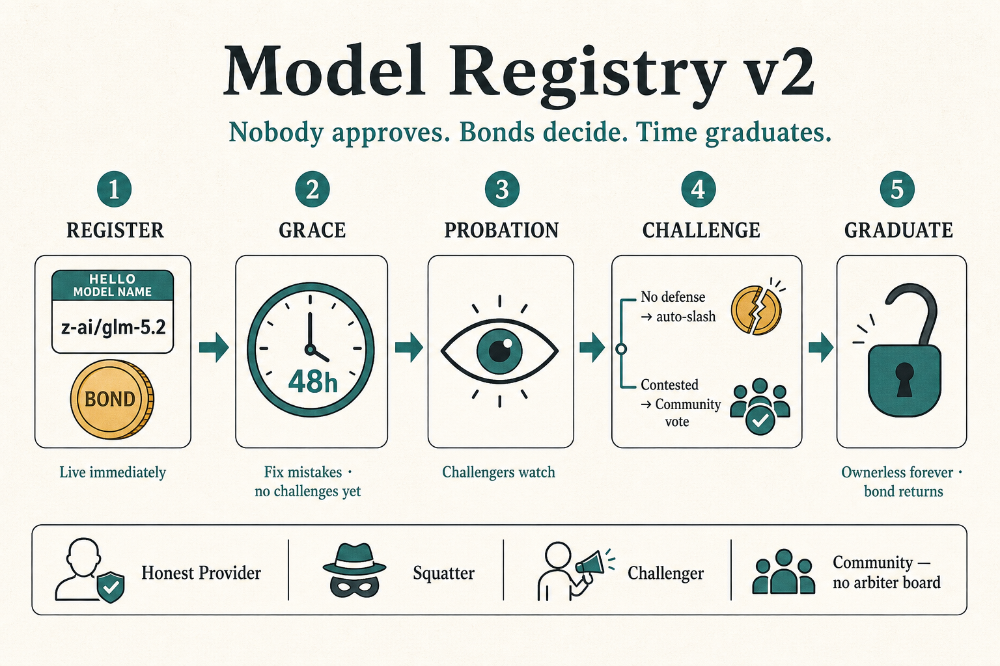

# One Name, One Model, Forever

### The Morpheus model registry — how models are born, vetted, and become permanent

**Companion to:** [`inference-contract-enhancements-rfp.md`](inference-contract-enhancements-rfp.md) (the full spec) and [`inference-contract-enhancements-executive-summary.md`](inference-contract-enhancements-executive-summary.md) (the impact analysis)  
**Audience:** anyone — community, providers, partners. No Solidity required.

> **The contract checks the spelling. Money checks the honesty. Time makes it permanent. Nobody wears a badge.**

---

## The problem

Today, anyone can register a model named `GLM 5.2`, and so can anyone else — so the catalog fills with duplicates, look-alikes, and junk, and a consumer picking a model is partly guessing.

We rejected a review committee (slow, gatekeeping, freezes when it disappears). We also rejected a standing **arbiter panel** for disputes — a named board can be doxxed, subpoenaed, or coerced into becoming a gatekeeper with a different job title. Challengers open cases; the **contract** closes them (timeout, proof, or bonded **Community** vote).

Nobody approves a model. Nobody can stop you from listing one. Lying costs collateral. Truth costs patience. Rules resolve fights — not humans with a badge.

---

## The cast

| Role | Who | Job |
|------|-----|-----|
| **Honest Provider** | **Rita** | Serves real `z-ai/glm-5.2`; expects her bond back |
| **Squatter** | **Sam** | Registers fakes (`zai/glm-5.2`) to ride typos |
| **Challenger** | **Charlie** | Checks listings vs HF / vendor docs; earns for catching lies. Proposes; never slashes by fiat |
| **Community** | Any wallet that stakes in | Votes only on *escalated* (contested) disputes. No appointment, no roster that "is the court" |
| **Contract** | — | Only party that moves disputed deposits |

**Community minimums:**

| Minimum | Proposed default | Why |
|---------|------------------|-----|
| **Stake to join** | e.g. 50–100 MOR (tunable) | Voting isn't free; Sybil / drive-by voters cost capital |
| **Quorum to slash** | e.g. ≥5 distinct Community voters **or** ≥X% of staked Community weight | A lonely vote must not retire a listing |
| **Below quorum** | **Fail-open** — challenge expires, bonds returned, listing continues | Community napping ≠ market freeze; explicit fraud majority required to slash |

**Community pay:** If a dispute escalates to a Community vote, voters who sided with the **majority** are paid from the **loser's bond**, **pro-rata by vote weight**. No vote, no pay. Uncontested resolves and pure proof resolves never touch Community (they weren't called).

Two registrations, same rules — follow Rita and Sam through every act.

---

## Act 1 — Both list + grace (48h)

Same register path: commit-reveal, **100 MOR bond** + **10 MOR fee**, spelling check, live immediately.

Then **grace (default 48h):** challenges **off**. Listings are public; bids allowed. Metadata editable by the registrant; wrong **name** only fixable by voluntary retire (no bids/sessions) + re-register.

| | **Rita — Honest Provider** | **Sam — Squatter** |
|---|---|---|
| **Name** | `z-ai/glm-5.2` | `zai/glm-5.2` (no HF repo) |
| **During grace** | Spots a context-window typo → `updateModelMetadata`. Done. | Could retire and walk away with the bond. He doesn't — the fake stays up. |
| **Challengers?** | Not yet | Not yet — but the clock is ticking in public |

Grace is for fat-fingers, not a free pass. After 48h, Charlie is live.

---

## Act 2 — Probation: challenge → contest → resolve

After grace through day 30. Charlie posts matching bond + typed claim + evidence. One live challenge at a time; pending challenge blocks graduation. **No Arbiter.**

### How a fight ends

| Step | Outcome |
|------|---------|
| Challenge opened | Defense clock (3–7 days) |
| No defense | Anyone `resolveUncontested()` → slash — **Community not involved, not paid** |
| **Concede** | Lie cured; listing may stay; Charlie gets **finder's bounty** + keeps deposit (silent edit must not erase him) — Community not involved |
| **Contest** | Escalate: hard-fact **proof** if available (Community not involved), else bonded **Schelling vote** among the **Community** |
| Finalize (Community path) | Snapshot = claim **at challenge open**. Below quorum → **fail-open**. Else loser bond splits three ways (tunable): **winner / Community majority pro-rata / fee pool** |

**Loser-bond split when Community votes** (illustrative default):

| Slice | Share | Who |
|-------|-------|-----|
| Winner | **40%** | Charlie if challenge upheld; Rita if rejected |
| **Community** | **40%** | Majority voters only, **pro-rata by vote weight** |
| Fee pool | **20%** | Ongoing bounties / policing |

Minority voters earn **nothing** from that round (wrong side of Schelling). Paths that never call Community (uncontested, concede, proof-only) keep the simpler **50% winner / 50% fee pool** split — no idle Community tax.

| | **Rita — Honest Provider** | **Sam — Squatter** |
|---|---|---|
| **Charlie** | Usually nothing to file. Harasser challenges → she **contests** → Community sides with her | Files immediately: `UPSTREAM_MISSING` |
| **Choice** | — | Ignores (common) or contests a lost cause |
| **Resolve** | Frivolous challenge rejected; she continues probation | **Uncontested slash** (usual) or Community upholds → listing removed, name freed |
| **Money** | Bond intact; if Community sat, she gets the winner slice + Community is paid from *his* bond | Uncontested: **50% Charlie / 50% fee pool**. Contested: **40% Charlie / 40% Community pro-rata / 20% fee pool**. Out **110 MOR** either way |

Wrong name: edit can't save Sam. Wrong metadata fixed in grace: Charlie never fires on Rita. Fixed only after he challenges: she **concedes** — Charlie paid, listing lives.

---

## Act 3 — Graduation (or not)

| | **Rita — Honest Provider** | **Sam — Squatter** |
|---|---|---|
| **Day 30** | No upheld challenge → **graduates** | Already tombstoned in Act 2 |
| **Bond** | **100 MOR returns** | Gone |
| **Role** | Edit powers end; listing is ownerless protocol infrastructure | None; name free for a real registrant |
| **Net** | **10 MOR + patience** to donate a catalog entry forever | **110 MOR** tuition for one fake |

---

## Act 4 — Forever after

| | **Rita's listing** | **Sam — Squatter** |
|---|---|---|
| **Dormancy** | No bids → hidden, not deleted; one bid wakes it | No listing. New fake → pay Act 1–2 again |
| **Corrections** | Anyone, small deposit, objection window; opposed → same optimistic / Community rails | Cannot sit on a graduated name as owner |
| **Late fraud** | Still challengeable; bounty from fee pool | "Wait out probation" earned **nothing** — no registrant payoff. Serving fakes under an honest name = **provider** problem |

---

## Incentives (who breaks the bond)

| Role | Wins by… | Loses by… |
|------|-----------|-----------|
| **Rita — Honest Provider** | Fast list; 48h to fix; bond back; false challenges pay her | Lying after grace; ignoring a real challenge |
| **Sam — Squatter** | *(shouldn't)* | Every fake locks a full bond once Challengers are in |
| **Charlie — Challenger** | Winner slice / finder's bounties | False challenges (his bond funds Rita + Community) |
| **Community** | **40% of loser bond pro-rata** when on majority | Wrong-side vote (no share); abstain → no pay that round |
| **Owner multisig** | Params in bounds; `DISABLED` on new sessions | Cannot approve listings or resolve disputes |

**Who breaks the bond?** The contract — uncontested timeout, proof, or Community vote. Challengers propose; they never slash by fiat. **Community is paid only when it works** — pro-rata from the loser bond.

---

## Bad actors (security hat)

| Attack | Why it fails (or residual) |
|--------|----------------------------|
| Spam junk names | 110 MOR each; grammar; dormant junk stays out of active catalog |
| Typo-squat (Sam) | Charlie's default uncontested slash after grace |
| Sit in grace, then hope | Grace is short; listing is already public |
| Challenge-grief Rita | Matching bond; she wins → his bond; one live challenge; no challenges in grace |
| Fix-after-challenge to moot Charlie | Concede/finder's bounty; snapshot at open |
| Capture Community vote | Hard residual — min stake + quorum price it; prefer proofs; still better than a doxxable panel |
| Stall forever | Uncontested on a clock; fail-open below Community quorum |
| Doxx "the court" | There isn't one |

---

## Names & family

| You see | Same listing? |
|---|---|
| Case variants | **Yes** — folded |
| `glm-5.2` alias | **Yes** — bonded; wrong target = Squatter economics |
| `:tee` variant | **No** — different product |
| `zai/glm-5.2` | **Sam's path** — slash |

---

## Who's in charge?

| Party | Can | Cannot |
|---|---|---|
| **Anyone** | Register, challenge, defend, concede, correct, bid, finalize uncontested | Move bonds by fiat |
| **Community** (staked) | Vote on escalations | Approve listings; act with no stake / below quorum |
| **Owner multisig** | Params; emergency new-session pause; upgrades | Appoint an arbiter; freeze settlements |

**Disaster drill:** keys vanish → market + uncontested resolves + Community votes still work. Only param tuning stalls.

---

## Numbers (tunable within on-chain limits)

| Thing | Default | For |
|---|---|---|
| Registration bond | 100 MOR, returned at graduation | Skin during probation |
| Registration fee | 10 MOR | Spam toll / bounty pool |
| Challenge grace | **48 hours** | Rita fixes fat-fingers; Sam still on the clock |
| Probation | 30 days (includes grace) | Full review window |
| Challenge deposit | Matches bond | Loser pays |
| Defense window | 3–7 days | Then uncontested slash |
| Community join stake | **50–100 MOR** (TBD) | Skin to vote |
| Community quorum | **≥5 voters or ≥X% weight** (TBD) | No lonely slash; fail-open below |
| Loser bond if Community voted | **40% winner / 40% Community pro-rata / 20% fee pool** | Pay everyone who showed up correctly |
| Loser bond if Community *not* called | **50% winner / 50% fee pool** | Uncontested, concede bounty path, proof-only |
| Finder's bounty (concede) | TBD — small, fee pool | Pay Charlie when Rita cures after a valid catch |
| Late-fraud bounty | 50 MOR from fee pool | Post-graduation |

---

## In five lines

1. **Rita and Sam both list** — same bond; **48h grace** so Honest Provider can fix, not so Squatter can hide.
2. **Then Charlie** — her truth is boring; his fake meets a bonded Challenger.
3. **Most fights need no court** — Sam ignores → auto-slash; Rita concedes a real catch → Charlie paid.
4. **Contested fights use Community stake, not a board** — majority paid pro-rata from the loser bond; nobody to doxx.
5. **Rita graduates; Sam doesn't** — bond returns to honesty; only proven fraud is removed.
