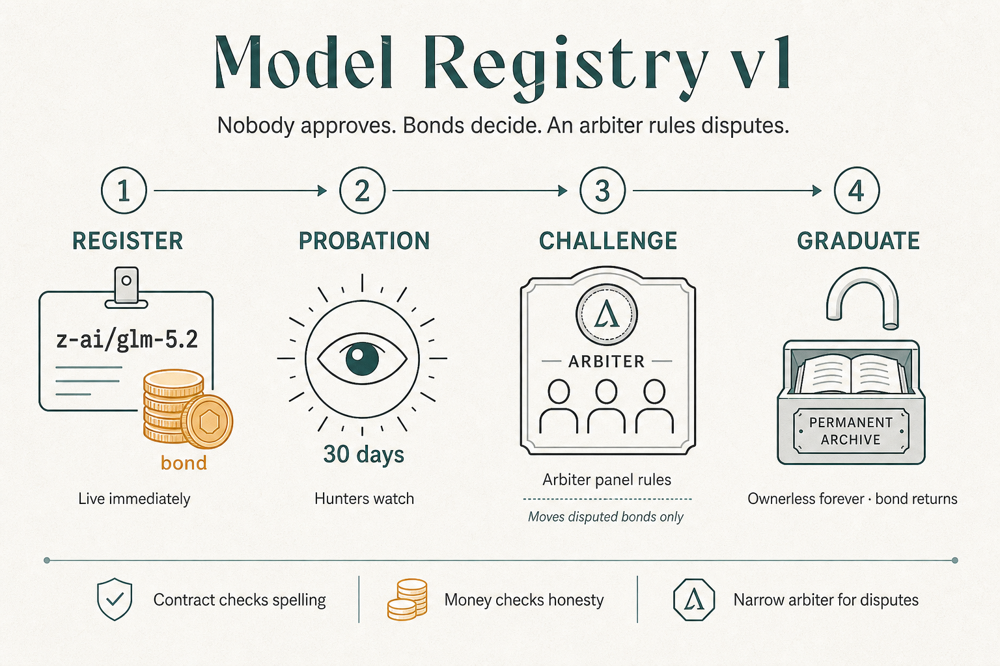

# One Name, One Model, Forever

### The story of the Morpheus model registry — how models are born, vetted, and become permanent

**Companion to:** [`inference-contract-enhancements-rfp.md`](inference-contract-enhancements-rfp.md) (the full spec) and [`inference-contract-enhancements-executive-summary.md`](inference-contract-enhancements-executive-summary.md) (the impact analysis)  
**Audience:** anyone — community, providers, partners. No Solidity required.

> **The contract checks the spelling. Money checks the honesty. Time makes it permanent.**

---

## The problem, in one sentence

Today, anyone can register a model named `GLM 5.2`, and so can anyone else — so the catalog fills with duplicates, look-alikes, and junk, and a consumer picking a model is partly guessing.

We rejected a review committee (slow, gatekeeping, freezes when it disappears). Instead:

Nobody approves a model. Nobody can stop you from listing one. Lying costs real collateral; telling the truth costs patience.

---

## The cast

| Role | Who | Job |
|------|-----|-----|
| **Honest Provider** | **Rita** | Serves real `z-ai/glm-5.2`; lists it so anyone can bid |
| **Squatter** | **Sam** | Registers look-alikes (`zai/glm-5.2`) to ride typos and reputation |
| **Challenger** | **Charlie** | Checks listings against Hugging Face / vendor docs; earns when he catches lies |
| **Arbiter** | Narrow panel | Rules disputes; moves only the disputed deposits — not earnings, stakes, or refunds |

Two registrations, same rules — follow Rita and Sam through every act.

---

## Act 1 — Both list (minutes)

Same mechanics for both: commit-reveal (no name sniping), **100 MOR bond** (refundable) + **10 MOR fee** (kept). Contract checks spelling, derives id from the name, rejects if taken. **One name, one id, forever. Live immediately** — anyone can bid.

| | **Rita — Honest Provider** | **Sam — Squatter** |
|---|---|---|
| **Name** | `z-ai/glm-5.2` — real HF id | `zai/glm-5.2` — fake org, no HF repo |
| **Cost** | 110 MOR locked / spent | Same 110 MOR — spam isn't free |
| **Result** | Listing live; providers can bid | Listing also live — no reviewer stopped him |

The contract does not know who is honest. That is the point: economics and time will.

---

## Act 2 — Probation: thirty days in the sunlight

Market runs normally. Each registrant is accountable for their claim; their 100 MOR is the collateral. A **Challenger** can challenge with a matching deposit. The **Arbiter** rules on public facts.

| | **Rita — Honest Provider** | **Sam — Squatter** |
|---|---|---|
| **What Charlie sees** | Real HF repo; claims check out | No such HF repo — thirty-second check |
| **Challenge?** | Usually none. If a harasser challenges and loses → *their* bond splits half to Rita / half fee pool | Charlie challenges with matching bond |
| **Arbiter** | Rejects frivolous challenges | **Upholds** — listing removed, name freed |
| **Money** | Bond still hers; harassers pay her | Bond split **half Charlie / half fee pool**; Sam out **110 MOR** |

Rita barely notices probation (honest claims are boring). Sam bleeds collateral on every fake — during the window when new names get the most eyeballs. That is why this beats a review committee: it slows Squatter, not Honest Provider.

---

## Act 3 — Graduation (or not)

| | **Rita — Honest Provider** | **Sam — Squatter** |
|---|---|---|
| **Day 30** | No upheld challenge → **graduates** | Never gets here — listing already `RETIRED` |
| **Bond** | **100 MOR returns** in full | Gone (slashed in Act 2) |
| **Role** | Special edit powers **end** — listing no longer belongs to anyone | No role; name is free for a real registrant later |
| **What she/he is** | **First contributor**, not owner — no royalty, no priority | Paid the spam tax; catalog forgot him |

Rita's cost to donate a catalog entry forever: **10 MOR and a month of patience.** Sam's cost for one fake: **110 MOR and a tombstone.**

---

## Act 4 — Forever after

| | **Rita's listing** | **Sam — Squatter** |
|---|---|---|
| **Dormancy** | No bids? Hidden from active catalog, still on the books. One bid wakes it — no re-bond, no re-probation | Has no listing. If he registers another fake, Act 1–2 repeat |
| **Corrections** | Anyone proposes a fix with a small deposit; unopposed a week → applies; opposed → Arbiter. Accountability follows the *newest* claim | Cannot "own" a graduated name to vandalize it |
| **Late fraud** | If something slipped through, Challenger + bounty from the fee pool still removes it | Waiting out probation earned him **nothing** — registrant gets no ongoing payoff. Serving fakes under an *honest* name is a **provider** offense (stats), not a registry jackpot |

---

## Names, variants, and the family question

| You see | Same listing? |
|---|---|
| `Z-AI/GLM-5.2` vs `z-ai/glm-5.2` | **Yes** — case-folded |
| `glm-5.2` short form | **Yes** — bonded alias (own probation; wrong target = Squatter economics) |
| `z-ai/glm-5.2:tee` | **No** — different product |
| `zai/glm-5.2` | **Sam's path** — challengeable fraud; slash |

---

## Who's in charge here?

| Party | Can do | Cannot do |
|---|---|---|
| **Anyone** (incl. Honest Provider, Squatter, Challenger) | Register, challenge, propose corrections, bid, wake dormant models | Register a taken name; edit without deposit at risk |
| **Arbiter** | Rule challenges / correction disputes; move disputed deposits | Touch stakes, earnings, refunds |
| **Owner multisig** | Params in bounds; appoint Arbiter; emergency-pause *new sessions* | Approve/block registrations; freeze settlements |

**Disaster drill:** keys vanish → register, bid, settle, graduate, bond returns still work. Only dispute *rulings* stall until a new Arbiter is installed.

---

## The numbers (tunable within on-chain limits)

| Thing | Default | What it's for |
|---|---|---|
| Registration bond | 100 MOR, returned at graduation | Skin during probation |
| Registration fee | 10 MOR, kept | Spam toll; bounty pool |
| Probation | 30 days | Review window |
| Challenge deposit | Matches bond | Loser pays |
| Correction deposit | 20 MOR | Graduated metadata |
| Late-fraud bounty | 50 MOR from fee pool | Policing after graduation |

---

## The whole story in four lines

1. **Rita and Sam both list in minutes** — same bond, same fee; the contract only checks spelling.
2. **For 30 days Charlie can call the bluff** — Honest Provider's truth is boring; Squatter's fake loses the bond to the Challenger.
3. **Rita graduates; Sam doesn't** — her deposit comes home; the listing becomes ownerless protocol infrastructure.
4. **Honest listings nap, they don't die** — only proven fraud is removed; Squatter never gets a long game.
