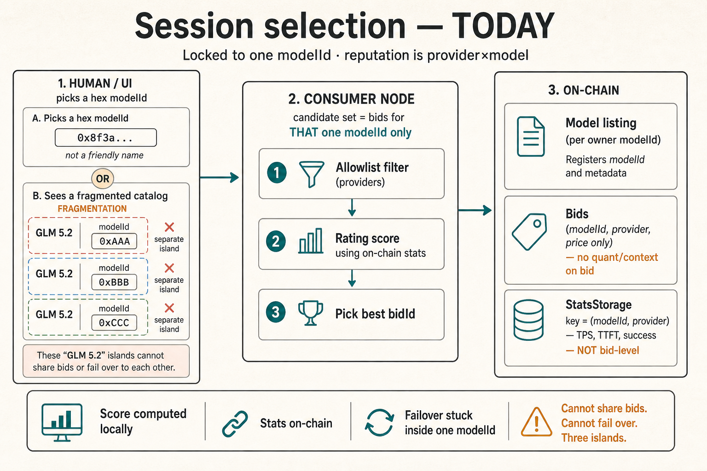
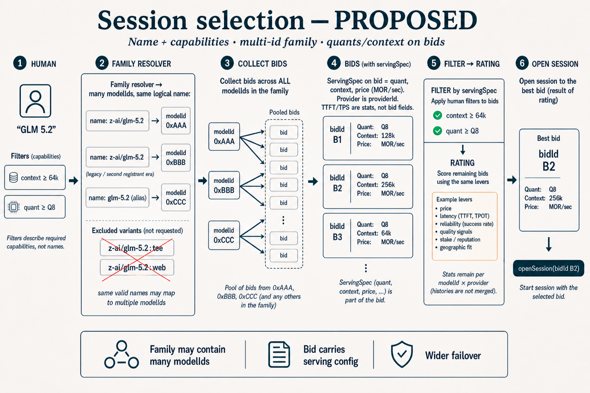

# Session selection & bid enrichment (design note)

**Status:** side discussion for team agreement — not part of the model-registry RFP cut  
**Related but separate:** [`model-registry-story.md`](model-registry-story.md) / [`model-registry-story-v2.md`](model-registry-story-v2.md) (catalog identity). This note is about **how consumers choose a bid** and **what bids declare**.  
**Audience:** product, proxy-router, contracts — anyone thinking about failover, UX, and marketplace liquidity.





---

## Why this came up

Two threads landed together:

1. **Kyle:** Can quant, max output, context window, etc. live in models-config / on the **bid**, under one model name, so consumers filter providers by configuration — fewer modelnames, more fallback, still filterable?
2. **Selection UX:** Today session open is effectively locked to a **modelId** (hex). Humans think in **model name + capabilities**. With fragmented ids (today) and richer bid metadata (tomorrow), the consumer node should resolve a name to a **family of modelIds**, pool bids, filter, then rate.

Registry work cleans *identity*. This note widens *selection* and enriches *offers*. They reinforce each other; they are not the same workstream.

---

## Layering (keep crisp)

| Layer | Answers | Examples |
|-------|---------|----------|
| **Model / family** | *What artifact?* | `z-ai/glm-5.2`, alias `glm-5.2` |
| **Bid servingSpec** | *How is this offer configured, at what price?* | quant, context, price (`MOR/sec`) |
| **Stats / rating** | *How has this provider×model behaved?* | TTFT, TPS, success — **after** sessions, on-chain |

**Not separate model names:** `…-q8-64k`, `…-q4-128k`. Those are bid fields, not catalog identity.

**Still separate catalog markets when the product differs:** `:tee`, `:web` (and similar governed suffixes) — only in the family if the human asked for that product.

---

## Today (reminder)

- Catalog is fragmented: same logical “GLM 5.2” can be many `modelId`s (`keccak(owner, …)` era).
- Bid ≈ `(modelId, providerId, pricePerSecond)` — no structured quant/context on the bid.
- Reputation / stats are **on-chain** in `StatsStorage`, keyed **`(modelId, provider)`** — not bid-level; no stored “score.”
- Consumer node steers via local `rating-config.json` (weights + provider allowlist), scores bids **within one modelId**, then `openSession(bidId)`.
- Failover is weak when liquidity is split across ids and humans can’t express “GLM 5.2 with context ≥ 64k.”

See [`rating-config`](../../docs/reference/rating-config.mdx) and the rating summary in the conversation that led here: score is local; stats are on-chain; choice unit is bid; reputation unit is provider×model.

---

## Proposed selection stack (consumer node)

```text
Human: "GLM 5.2" + filters (e.g. context ≥ 64k, quant ≥ Q8)
        ↓
1. Family resolver → all modelIds for that valid name (+ aliases)
   - May be MANY ids (backward compatibility / legacy)
   - Exclude :tee / :web unless requested
   - Do not fuzzy-match squatters (zai/…); that’s registry/Charlie
        ↓
2. Collect all active bids on those modelIds (one pool)
        ↓
3. Filter by bid servingSpec (quant, context, …)
        ↓
4. Rate remaining bids (existing levers: on-chain stats + price + stake + allowlist)
   - Stats stay per (modelId, provider); histories are not merged across ids
        ↓
5. openSession(best bidId)   ← chain unchanged
```

**Chain still settles on `bidId`.** The node gets smarter about *which* bidId; the Diamond does not need “open by name.”

---

## Bid enrichment (servingSpec)

Add **known capabilities** on the bid (sourced from provider `models-config` at bid creation / update):

| On the bid | Not on the bid |
|------------|----------------|
| Quantization | TTFT |
| Context window | TPS |
| Price (`MOR/sec`; humans may *display* MOR/hour) | “Quality” scores |
| *(provider is already `providerId` on the bid)* | Per-token pricing |

Optional later: max output, other serving knobs — only if they’re declared config, not observed behavior.

**Bid Charlie** (challenging false servingSpec) is **later, if at all**. v1 can be filter + stats only.

---

## Rating — what stays the same

- Inputs: on-chain `ProviderModelStats` / `ModelStats` + bid price + provider stake.
- Policy: per-consumer-node `rating-config` (weights, allowlist).
- **Change:** candidate set = filtered bids across the **family**, not a single modelId.
- Self-dealt / fabricated receipts remain a known limitation until attestation; don’t pretend rating is a court of truth.

---

## How this relates to model registry

| Registry (identity) | This note (selection + offers) |
|---------------------|--------------------------------|
| One honest name, bond/probation, slash fakes | Name → multi-id family for routing |
| Aliases, `:tee` as separate product | Family excludes suffix markets unless asked |
| Catalog metadata about the artifact | Bid servingSpec about this provider’s offer |
| Does not open sessions | Consumer node opens by name + filters |

Canonical registry **reduces** how many ids a family needs over time; family resolution **must still accept multiple modelIds** for the same valid name so failover works through migration and legacy catalog dirt.

---

## Open points

1. Exact servingSpec schema / governed quant vocabulary (avoid `Q4` vs `q4_0` chaos).
2. On-chain bid fields vs hash-of-spec + off-chain blob (prefer enough on-chain for any node to filter).
3. Soft-relax when no bid meets filters (clear failure vs widen filters — never into `:tee` by accident).
4. UI: pick by name; show winning bid’s servingSpec + provider stats for trust.
5. Scope vs registry RFP: land as proxy-router + Marketplace bid shape work; don’t block registry v2 on this.

---

## Punchline

**Humans select model name + capability constraints. The node expands that to a multi-id family, pools bids, filters on bid servingSpec (quant / context / MOR/sec), then applies today’s reputation model. Sessions still open on a bidId. Wider failover, less catalog sprawl, rating levers unchanged.**
